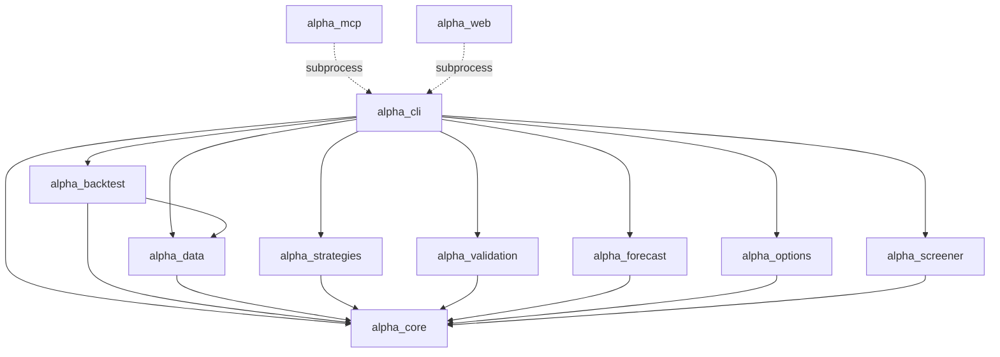
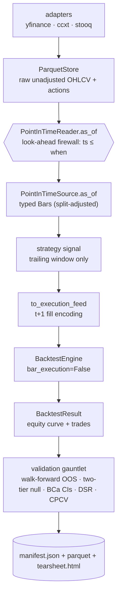
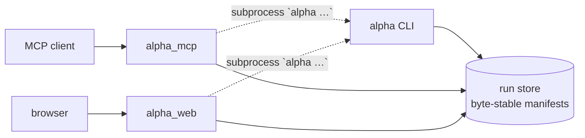

# Project ALPHA — Architecture

**Last reviewed:** 2026-07-18
**Status:** Living (reflects `main`; updated as the platform evolves)
**Companion docs:** [`CLAUDE.md`](../CLAUDE.md) (agent operating manual + module map) · [`docs/superpowers/specs/2026-06-14-project-alpha-v1-design.md`](superpowers/specs/2026-06-14-project-alpha-v1-design.md) (original v1 design) · [`research/00-SYNTHESIS.md`](../research/00-SYNTHESIS.md) (research synthesis) · [`adr/`](adr/) (decision records)

---

## 1. Purpose & Scope

Project ALPHA is a **$0, institutional-grade, Python** quantitative research platform — point-in-time data, event-driven backtesting, and a heavy-tailed statistical **validation gauntlet** — written and operated entirely by AI agents. The platform's value is not a strategy; it is **machinery you can trust**: a backtest is only believable once it survives walk-forward out-of-sample testing, a randomized-price null, bootstrap confidence intervals, the Deflated Sharpe Ratio, and CPCV.

This document is the **current-state architecture reference**: the enforced dependency DAG, each layer's charter, the end-to-end data flow, and the cross-cutting invariants. It is the stable map; the **"why" behind the load-bearing decisions** lives in the linked [ADRs](adr/). It is deliberately *not* a build history — the dated specs and plans under [`docs/superpowers/`](superpowers/) remain the point-in-time record of how the platform was constructed. Audience: an engineer (human or agent) who needs to place a change correctly and not violate the architecture.

## 2. The Layered DAG

The platform is a `uv` workspace of small, strictly-typed `src/`-layout packages. Hard import boundaries are the #1 reliability lever for AI-written code, so the dependency graph is a **DAG enforced as a CI gate**, not a convention. An edge `X → Y` reads "**X may import Y**".



<details><summary>ASCII fallback</summary>

```
alpha_mcp   alpha_web          surfaces: subprocess `alpha`; public metadata/read seams
     \       /
      alpha_cli               sole composer; may import every package below
      /   |   \
     /    |    +------------ alpha_backtest ---- alpha_data ----+
alpha_strategies  alpha_validation  alpha_forecast  alpha_options  alpha_screener
    \             |                 |               |              /
     +------------+-----------------+---------------+-------------+
```
<!-- legacy connector hidden after diagram expansion
   └─────────┴───────┬───────┴────────────────┴──────────────────┴──────────────┘
                                  alpha_core       imports nothing internal
-->
```
                                  alpha_core       imports nothing internal
```
</details>

**The rule:** `alpha_core` ← `alpha_data` ← `alpha_backtest`; `alpha_strategies`, `alpha_validation`, `alpha_forecast`, `alpha_options`, and `alpha_screener` depend on `alpha_core` only (and only `alpha_cli` may import `alpha_forecast`); `alpha_cli` may import everything; `alpha_mcp` and `alpha_web` sit atop the DAG, depend only on `alpha_core` and lightweight public `alpha_cli` seams, and **nothing imports them**.

**Enforcement:** twelve `[tool.importlinter]` *forbidden* contracts in the root [`pyproject.toml`](../pyproject.toml) encode these boundaries, including outbound contracts that keep both surfaces free of heavy numeric, validation, engine, and model imports. They run as the **`Architecture`** step (`uv run lint-imports`) in [`.github/workflows/ci.yml`](../.github/workflows/ci.yml). See **[ADR-0001](adr/0001-strict-layered-dag.md)**.

## 3. Layer Responsibilities

One charter per package; see the **MODULE MAP** in [`CLAUDE.md`](../CLAUDE.md) for the per-module detail (not duplicated here).

| Package | Layer | Charter | May import |
|---|---|---|---|
| `alpha_core` | 0 — domain | Frozen domain types (`Bar`, `CorporateAction`, `ValidationOutcome`), typed error hierarchy (`AlphaError`/`DataError`/`LookAheadError`), structural `Protocol`s, and typed settings. | *(nothing internal)* |
| `alpha_data` | 1 — data | Ingestion adapters, the raw unadjusted Parquet store, the **point-in-time `as_of` firewall**, two-clock corporate-action math, immutable hashed snapshots. | `core` |
| `alpha_strategies` | 1 — strategy | Pure decision signals (`{-1,0,1}`, trailing-window only) + vol-target sizing + the shared nautilus `Strategy` lifecycle. | `core` |
| `alpha_validation` | 1 — stats | Engine-agnostic numpy/scipy statistics: walk-forward, CPCV, bootstrap CIs, Monte-Carlo nulls, DSR/PSR, PBO, prop-firm, reality-check, forecast-skill scores (CRPS/pinball/coverage + baselines), tear sheet. | `core` |
| `alpha_forecast` | 1 — model | Kronos foundation-model facade: vendored pinned weights code, typed `Forecaster` protocol, per-sample OHLCV paths, deterministic seeding, offline `FakeForecaster`. torch/pandas confined inside; importing the package never imports torch. See [ADR-0008](adr/0008-vendored-kronos-and-alpha-forecast-layer.md). | `core` |
| `alpha_options` | 1 — analytics | Pure Black–Scholes pricing, Greeks, and implied volatility. | `core` |
| `alpha_screener` | 1 — market edge | Typed Finnhub quote/news parsing plus the opt-in API-key-gated network adapter. | `core` |
| `alpha_backtest` | 2 — engine | The `nautilus_trader` run harness: bar→feed encoding (t+1 fills), engine config, instruments, fee model, result schema. | `core`, `data` |
| `alpha_cli` | 3 — compose | The **only** layer allowed to compose the engine with the gauntlet. Typer app; owns the deterministic run id, OOS stitch, gauntlet assembly, optimization, portfolio/cross-sectional, prop-firm, artifacts. Engine imports are lazy. | everything |
| `alpha_mcp` | 4 — surface | stdio MCP server exposing exactly 12 tools: six data/backtest/validation/optimization actions, two forecast actions, prop-firm simulation, and three discovery/read tools. **Subprocesses the `alpha` CLI**, composes nothing. | `core`, public `cli` seams |
| `alpha_web` | 4 — surface | Local FastAPI JSON+SSE backend serving the committed Vite/React/Dockview SPA. Stable endpoints use strict Pydantic models and generated OpenAPI/TypeScript contracts. **Subprocesses the `alpha` CLI**, composes nothing. | `core`, public `cli` seams |

The two surface layers use `alpha_core` settings and the public `alpha_cli.catalog` / `alpha_cli.run_store` seams for metadata and artifact discovery. Actual engine/gauntlet work happens **out-of-process** via subprocess, so heavyweight numeric, Nautilus, validation, and model stacks never enter the server processes. See **[ADR-0002](adr/0002-cli-sole-composer-subprocess-surfaces.md)**.

## 4. Data Flow

The research loop, from raw bars to a byte-stable manifest:



<details><summary>ASCII fallback</summary>

```
adapters (yfinance/ccxt/stooq)
   → ParquetStore (raw, unadjusted OHLCV + corporate actions)
   → PointInTimeReader.as_of   ── look-ahead firewall: filter ts ≤ when ──┐
   → PointInTimeSource.as_of   ── typed Bars, split-adjusted              │ strategies read ONLY here
   → strategy signal           ── trailing-window only (no peek)          ┘
   → to_execution_feed         ── decide close(t), fill open(t+1)
   → BacktestEngine            ── bar_execution=False (quotes fill, bars decide)
   → BacktestResult            ── per-session mark-to-market equity curve + trade log
   → validation gauntlet       ── walk-forward OOS · two-tier null · BCa CIs · DSR · CPCV
   → manifest.json + parquet + tearsheet.html
```
</details>

Two firewalls govern correctness end-to-end: the **PIT `as_of` seam** (no strategy ever sees a future bar — **[ADR-0005](adr/0005-point-in-time-firewall.md)**) and the **t+1 fill encoding** (a decision on the close of `t` can only fill at the open of `t+1` — **[ADR-0003](adr/0003-t+1-fill-encoding.md)**). The gauntlet's headline gate is a **two-tier null** that the observed result must beat in *both* tiers — **[ADR-0006](adr/0006-two-tier-null-model.md)**.

The two surfaces wrap this same loop without re-implementing it:



<details><summary>ASCII fallback</summary>

```
MCP client ─▶ alpha_mcp ─┐
                         ├─ subprocess `alpha …` ─▶ alpha CLI ─▶ run store (byte-stable manifests)
browser    ─▶ alpha_web ─┘                                            ▲
            alpha_mcp / alpha_web read artifacts back from ───────────┘
```
</details>

## 5. Cross-cutting Invariants

These hold across every layer; the [golden rules in `CLAUDE.md`](../CLAUDE.md) are authoritative — summarized here with their governing ADR.

- **No look-ahead, ever.** Strategies/backtests read data only through the point-in-time `as_of` accessor; every data/strategy unit gets a `@pytest.mark.bias_guard` future-poison test. → [ADR-0005](adr/0005-point-in-time-firewall.md)
- **Execution realism.** Decide on close of bar `t`, fill at open of `t+1`, modeled in the feed (not assumed away). → [ADR-0003](adr/0003-t+1-fill-encoding.md)
- **Two-clock corporate actions.** Knowledge time gates visibility; ex-date gates split application; dividends are decoupled cash events. → [ADR-0004](adr/0004-two-clock-corporate-actions.md)
- **Determinism.** `run_id` = sha256 of the canonical sorted-key JSON of params (no wall-clock); all seeds derive from `random_seed` (default 7) via independent `SeedSequence.spawn` children; manifests are byte-stable. → [ADR-0007](adr/0007-deterministic-run-id-and-seeds.md)
- **Fail loud.** No empty `except`; raise/propagate typed `AlphaError`/`DataError`/`LookAheadError` with context on gaps, NaN/inf, disorder, or degenerate stats.
- **TDD + strong typing.** Failing test → minimal code → green → atomic conventional commit. `mypy --strict` is a CI gate (with documented third-party overrides: `nautilus_trader.*`, `scipy.*`, `quantstats_lumi.*`, and the vendored `alpha_forecast._vendor.*`).
- **Polars by default.** Polars is the dataframe; pandas appears *only* at two sanctioned edges — the tear-sheet renderer (`alpha_validation.tearsheet`) and the Kronos facade (`alpha_forecast.kronos`); numpy/scipy in the validation numeric layer (numpy/torch also inside `alpha_forecast`, never at its public seam).
- **Model leakage is labeled, never silent.** Pretrained-forecaster runs record `pretrain` overlap vs the assumed training cutoff, warn loudly, and split eval metrics pre/post cutoff. → [ADR-0009](adr/0009-forecast-leakage-and-tier2-cost-policy.md)
- **Model weights are local and machine-scoped.** The Kronos cache path and offline-only switch never enter run ids or manifests; missing offline weights fail loudly before network access. → [ADR-0010](adr/0010-local-kronos-weights-offline-policy.md)

## 6. Key Decisions (ADR index)

| ADR | Decision | Status |
|---|---|---|
| [0001](adr/0001-strict-layered-dag.md) | Strict layered DAG enforced by `import-linter` (not convention) | Accepted |
| [0002](adr/0002-cli-sole-composer-subprocess-surfaces.md) | `alpha_cli` is the sole composer; `alpha_mcp`/`alpha_web` subprocess the CLI | Accepted |
| [0003](adr/0003-t+1-fill-encoding.md) | t+1 fills via a dual-event feed (`QuoteTick` at open + close-stamped decision `Bar`) | Accepted |
| [0004](adr/0004-two-clock-corporate-actions.md) | Two-clock corporate actions; dividends decoupled as cash, never folded into prices | Accepted |
| [0005](adr/0005-point-in-time-firewall.md) | A single point-in-time `as_of` firewall, guarded by future-poison tests | Accepted |
| [0006](adr/0006-two-tier-null-model.md) | Two-tier null (returns-level surrogate + full-engine synthetic OHLCV); both must pass | Accepted |
| [0007](adr/0007-deterministic-run-id-and-seeds.md) | Content-addressed `run_id` + independent `SeedSequence` child seeds | Accepted |
| [0008](adr/0008-vendored-kronos-and-alpha-forecast-layer.md) | Vendored Kronos model behind a layer-1 `alpha_forecast` facade | Accepted |
| [0009](adr/0009-forecast-leakage-and-tier2-cost-policy.md) | Pretrain-leakage policy + cache-first engine integration for model strategies | Accepted |
| [0010](adr/0010-local-kronos-weights-offline-policy.md) | Local Kronos weights and code-wired offline loading policy | Accepted |

## 7. References

- [`CLAUDE.md`](../CLAUDE.md) — agent operating manual, golden rules, CLI surface, full module map.
- [`docs/superpowers/specs/2026-06-14-project-alpha-v1-design.md`](superpowers/specs/2026-06-14-project-alpha-v1-design.md) — the original v1 design spec (pre-build).
- [`research/00-SYNTHESIS.md`](../research/00-SYNTHESIS.md) — consolidated research synthesis + decision table.
- [`research/07-architecture-ai-workflow.md`](../research/07-architecture-ai-workflow.md) — repo layout, tooling, and AI build-workflow rationale.
