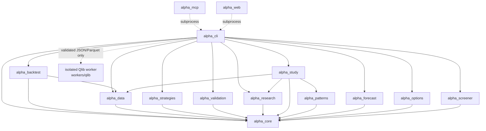
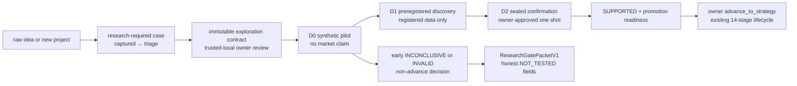
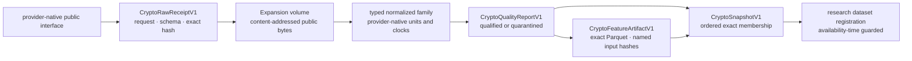
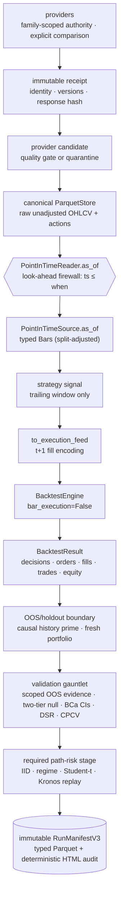
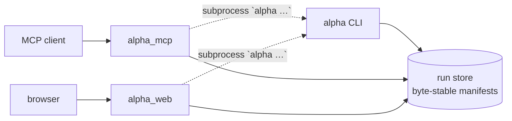
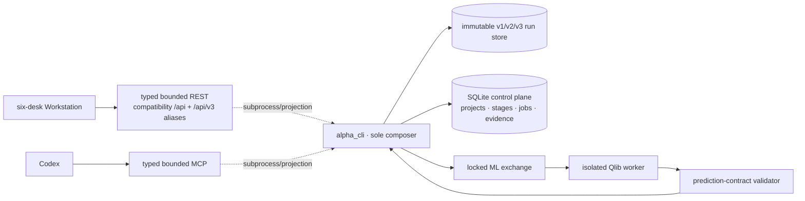
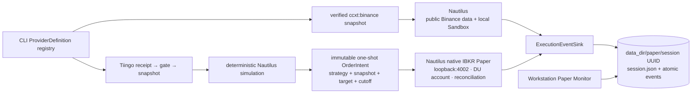

# Project ALPHA — Architecture

**Last reviewed:** 2026-08-21
**Status:** Living (six-screen Workstation and governed D0/D1/D2 research flow implemented;
private single-owner local-device scope; no production or distribution target)
**Companion docs:** [`CLAUDE.md`](../CLAUDE.md) (agent operating manual + module map) · [`docs/superpowers/specs/2026-06-14-project-alpha-v1-design.md`](superpowers/specs/2026-06-14-project-alpha-v1-design.md) (original v1 design) · [Workstation v3 specifications](superpowers/specs/2026-07-19-workstation-v3-chart-artifacts-design.md) · [Research Scientist specification](superpowers/specs/2026-08-06-research-scientist-program-design.md) · [`research/00-SYNTHESIS.md`](../research/00-SYNTHESIS.md) (research synthesis) · [`adr/`](adr/) (decision records)

---

## 1. Purpose & Scope

Project ALPHA is a **private, local, Python** quantitative research platform — point-in-time data, event-driven backtesting, and a heavy-tailed statistical **validation gauntlet**. The platform's value is not a strategy; it is **machinery you can audit**: a backtest is only believable once it survives walk-forward out-of-sample testing, a randomized-price null, bootstrap confidence intervals, the Deflated Sharpe Ratio, and CPCV.

This document is the **current-state architecture reference**: the enforced dependency DAG, each layer's charter, the end-to-end data flow, and the cross-cutting invariants. It is the stable map; the **"why" behind the load-bearing decisions** lives in the linked [ADRs](adr/). It is deliberately *not* a build history — the dated specs and plans under [`docs/superpowers/`](superpowers/) remain the point-in-time record of how the platform was constructed. Audience: an engineer (human or agent) who needs to place a change correctly and not violate the architecture.

## 2. The Layered DAG

The platform is a `uv` workspace of small, strictly-typed `src/`-layout packages. Hard import boundaries are the #1 reliability lever for AI-written code, so the dependency graph is a **DAG enforced as a CI gate**, not a convention. An edge `X → Y` reads "**X may import Y**".


```mermaid
graph TD
    mcp[alpha_mcp]
    web[alpha_web]
    cli[alpha_cli]
    bt[alpha_backtest]
    data[alpha_data]
    strat[alpha_strategies]
    val[alpha_validation]
    research[alpha_research]
    study[alpha_study]
    fc[alpha_forecast]
    opt[alpha_options]
    screen[alpha_screener]
    core[alpha_core]
    qlib["isolated Qlib worker\nworkers/qlib"]

    mcp -. subprocess .-> cli
    web -. subprocess .-> cli
    cli --> bt
    cli --> data
    cli --> strat
    cli --> val
    cli --> research
    cli --> study
    cli --> fc
    cli --> opt
    cli --> screen
    cli --> core
    bt --> data
    bt --> core
    data --> core
    strat --> core
    val --> core
    research --> core
    study --> core
    study --> data
    study --> patterns
    study --> research
    patterns[alpha_patterns] --> core
    fc --> core
    opt --> core
    screen --> core
    cli -. "validated JSON/Parquet only" .-> qlib
```

<details><summary>ASCII fallback</summary>

```
alpha_mcp   alpha_web          surfaces: subprocess `alpha`; public metadata/read seams
     \       /
      alpha_cli               sole composer; may import every package below
      /   |   \
     /    |    +------------ alpha_backtest ---- alpha_data ----+
alpha_strategies  alpha_validation  alpha_research  alpha_study  alpha_forecast  alpha_options  alpha_screener
    \             |                 |               |               |              /
     +------------+-----------------+---------------+---------------+-------------+ -> alpha_core
                                                               imports nothing internal
```
</details>

**The rule:** `alpha_core` ← `alpha_data` ← `alpha_backtest`; `alpha_patterns` depends on `alpha_core`; `alpha_strategies`, `alpha_validation`, `alpha_research`, `alpha_forecast`, `alpha_options`, and `alpha_screener` depend on `alpha_core` only (and only `alpha_cli` may import `alpha_forecast`); `alpha_study` is an additive projection/composition seam over `alpha_core`, `alpha_data`, `alpha_patterns`, and `alpha_research`; `alpha_cli` may import everything; `alpha_mcp` and `alpha_web` sit atop the DAG, depend only on `alpha_core` and supported public `alpha_cli` seams, and **nothing imports them**. Those surface seams cover catalog/run metadata, artifact contracts and bounded run projections, job capacity/durable leases, the paper journal, and governed research-case projections; bounded artifact projection may use Polars. Neither surface imports or executes the engine, gauntlet, Nautilus, Qlib, or Kronos in-process. `alpha_study` owns no canonical contract, persistence, authority, or command. `workers/qlib` is a separate project/process with its own lock; no root package imports it.

**Enforcement:** fifteen `[tool.importlinter]` *forbidden* contracts in the root [`pyproject.toml`](../pyproject.toml) encode these boundaries, including outbound contracts that keep both surfaces free of internal data, strategy, validation, research, engine, and model-package imports and the bidirectional alpha-study seam. They run as the **`Architecture`** step (`uv run lint-imports`) in [`.github/workflows/ci.yml`](../.github/workflows/ci.yml). See **[ADR-0001](adr/0001-strict-layered-dag.md)**.

## 3. Layer Responsibilities

One charter per package; see the **MODULE MAP** in [`CLAUDE.md`](../CLAUDE.md) for the per-module detail (not duplicated here).

| Package | Layer | Charter | May import |
|---|---|---|---|
| `alpha_core` | 0 — domain | Frozen domain types, typed errors/settings, structural protocols including the low-volume operational `ExecutionEventSink`; paper opt-in defaults false. | *(nothing internal)* |
| `alpha_data` | 1 — data | Receipt-backed Tiingo EOD plus family-scoped native crypto ingestion, raw Parquet store, external content-addressed public bulk storage, candidate quality/quarantine/promotion recovery, **point-in-time `as_of` firewall**, corporate-action clocks, and immutable hashed snapshots. CCXT provenance remains venue-qualified and byte-compatible. | `core` |
| `alpha_strategies` | 1 — strategy | Pure trailing-window signals + vol-target sizing + shared Nautilus lifecycle; paper-only no-order history priming, exact intent release, account-state reconciliation, hard risk limits, and venue-increment quantity normalization preserve the SIM path. | `core` |
| `alpha_validation` | 1 — stats | Engine-agnostic numpy/scipy statistics: walk-forward, CPCV, bootstrap CIs, Monte-Carlo nulls, four-family path-risk primitives, DSR/PSR, PBO, prop-firm, reality-check, forecast-skill scores (CRPS/pinball/coverage + baselines), tear sheet. | `core` |
| `alpha_research` | 1 — research | Pure deterministic research primitives: fixed-duration research bars and identity, group-atomic chronological D1/D2/D3 allocation, causal pattern detection, prospective power and confirmation, point-in-time matched event studies, multiplicity control, lineage-bound charts, and terminal gate packets. D1/D2 are admitted only through governed contracts/phases; the package grants no strategy, validation, holdout, paper, or execution authority. | `core` |
| `alpha_study` | 2 — research composition | Empty additive seam for future generic study projections over existing research/control-store authorities. S2 owns metadata only: no canonical contracts, persistence, commands, UI, approvals, D1/D2, promotion, paper, broker, or order authority. | `core`, `data`, `patterns`, `research` |
| `alpha_forecast` | 1 — model | Kronos foundation-model facade: vendored pinned weights code, typed `Forecaster` protocol, per-sample OHLCV paths, deterministic seeding, offline `FakeForecaster`. torch/pandas confined inside; importing the package never imports torch. See [ADR-0008](adr/0008-vendored-kronos-and-alpha-forecast-layer.md). | `core` |
| `alpha_options` | 1 — analytics | Pure Black–Scholes pricing, Greeks, and implied volatility. | `core` |
| `alpha_screener` | 1 — market edge | Typed Finnhub quote/news parsing plus the opt-in API-key-gated network adapter. | `core` |
| `alpha_backtest` | 2 — engine | The `nautilus_trader` run harness: bar→feed encoding (t+1 fills), engine config, instruments, fee model, result schema. | `core`, `data` |
| `alpha_cli` | 3 — compose/control | The **only** operational composition layer. Owns governed D0/D1/D2 research orchestration, v3 run/artifact contracts, the SQLite project/job/evidence/research-governance control plane, isolated-worker exchange validation, provider/system registry, wake-safe Tiingo daily scheduling, Binance Sandbox and native IBKR Paper admission/node assembly, immutable order intents/readiness evidence, and the separate operational paper journal. Engine imports are lazy. | everything in the root DAG |
| `alpha_mcp` | 4 — surface | stdio MCP server whose generated capability matrix records the current bounded tool count and authority. **Subprocesses the `alpha` CLI**, composes nothing, cannot approve/decide research, consume D2, reveal a holdout, or place orders. | `core`, supported public `cli` seams |
| `alpha_web` | 4 — surface | Local FastAPI JSON+SSE backend serving the committed six-screen SPA (Research, Build, Results, Compare, Studios, Operate). It subprocesses CLI actions/projections and serves server-rendered figures plus typed artifact/control records. It never queries SQLite, reconstructs trading evidence, or imports/executes the engine, gauntlet, Nautilus, Qlib, or Kronos in-process. Bounded Polars artifact projection is permitted. | `core`, supported public `cli` seams |
| `workers/qlib` | isolated process | Daily cross-sectional Alpha158-style/LightGBM training with fold-local preprocessing. Accepts an immutable exchange bundle and returns validated close-stamped OOS predictions; models/pickles never cross the boundary. | its own `pyqlib`/LightGBM lock only |

The two surface layers use `alpha_core` settings and supported CLI-owned catalog/run-store,
artifact-contract/run-projection, job-capacity/durable-lease, and paper-store seams. Direct reads
remain bounded; Polars is allowed only for artifact verification/projection. Provider/system,
control-plane, engine/gauntlet/paper-node, Qlib, and Kronos work happens **out-of-process** through
`alpha`. Composition, Nautilus execution, validation, and model stacks therefore never enter a
surface process. See **[ADR-0002](adr/0002-cli-sole-composer-subprocess-surfaces.md)**.

## 4. Data Flow

### 4.1 Governed research-case flow

Every newly created project receives a research-required marker. Both `alpha research capture` and
public `alpha project create` atomically and restart-idempotently capture the idea and enter triage
before strategy construction. The shipped analytical path supports synthetic D0, registered D1
discovery, one-shot sealed D2, and owner disposition. D3 remains unavailable to research; paper
and order authority stay separate.


```mermaid
flowchart LR
    IDEA["raw idea or new project"] --> CASE["research-required case<br/>captured → triage"]
    CASE --> CONTRACT["immutable exploration contract<br/>trusted-local owner review"]
    CONTRACT --> D0["D0 synthetic pilot<br/>no market claim"]
    D0 --> EARLY["early INCONCLUSIVE or INVALID<br/>non-advance decision"]
    D0 --> D1["D1 preregistered discovery<br/>registered data only"]
    D1 --> D2["D2 sealed confirmation<br/>owner-approved one shot"]
    D2 --> READY["SUPPORTED + promotion readiness"]
    READY --> STRATEGY["owner advance_to_strategy<br/>existing 14-stage lifecycle"]
    EARLY --> PACKET["ResearchGatePacketV1<br/>honest NOT_TESTED fields"]
```

Gate-1 D0 completion is not a manifest boolean. The immutable v3 run must contain the exact
canonical hashed `ResearchD0AcceptanceV1` raw measurements, and the control plane mechanically
reruns the frozen detector, null, four-observation D1/D2 and D2/D3 boundary-embargo, and power
criteria before admitting the attempt. Completed-D0 recovery, status/dossier, phase, and terminal
packet reads repeat that verification and compare the SQLite-stored acceptance selector with the
current manifest. Fresh compute also requires the approved code,
dependency-lock, evaluator, and environment fingerprints to match the executable installation.
Before compute, the queued D0 launch and its fixed budget/launch-slot reservation commit atomically
with the `running` event. Reservations are append-only: a hard crash consumes the slot and budget;
the one-to-one terminal-attempt link prevents a completed or failed attempt from debiting twice.

SQLite is the only mutable authority. Dossiers are deterministic projections under
`data_dir/research/projects/<project_id>/`; they are never parsed back into control state. The
default real-data commitment assigns chronologically ordered, indivisible eligible date/session/
dependency groups 60/20/20 to D1/D2/D3. An alternative must be event-blind, owner-approved before
D1, and retain at least 20% in D3. Governed runners consume only their assigned D1 or D2 share;
D3 remains prohibited to research. Pre-launch projects already present when schema v2 migrates are explicitly
grandfathered as migration-only `legacy_import` records; existing post-launch records become
research-required. Normal APIs cannot emit grandfathering. One SQLite writer lock spans the exact
v1 rollback snapshot, additive v1/v2 DDL, and v2 marker commit; an existing backup is accepted only
when its logical schema-and-row fingerprint matches that locked migration source.

### 4.2 Crypto data-house flow

ADR-0032 keeps provider-native datasets separate. Binance owns CEX spot/futures membership and market history;
Bybit owns advanced derivatives/options; CoinGecko owns asset identity and broad reference;
GeckoTerminal owns DEX pools/liquidity/OHLCV; Coin Metrics Community owns a supplemental frozen
catalog plus the reviewed on-chain/network metrics proven by that catalog; Coinbase through CCXT
is an independent comparison. No provider is a universal crypto
price and no fallback changes venue, quote asset, units, frequency, or evidence.


```mermaid
flowchart LR
    P["provider-native public interface"] --> RR["CryptoRawReceiptV1<br/>request · schema · exact hash"]
    RR --> EXT["Expansion volume<br/>content-addressed public bytes"]
    EXT --> N["typed normalized family<br/>provider-native units and clocks"]
    N --> Q["CryptoQualityReportV1<br/>qualified or quarantined"]
    Q --> F["CryptoFeatureArtifactV1<br/>exact Parquet · named input hashes"]
    Q --> S["CryptoSnapshotV1<br/>ordered exact membership"]
    F --> S
    S --> R["research dataset registration<br/>availability-time guarded"]
```

External publication completes before its internal manifest. The configured volume UUID,
writability, and free-space reserve are fail-closed prerequisites. The control database and
manifests stay internal. Asset joins require network plus contract address or an explicitly reviewed
native mapping; ticker-only joins fail. A content-addressed asset-master artifact commits to its
ordered identities and the exact qualified CoinGecko/GeckoTerminal source-manifest IDs. Snapshot
creation and every later verification rederive that version before accepting contract identity;
historical snapshots using the built-in `reviewed-native-v1` label remain byte-compatible. Existing
CCXT snapshots and the `ccxt:binance` paper warmup
path are unchanged. Cursor-based Bybit ranges and complete catalogs freeze each exact response as
its own raw receipt; their one normalized artifact commits to every ordered raw manifest. Bybit
point-in-time executions, books, chains, and catalogs use network completion as the local knowledge
clock while retaining every provider event/engine timestamp separately. High-frequency derivative
executions and books additionally require `CryptoAcquisitionScopeV1`, bound to an existing research
case, its exact pre/post-fetch revision, and a bounded reason. Historical unscoped artifacts remain
readable but fail governed snapshot creation and re-verification. The typed Workstation Crypto
Data Center projects this same catalog, coverage, quality, storage, acquisition, and snapshot seam;
its Guided mode can build, select, verify, and resolve the latest exact contract map without copying
opaque IDs, while Advanced only reveals its hash and receipts. Both modes share identical server
authority. An explicit typed registration
re-verifies every external member before recording the snapshot through the historical research
`snapshot` kind with `snapshot_schema=CryptoSnapshotV1`; proposal preflight still admits it only
when a registered operator declares compatibility.
CoinGecko full-market reference uses ordered 250-row pages through one short terminal page, bounded
to 100 pages. GeckoTerminal top-pool catalogs use exactly five 20-row pages per network. Each page
is a separate immutable raw receipt and the combined normalized catalog preserves that order. The
keyless DEX client paces those requests and applies bounded 429 backoff; failed batches expose a
safe blocker and recovery action while retaining completed task checkpoints.
A `CryptoCoverageProfileV1` freezes the exact qualified Bybit catalog and option-chain manifests
plus exact qualified Binance spot/USD-M/COIN-M membership and Coin Metrics Community catalog
manifests used to derive active venue,
perpetual, option-underlying, and cadence-specific acquisition tasks. Its
membership is content-addressed and bounded to 10,000 tasks; profile inspection is paginated and
the profile itself has no provider, research-gate, paper, or execution authority. Provider requests
run only through an explicitly confirmed cadence batch of at most 25 tasks. Each batch freezes its
exact profile slice and knowledge time in an immutable content-addressed plan, atomically checkpoints
each successful normalized manifest, re-verifies all source manifests on execution or resume, and
retries only unfinished membership. A completed resume is offline and idempotent.
The typed Workstation projects those profiles as filtered, human-readable cadence pages and launches
only an explicitly confirmed page of at most 25 tasks. Failed checkpoints alone are resumable.
Prior-day Binance liquidity membership and one-minute research selections use the same server
contracts as the CLI; the latter is bound to a fresh research-case revision and paginated daily
membership, while stale async pages are discarded.
Binance daily tasks cover every active spot/perpetual identity and deterministically request only
the previous complete UTC day. Dated, future-launched, inactive, and duplicate membership fails or
is excluded before task construction; Unicode provider symbols retain exact identity. A
`binance-liquidity-membership` derived artifact is available only when an exact category/quote scope
has complete qualified prior-day observations. It commits to all universe inputs, ranks at most 250
without mixing USD/USDT or contract units, and supplies the following profile's one-hour tasks.
An explicit `binance-research-selection` artifact separately binds at most 50 one-minute markets to
one current research-case revision and reason. Only exact daily-profile identities are selectable;
the case is checked before and after receipt publication. It is scheduling provenance, not evidence
approval or execution authority.
Coinbase comparison bars are acquired through the existing venue-qualified CCXT seam at exact
1m/5m/1h/1d intervals. Bybit spot bars may be stored only as diagnostics and fail snapshot authority
checks. A derived market-comparison artifact commits to the authoritative Binance input, every
independent input hash, the exact quote/frequency identity, and mechanical thresholds; it never
rewrites or substitutes the primary dataset.
Funding, open-interest change, basis, volatility-surface, DEX-liquidity, and on-chain-change
features are immutable derived Parquet artifacts. Their content-addressed manifests bind the
ordered input manifest IDs by name, each reverified normalized artifact hash, the causal
availability time, and the feature method version. CLI, REST, and the Guided Workstation accept
only complete compatible qualified selections; listing or reading a feature re-hashes its bytes
and complete source lineage. Features remain research inputs beside an exact snapshot and grant no
research-gate or execution authority.
Storage inventory and verification expose counts and hashes without private absolute paths.
Cleanup is confined to `bulk/cache`, requires an explicit confirmation, and reports zero immutable
artifacts removed; staging, raw, normalized, snapshot, manifest, and control roots are excluded.

ADR-0033 adds one explicit research edge to this data flow. The
`bybit_btcusdt_crowding_reversal_v1` proposal is available only for an exact qualified Bybit linear
BTCUSDT/USDT snapshot containing funding, hourly OI, premium, mark, index, derivative bars, and the
instrument catalog. `alpha_research` owns the versioned point-in-time event/outcome evaluation;
`alpha_cli` only re-verifies and composes the snapshot. The existing group-atomic D1/D2/D3
boundary, one-shot D2, owner actions, and prohibited D3 read do not change. A later
`hedged_basis_crowding_v1` candidate may inherit a supported research disposition into strategy
development, but it remains a two-venue standalone sandbox whose paper preflight is mechanically
blocked and whose outputs cannot become broker evidence.

### 4.3 Canonical strategy/validation flow

The canonical strategy loop runs from raw bars to an immutable v3 artifact bundle. Discovery runs execute from
their declared start; OOS and final-holdout evidence instead use the fresh-state boundary shown
below so an in-sample portfolio can never leak into scored execution:


```mermaid
flowchart TD
    A["providers<br/>family-scoped authority · explicit comparison"] --> R["immutable receipt<br/>identity · versions · response hash"]
    R --> Q["provider candidate<br/>quality gate or quarantine"]
    Q --> B["canonical ParquetStore<br/>raw unadjusted OHLCV + actions"]
    B --> C{{"PointInTimeReader.as_of<br/>look-ahead firewall: ts ≤ when"}}
    C --> D["PointInTimeSource.as_of<br/>typed Bars (split-adjusted)"]
    D --> E["strategy signal<br/>trailing window only"]
    E --> F["to_execution_feed<br/>t+1 fill encoding"]
    F --> G["BacktestEngine<br/>bar_execution=False"]
    G --> H["BacktestResult<br/>decisions · orders · fills · trades · equity"]
    H --> PRIME["OOS/holdout boundary<br/>causal history prime · fresh portfolio"]
    PRIME --> I["validation gauntlet<br/>scoped OOS evidence · two-tier null · BCa CIs · DSR · CPCV"]
    I --> MC["required path-risk stage<br/>IID · regime · Student-t · Kronos replay"]
    MC --> J[("immutable RunManifestV3<br/>typed Parquet + deterministic HTML audit")]
```

<details><summary>ASCII fallback</summary>

```
providers (family-scoped authority; explicit non-substituting comparison)
   → immutable response receipt + dataset identity
   → provider candidate → quality gate/quarantine
   → canonical ParquetStore (raw, unadjusted OHLCV + corporate actions)
   → PointInTimeReader.as_of   ── look-ahead firewall: filter ts ≤ when ──┐
   → PointInTimeSource.as_of   ── typed Bars, split-adjusted              │ strategies read ONLY here
   → strategy signal           ── trailing-window only (no peek)          ┘
   → to_execution_feed         ── decide close(t), fill open(t+1)
   → BacktestEngine            ── bar_execution=False (quotes fill, bars decide)
   → BacktestResult            ── decisions/orders/fills/trades + mark-to-market equity
   → OOS/holdout boundary      ── prime prior history without orders; start a fresh portfolio
   → validation gauntlet       ── metrics + causal evidence from the same scoped OOS execution
   → required path-risk Monte Carlo ── IID/regime/Student-t + Kronos engine replay
   → immutable v3 manifest + typed parquet + deterministic HTML audit
```
</details>

Two firewalls govern correctness end-to-end: the **PIT `as_of` seam** (no strategy ever sees a future bar — **[ADR-0005](adr/0005-point-in-time-firewall.md)**) and the **t+1 fill encoding** (a decision on the close of `t` can only fill at the open of `t+1` — **[ADR-0003](adr/0003-t+1-fill-encoding.md)**). The gauntlet's headline gate is a **two-tier null** that the observed result must beat in *both* tiers — **[ADR-0006](adr/0006-two-tier-null-model.md)**.

QuantPad currently sits outside this canonical flow: Codex uses its OAuth MCP server only for
symbol/schema/coverage discovery and bounded previews, while bulk historical bars/ticks/L1/L2 use
the official REST/Python API. Those downloads remain research scratch input until they enter the
same receipt → candidate → quality/quarantine path through a tested adapter. They cannot directly
feed strategies, snapshots, charts, or paper intents. See **[ADR-0018](adr/0018-quantpad-external-research-data-boundary.md)**.

The two surfaces wrap this same loop without re-implementing it:


```mermaid
flowchart LR
    U1[MCP client] --> M[alpha_mcp]
    U2[browser] --> W[alpha_web]
    M -. "subprocess `alpha …`" .-> CLI[alpha CLI]
    W -. "subprocess `alpha …`" .-> CLI
    CLI --> ST[("run store<br/>byte-stable manifests")]
    M --> ST
    W --> ST
```

<details><summary>ASCII fallback</summary>

```
MCP client ─▶ alpha_mcp ─┐
                         ├─ subprocess `alpha …` ─▶ alpha CLI ─▶ run store (byte-stable manifests)
browser    ─▶ alpha_web ─┘                                            ▲
            alpha_mcp / alpha_web read artifacts back from ───────────┘
```
</details>

Workstation v3 adds two CLI-owned planes without changing that composition rule:


```mermaid
flowchart LR
    UI["six-desk Workstation"] --> REST["typed bounded REST<br/>compatibility /api + /api/v3 aliases"]
    AGENT["Codex"] --> MCP["typed bounded MCP"]
    REST -. "subprocess/projection" .-> CLI["alpha_cli · sole composer"]
    MCP -. "subprocess/projection" .-> CLI
    CLI --> RUNS[("immutable v1/v2/v3 run store")]
    CLI --> CONTROL[("SQLite control plane\nprojects · stages · jobs · evidence")]
    CLI --> INPUT["locked ML exchange"]
    INPUT --> WORKER["isolated Qlib worker"]
    WORKER --> VALIDATE["prediction-contract validator"]
    VALIDATE --> CLI
```

The web process never queries the control database directly. Qlib receives only immutable
snapshot/fold/config inputs; only validated JSON/Parquet predictions return. Daily panel rows and
predictions are available at the canonical close (`session_ts + 23h`), not at session midnight.
ALPHA then performs one synchronized, costed, long-only multi-asset replay across the frozen
universe. Its canonical engine metrics and causal artifacts are authoritative for that replay;
Qlib diagnostics are not. It is not a full counterfactual gauntlet because randomized paths do not
yet trigger fold-by-fold model retraining.

The job journal and the operating process remain separate authorities. Direct heavyweight children
launched by the Workstation or MCP own isolated process groups and an independent five-second
heartbeat/cancellation lease (the supported interval is capped at ten seconds). A failed renewal or
audited cancellation stops the child group with TERM, a bounded grace period, then KILL if needed,
and reaps the direct child. The Workstation reports exact elapsed/current-operation/output state;
same-session ETA is indeterminate until a comparable successful command supplies a median.
UI-launched heavyweight children run at reduced OS scheduling priority to favor desk input without
changing analytical commands. Lease liveness follows the whole process group, so heartbeats continue
when a leader exits while a descendant still runs or retains a pipe. Constructor, selector, lease-
thread, and output-pump initialization all sit behind verified group cleanup; cleanup failure keeps
the journal nonterminal and the shared slot reserved. The lease owns the failure/cancellation
journal callback, and the caller stops and joins its loop before publishing any subsequent terminal
state. Suite workers provide the equivalent five-second heartbeat/cancellation polling and process-
group reaping around each step.
Stale-heartbeat reconciliation changes the journal only
after an interruption is confirmed and never treats a persisted PID as authority. If the owning
surface itself crashes, an operating-system child may survive: reconciliation cannot prove that
orphan is dead or that physical heavyweight capacity is free, so an operator must confirm/reap it
before reconciling and relaunching. There is intentionally no automatic PID recovery.

The operational paper plane deliberately shares strategy code but not research identity. Crypto
retains public Binance data with local Sandbox execution; equities consume only scheduler-issued
Tiingo snapshot intents through native IBKR Paper:


```mermaid
flowchart LR
    REG["CLI ProviderDefinition registry"] --> CRYPTO["verified ccxt:binance snapshot"]
    CRYPTO --> BINANCE["Nautilus<br/>public Binance data + local Sandbox"]
    REG --> TIINGO["Tiingo receipt → gate → snapshot"]
    TIINGO --> SIM["deterministic Nautilus simulation"]
    SIM --> INTENT["immutable one-shot OrderIntent<br/>strategy + snapshot + target + cutoff"]
    INTENT --> IB["Nautilus native IBKR Paper<br/>loopback:4002 · DU account · reconciliation"]
    BINANCE --> SINK["ExecutionEventSink"]
    IB --> SINK
    SINK --> PAPER[("data_dir/paper/session UUID<br/>session.json + atomic events")]
    WEB["Workstation Paper Monitor"] --> PAPER
```

Binance admission requires `ALPHA_PAPER_ENABLED=true`, a supported rule strategy, and an immutable
same-symbol `ccxt:binance` snapshot; only public data and local Nautilus Sandbox execution exist.
IBKR admission additionally requires a qualified Tiingo snapshot, exact unexpired scheduler intent,
both paper enable flags, loopback paper port 4002, a digest-pinned gateway, a `DU…` account,
instrument/client-ID allowlists, a quote no older than five seconds, and exact account/journal
reconciliation. An atomic release claim makes the intent hash one-shot across process restarts; the
same hash is journaled before submission and becomes the broker client-order ID. Reconciled
overnight units seed the strategy's target delta rather than assuming a flat account.
Safe stop cancels ALPHA DAY orders and never flattens. Mutable UUID/PID/heartbeat/event state never
enters `RUN_DIRS`, `RunSpec`, run hashing, or strategy-validation evidence. See
[ADR-0012](adr/0012-operational-paper-sessions.md) and
[ADR-0017](adr/0017-authoritative-daily-data-and-broker-paper-boundary.md).

## 5. Cross-cutting Invariants

These hold across every layer; the [golden rules in `CLAUDE.md`](../CLAUDE.md) are authoritative — summarized here with their governing ADR.

- **No look-ahead, ever.** Strategies/backtests read data only through the point-in-time `as_of` accessor; every data/strategy unit gets a `@pytest.mark.bias_guard` future-poison test. → [ADR-0005](adr/0005-point-in-time-firewall.md)
- **Execution realism.** Decide on close of bar `t`, fill at open of `t+1`, modeled in the feed (not assumed away). → [ADR-0003](adr/0003-t+1-fill-encoding.md)
- **Two-clock corporate actions.** Knowledge time gates visibility; ex-date gates split application; dividends are decoupled cash events. → [ADR-0004](adr/0004-two-clock-corporate-actions.md)
- **Determinism and immutability.** V3 identity hashes normalized config, snapshot, seed, and strategy execution/source fingerprint. Semantic seed namespaces make results independent of family ordering. Completed directories are immutable and every artifact hash/size/row count is manifest-pinned. → [ADR-0007](adr/0007-deterministic-run-id-and-seeds.md), [ADR-0013](adr/0013-run-identity-v3-and-causal-artifacts.md)
- **Fail loud.** No empty `except`; raise/propagate typed `AlphaError`/`DataError`/`LookAheadError` with context on gaps, NaN/inf, disorder, or degenerate stats.
- **TDD + strong typing.** Failing test → minimal code → green → atomic conventional commit. `mypy --strict` is a CI gate (with documented third-party overrides: `nautilus_trader.*`, `scipy.*`, `quantstats_lumi.*`, and the vendored `alpha_forecast._vendor.*`).
- **Polars by default.** Polars is the dataframe; pandas appears *only* at three sanctioned vendor/library edges — the yfinance adapter/parser (`alpha_data.adapters.yfinance_adapter`), tear-sheet renderer (`alpha_validation.tearsheet`), and Kronos facade (`alpha_forecast.kronos`); numpy/scipy are sanctioned in the validation and pure research numeric layers, deterministic Matplotlib rendering is sanctioned in `alpha_research`, and numpy/torch also live inside `alpha_forecast` (never at its public seam).
- **Model leakage is labeled, never silent.** Pretrained-forecaster runs record `pretrain` overlap vs the assumed training cutoff, warn loudly, and split eval metrics pre/post cutoff. → [ADR-0009](adr/0009-forecast-leakage-and-tier2-cost-policy.md)
- **Model weights are local and machine-scoped.** The Kronos cache path and offline-only switch never enter run ids or manifests; missing offline weights fail loudly before network access. → [ADR-0010](adr/0010-local-kronos-weights-offline-policy.md)
- **External integrations are evidence-gated.** A repository recommendation is not an adoption decision; every new integration must prove a missing capability, boundary fit, maintenance and license posture, deterministic behavior, and a replacement path. → [ADR-0011](adr/0011-evidence-gated-external-integrations.md)
- **Operational sessions are not research runs.** Paper sessions use UUIDs, clocks, heartbeats, and an operational event journal outside deterministic `RUN_DIRS`; they never become validation evidence or alter a research `run_id`. → [ADR-0012](adr/0012-operational-paper-sessions.md)
- **Vendor bytes qualify before strategy visibility.** Tiingo daily responses become immutable receipts and candidates; only the configured authority can auto-promote after every critical check, and no comparison feed can silently replace it. → [ADR-0017](adr/0017-authoritative-daily-data-and-broker-paper-boundary.md)
- **QuantPad discovery and bulk payloads are separate.** MCP is for bounded discovery/previews; the official API/SDK is for bulk historical research. Neither becomes canonical or paper-authoritative without receipt-backed qualification. → [ADR-0018](adr/0018-quantpad-external-research-data-boundary.md)
- **Development state is external lineage.** Mutable projects, stages, attempts, sealed holdouts, jobs, and decisions are atomic CLI-owned SQLite records; immutable manifests are never edited to attach workflow state. Append-only project-scope selection events support point-in-time AgentBrief projections. Direct and suite Qlib/Kronos launches share one transactional capacity class. → [ADR-0014](adr/0014-cli-owned-development-control-plane.md)
- **Null evidence and path risk answer different questions.** The required `monte_carlo` stage follows randomized-price robustness and independently reports IID empirical, causal regime Markov, Student-t, and Kronos full-engine paths. No majority vote exists; warnings require an exact-hash CLI-only owner disposition. → [ADR-0029](adr/0029-four-family-monte-carlo-validation.md)
- **Evidence is cited, revisioned, and time-aware.** Agent findings begin as drafts and must name exact run/artifact/field selectors; supplied experiment/version links must match the immutable lineage. As-of AgentBrief reads filter version/experiment scope, stages, run links, holdout audit, and evidence to the requested cutoff; no opaque vector memory is authoritative. → [ADR-0015](adr/0015-evidence-ledger-not-agent-memory.md)
- **Qlib is isolated; ALPHA replay is authoritative.** The root runtime never imports Qlib/LightGBM or deserializes models. Fold-local, close-stamped predictions must pass strict contract and future-leakage validation before synchronized canonical replay. Qlib diagnostics remain advisory, and replay is labeled model-not-recomputed until a counterfactual retraining design exists. → [ADR-0016](adr/0016-isolated-qlib-worker.md)
- **Research is upstream and finite.** Fresh projects automatically receive a governed Research Case; no strategy version can bypass its approved confirmation contract, mechanical readiness, and owner-advance link. D0 is synthetic; D1 is registered discovery; D2 is one-shot confirmation; D3 remains prohibited to research. Migrated pre-launch projects alone retain explicit grandfathered compatibility. → [ADR-0019](adr/0019-governed-research-cases-before-strategy-development.md), [ADR-0027](adr/0027-tiered-research-readiness-semantics.md)
- **Owner presence is authenticated per research action.** The closed research-lifecycle UI action set requires a fresh, one-use Touch ID assertion bound to exact origin, RP, action, project, artifact hash, case revision, consequence, and reason. The verified credential determines the actor. MCP and generic jobs cannot obtain challenges or credentials; trusted CLI is the separately audited enrollment/recovery path. This grants no holdout, paper, broker, order, or research-gate-override authority. → [ADR-0030](adr/0030-touch-id-owner-presence-for-research-actions.md)
- **Intraday research cannot inherit daily authority.** Gate 1 uses only synthetic fixed-duration proxy bars. There is no qualified real intraday adapter, and research bars/results cannot enter daily snapshots, validation, holdout, paper, or orders. → [ADR-0020](adr/0020-intraday-event-research-is-not-daily-validation-evidence.md)
- **Surface state is bounded and recoverable.** REST publishes an explicit contract version and endpoint limits; chart windows filter bars and every linked evidence series together; figures report downsampling bounds; the fixed six-screen shell mounts only visible panels; direct and suite durable jobs rehydrate, expose failure, and use owner-driven heartbeat/cancellation/reconciliation rather than raw PID authority. Journal recovery alone does not prove an orphan child has stopped.
- **Paper authority is narrow and never live capital.** Crypto execution is local Sandbox only. IBKR is paper-account only and consumes an exact immutable intent after reconciliation, dual flags, fresh quote, and cutoff checks. Futures remain connectivity probes, not research. Kronos has no live-paper support without a separately approved causal cache.
- **Private local use only.** Distribution-only release gates are out of scope. Preserve dependency notices and provider/data terms; reopen distribution governance only if the owner explicitly changes this scope.

## 6. Key Decisions (ADR index)

| ADR | Decision | Status |
|---|---|---|
| [0001](adr/0001-strict-layered-dag.md) | Strict layered DAG enforced by `import-linter` (not convention) | Accepted |
| [0003](adr/0003-t+1-fill-encoding.md) | t+1 fills via a dual-event feed (`QuoteTick` at open + close-stamped decision `Bar`) | Accepted |
| [0004](adr/0004-two-clock-corporate-actions.md) | Two-clock corporate actions; dividends decoupled as cash, never folded into prices | Accepted |
| [0005](adr/0005-point-in-time-firewall.md) | A single point-in-time `as_of` firewall, guarded by future-poison tests | Accepted |
| [0006](adr/0006-two-tier-null-model.md) | Two-tier null (returns-level surrogate + full-engine synthetic OHLCV); both must pass | Accepted |
| [0007](adr/0007-deterministic-run-id-and-seeds.md) | Historical v1/v2 content IDs + positional child seeds | Superseded by 0013 for v3 |
| [0008](adr/0008-vendored-kronos-and-alpha-forecast-layer.md) | Vendored Kronos model behind a layer-1 `alpha_forecast` facade | Accepted |
| [0009](adr/0009-forecast-leakage-and-tier2-cost-policy.md) | Pretrain-leakage policy + cache-first engine integration for model strategies | Accepted |
| [0010](adr/0010-local-kronos-weights-offline-policy.md) | Local Kronos weights and code-wired offline loading policy | Accepted |
| [0011](adr/0011-evidence-gated-external-integrations.md) | Evidence-gated adoption of external integrations | Accepted |
| [0012](adr/0012-operational-paper-sessions.md) | Operational paper sessions remain separate from deterministic research runs | Accepted |
| [0013](adr/0013-run-identity-v3-and-causal-artifacts.md) | V3 execution fingerprints, semantic seeds, immutable artifact contracts, and causal chart traces | Accepted |
| [0014](adr/0014-cli-owned-development-control-plane.md) | SQLite project/stage/job/holdout state is CLI-owned external lineage | Accepted |
| [0015](adr/0015-evidence-ledger-not-agent-memory.md) | Append-only cited evidence replaces opaque agent memory | Accepted |
| [0016](adr/0016-isolated-qlib-worker.md) | Qlib/LightGBM remain in a separately locked process with validated prediction exchange | Accepted |
| [0017](adr/0017-authoritative-daily-data-and-broker-paper-boundary.md) | Qualify authoritative daily data before releasing broker-paper intents | Accepted |
| [0018](adr/0018-quantpad-external-research-data-boundary.md) | Separate QuantPad MCP discovery from API/SDK bulk research data | Accepted |
| [0019](adr/0019-governed-research-cases-before-strategy-development.md) | Govern finite research cases before strategy development | Accepted |
| [0020](adr/0020-intraday-event-research-is-not-daily-validation-evidence.md) | Keep intraday event research outside daily validation and paper evidence | Accepted |
| [0021](adr/0021-research-workstation-read-plane-and-command-center.md) | Research workstation read plane | Accepted |
| [0022](adr/0022-codex-collaboration-surface.md) | Structured Codex collaboration surface | Accepted |
| [0023](adr/0023-research-dataset-registration-and-quantpad-lane.md) | Registered research datasets and QuantPad lane | Accepted |
| [0024](adr/0024-literature-acquisition-worker-and-claim-model.md) | Isolated literature acquisition and claim evidence | Accepted |
| [0025](adr/0025-empirical-d1-research-runner-admission.md) | Governed empirical D1 admission | Accepted |
| [0026](adr/0026-d2-confirmation-readiness-gate-promotion-override.md) | One-shot D2, promotion, and exploratory override | Accepted |
| [0027](adr/0027-tiered-research-readiness-semantics.md) | Python-authoritative tiered readiness | Accepted |
| [0028](adr/0028-governed-market-state-and-model-candidates.md) | Governed market-state and model candidates | Accepted |
| [0029](adr/0029-four-family-monte-carlo-validation.md) | Required four-family Monte Carlo path-risk validation | Accepted |
| [0030](adr/0030-touch-id-owner-presence-for-research-actions.md) | Per-action Touch ID for closed research-lifecycle authority | Accepted |
| [0031](adr/0031-provider-readiness-and-paper-acceptance-v2.md) | Receipted provider readiness and mechanically reverified paper acceptance | Accepted |

## 7. References

- [`CLAUDE.md`](../CLAUDE.md) — agent operating manual, golden rules, CLI surface, full module map.
- [`docs/superpowers/specs/2026-06-14-project-alpha-v1-design.md`](superpowers/specs/2026-06-14-project-alpha-v1-design.md) — the original v1 design spec (pre-build).
- [`research/00-SYNTHESIS.md`](../research/00-SYNTHESIS.md) — consolidated research synthesis + decision table.
- [`research/07-architecture-ai-workflow.md`](../research/07-architecture-ai-workflow.md) — repo layout, tooling, and AI build-workflow rationale.
- [`audit/2026-07-19-post-v2-architecture-audit.md`](audit/2026-07-19-post-v2-architecture-audit.md) — post-v2 capability/gap audit and track decision.
- [`superpowers/specs/2026-07-19-provider-control-plane-crypto-paper-design.md`](superpowers/specs/2026-07-19-provider-control-plane-crypto-paper-design.md) — approved Recommended-track implementation contract.
- [`superpowers/specs/2026-08-03-daily-data-ibkr-paper-hardening.md`](superpowers/specs/2026-08-03-daily-data-ibkr-paper-hardening.md) — implemented Tiingo qualification, scheduler, and IBKR Paper safety boundary.
- [`superpowers/specs/2026-07-19-workstation-v3-chart-artifacts-design.md`](superpowers/specs/2026-07-19-workstation-v3-chart-artifacts-design.md) — professional workstation, causal chart, and native analytics contract.
- [`superpowers/specs/2026-07-19-workstation-v3-development-control-plane-design.md`](superpowers/specs/2026-07-19-workstation-v3-development-control-plane-design.md) — durable lifecycle, suites, jobs, and sealed-holdout contract.
- [`superpowers/specs/2026-07-19-workstation-v3-evidence-agent-design.md`](superpowers/specs/2026-07-19-workstation-v3-evidence-agent-design.md) — cited evidence ledger and bounded agent interface contract.
- [`superpowers/specs/2026-07-19-workstation-v3-qlib-worker-design.md`](superpowers/specs/2026-07-19-workstation-v3-qlib-worker-design.md) — isolated Qlib exchange and replay contract.
- [`superpowers/specs/2026-08-06-research-scientist-program-design.md`](superpowers/specs/2026-08-06-research-scientist-program-design.md) — finite Research Case, evidence-firewall, and owner-workflow contract.
- [`superpowers/specs/2026-08-12-four-family-monte-carlo-validation.md`](superpowers/specs/2026-08-12-four-family-monte-carlo-validation.md) — required four-family path-risk stage, immutable evidence, and owner-review contract.
- [`governance/2026-07-19-dependency-license-matrix.md`](governance/2026-07-19-dependency-license-matrix.md) — direct dependency and upstream-candidate license disposition.
- [`governance/2026-07-19-post-v2-risk-register.md`](governance/2026-07-19-post-v2-risk-register.md) — live risk ownership and acceptance evidence.
