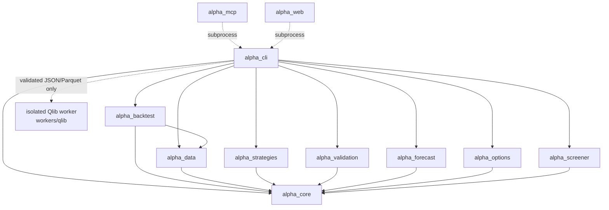
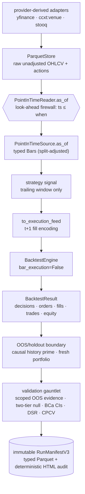
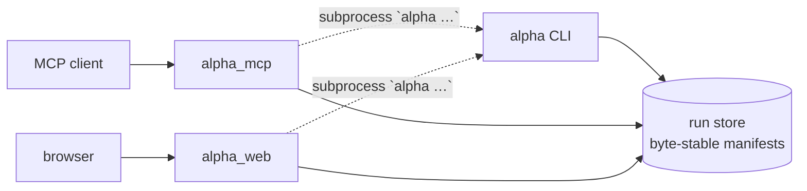
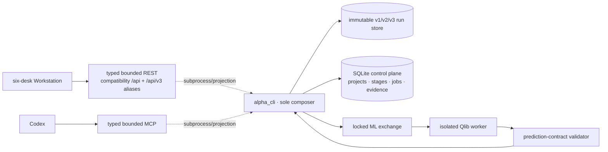
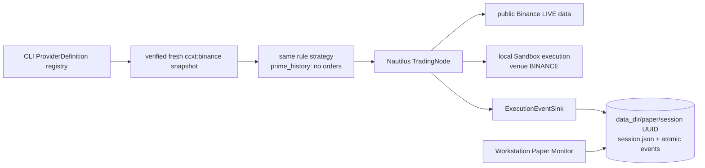

# Project ALPHA — Architecture

**Last reviewed:** 2026-07-19
**Status:** Living (Workstation v3 implemented; offline release gate passed)
**Companion docs:** [`CLAUDE.md`](../CLAUDE.md) (agent operating manual + module map) · [`docs/superpowers/specs/2026-06-14-project-alpha-v1-design.md`](superpowers/specs/2026-06-14-project-alpha-v1-design.md) (original v1 design) · [Workstation v3 specifications](superpowers/specs/2026-07-19-workstation-v3-chart-artifacts-design.md) · [`research/00-SYNTHESIS.md`](../research/00-SYNTHESIS.md) (research synthesis) · [`adr/`](adr/) (decision records)

---

## 1. Purpose & Scope

Project ALPHA is a **$0, institutional-grade, Python** quantitative research platform — point-in-time data, event-driven backtesting, and a heavy-tailed statistical **validation gauntlet** — written and operated entirely by AI agents. The platform's value is not a strategy; it is **machinery you can trust**: a backtest is only believable once it survives walk-forward out-of-sample testing, a randomized-price null, bootstrap confidence intervals, the Deflated Sharpe Ratio, and CPCV.

This document is the **current-state architecture reference**: the enforced dependency DAG, each layer's charter, the end-to-end data flow, and the cross-cutting invariants. It is the stable map; the **"why" behind the load-bearing decisions** lives in the linked [ADRs](adr/). It is deliberately *not* a build history — the dated specs and plans under [`docs/superpowers/`](superpowers/) remain the point-in-time record of how the platform was constructed. Audience: an engineer (human or agent) who needs to place a change correctly and not violate the architecture.

## 2. The Layered DAG

The platform is a `uv` workspace of small, strictly-typed `src/`-layout packages. Hard import boundaries are the #1 reliability lever for AI-written code, so the dependency graph is a **DAG enforced as a CI gate**, not a convention. An edge `X → Y` reads "**X may import Y**".


```mermaid
graph TD
    mcp[alpha_mcp]
    web[alpha_web]
    cli[alpha_cli]
    bt[alpha_backtest]
    data[alpha_data]
    strat[alpha_strategies]
    val[alpha_validation]
    fc[alpha_forecast]
    opt[alpha_options]
    screen[alpha_screener]
    core[alpha_core]
    qlib["isolated Qlib worker\nworkers/qlib"]

    mcp -. subprocess .-> cli
    web -. subprocess .-> cli
    cli --> bt
    cli --> data
    cli --> strat
    cli --> val
    cli --> fc
    cli --> opt
    cli --> screen
    cli --> core
    bt --> data
    bt --> core
    data --> core
    strat --> core
    val --> core
    fc --> core
    opt --> core
    screen --> core
    cli -. "validated JSON/Parquet only" .-> qlib
```

<details><summary>ASCII fallback</summary>

```
alpha_mcp   alpha_web          surfaces: subprocess `alpha`; public metadata/read seams
     \       /
      alpha_cli               sole composer; may import every package below
      /   |   \
     /    |    +------------ alpha_backtest ---- alpha_data ----+
alpha_strategies  alpha_validation  alpha_forecast  alpha_options  alpha_screener
    \             |                 |               |              /
     +------------+-----------------+---------------+-------------+ -> alpha_core
                                                               imports nothing internal
```
</details>

**The rule:** `alpha_core` ← `alpha_data` ← `alpha_backtest`; `alpha_strategies`, `alpha_validation`, `alpha_forecast`, `alpha_options`, and `alpha_screener` depend on `alpha_core` only (and only `alpha_cli` may import `alpha_forecast`); `alpha_cli` may import everything; `alpha_mcp` and `alpha_web` sit atop the DAG, depend only on `alpha_core` and supported public `alpha_cli` seams, and **nothing imports them**. Those surface seams cover catalog/run metadata, artifact contracts and bounded run projections, job capacity/durable leases, and the paper journal; bounded artifact projection may use Polars. Neither surface imports or executes the engine, gauntlet, Nautilus, Qlib, or Kronos in-process. `workers/qlib` is a separate project/process with its own lock; no root package imports it.

**Enforcement:** twelve `[tool.importlinter]` *forbidden* contracts in the root [`pyproject.toml`](../pyproject.toml) encode these boundaries, including outbound contracts that keep both surfaces free of internal data, strategy, validation, engine, and model-package imports. They run as the **`Architecture`** step (`uv run lint-imports`) in [`.github/workflows/ci.yml`](../.github/workflows/ci.yml). See **[ADR-0001](adr/0001-strict-layered-dag.md)**.

## 3. Layer Responsibilities

One charter per package; see the **MODULE MAP** in [`CLAUDE.md`](../CLAUDE.md) for the per-module detail (not duplicated here).

| Package | Layer | Charter | May import |
|---|---|---|---|
| `alpha_core` | 0 — domain | Frozen domain types, typed errors/settings, structural protocols including the low-volume operational `ExecutionEventSink`; paper opt-in defaults false. | *(nothing internal)* |
| `alpha_data` | 1 — data | Ingestion adapters, raw Parquet store, **point-in-time `as_of` firewall**, corporate-action clocks, immutable hashed snapshots; CCXT pull provenance is venue-qualified, persisted per symbol, and copied into hashed snapshot sidecars so exchanges cannot be relabelled. | `core` |
| `alpha_strategies` | 1 — strategy | Pure trailing-window signals + vol-target sizing + shared Nautilus lifecycle; paper-only no-order history priming and venue-increment quantity normalization preserve the SIM path. | `core` |
| `alpha_validation` | 1 — stats | Engine-agnostic numpy/scipy statistics: walk-forward, CPCV, bootstrap CIs, Monte-Carlo nulls, DSR/PSR, PBO, prop-firm, reality-check, forecast-skill scores (CRPS/pinball/coverage + baselines), tear sheet. | `core` |
| `alpha_forecast` | 1 — model | Kronos foundation-model facade: vendored pinned weights code, typed `Forecaster` protocol, per-sample OHLCV paths, deterministic seeding, offline `FakeForecaster`. torch/pandas confined inside; importing the package never imports torch. See [ADR-0008](adr/0008-vendored-kronos-and-alpha-forecast-layer.md). | `core` |
| `alpha_options` | 1 — analytics | Pure Black–Scholes pricing, Greeks, and implied volatility. | `core` |
| `alpha_screener` | 1 — market edge | Typed Finnhub quote/news parsing plus the opt-in API-key-gated network adapter. | `core` |
| `alpha_backtest` | 2 — engine | The `nautilus_trader` run harness: bar→feed encoding (t+1 fills), engine config, instruments, fee model, result schema. | `core`, `data` |
| `alpha_cli` | 3 — compose/control | The **only** composition layer. Owns deterministic research orchestration, v3 run/artifact contracts, the SQLite project/job/evidence control plane, isolated-worker exchange validation, provider/system registry, verified Binance paper admission/node assembly, and the separate public operational paper journal. Engine imports are lazy. | everything in the root DAG |
| `alpha_mcp` | 4 — surface | stdio MCP server exposing 42 bounded tools: 12 retained generic tools plus 30 typed v3 resources/actions for projects, stages, durable job/suite cancellation and reconciliation, evidence, charts/comparisons, and ML planning/launch. Retained deprecated action options use closed, bounded per-tool vocabularies. **Subprocesses the `alpha` CLI**, composes nothing, cannot reveal a holdout or place orders. | `core`, supported public `cli` seams |
| `alpha_web` | 4 — surface | Local FastAPI JSON+SSE backend serving the committed six-desk SPA. Subprocesses CLI actions/projections and renders typed artifacts/control records; it never queries SQLite, reconstructs trading evidence, or imports/executes the engine, gauntlet, Nautilus, Qlib, or Kronos in-process. Bounded Polars artifact projection is permitted. | `core`, supported public `cli` seams |
| `workers/qlib` | isolated process | Daily cross-sectional Alpha158-style/LightGBM training with fold-local preprocessing. Accepts an immutable exchange bundle and returns validated close-stamped OOS predictions; models/pickles never cross the boundary. | its own `pyqlib`/LightGBM lock only |

The two surface layers use `alpha_core` settings and supported CLI-owned catalog/run-store,
artifact-contract/run-projection, job-capacity/durable-lease, and paper-store seams. Direct reads
remain bounded; Polars is allowed only for artifact verification/projection. Provider/system,
control-plane, engine/gauntlet/paper-node, Qlib, and Kronos work happens **out-of-process** through
`alpha`. Composition, Nautilus execution, validation, and model stacks therefore never enter a
surface process. See **[ADR-0002](adr/0002-cli-sole-composer-subprocess-surfaces.md)**.

## 4. Data Flow

The research loop, from raw bars to an immutable v3 artifact bundle. Discovery runs execute from
their declared start; OOS and final-holdout evidence instead use the fresh-state boundary shown
below so an in-sample portfolio can never leak into scored execution:


```mermaid
flowchart TD
    A["provider-derived adapters<br/>yfinance · ccxt:venue · stooq"] --> B["ParquetStore<br/>raw unadjusted OHLCV + actions"]
    B --> C{{"PointInTimeReader.as_of<br/>look-ahead firewall: ts ≤ when"}}
    C --> D["PointInTimeSource.as_of<br/>typed Bars (split-adjusted)"]
    D --> E["strategy signal<br/>trailing window only"]
    E --> F["to_execution_feed<br/>t+1 fill encoding"]
    F --> G["BacktestEngine<br/>bar_execution=False"]
    G --> H["BacktestResult<br/>decisions · orders · fills · trades · equity"]
    H --> PRIME["OOS/holdout boundary<br/>causal history prime · fresh portfolio"]
    PRIME --> I["validation gauntlet<br/>scoped OOS evidence · two-tier null · BCa CIs · DSR · CPCV"]
    I --> J[("immutable RunManifestV3<br/>typed Parquet + deterministic HTML audit")]
```

<details><summary>ASCII fallback</summary>

```
provider-derived adapters (yfinance/ccxt:venue/stooq)
   → ParquetStore (raw, unadjusted OHLCV + corporate actions)
   → PointInTimeReader.as_of   ── look-ahead firewall: filter ts ≤ when ──┐
   → PointInTimeSource.as_of   ── typed Bars, split-adjusted              │ strategies read ONLY here
   → strategy signal           ── trailing-window only (no peek)          ┘
   → to_execution_feed         ── decide close(t), fill open(t+1)
   → BacktestEngine            ── bar_execution=False (quotes fill, bars decide)
   → BacktestResult            ── decisions/orders/fills/trades + mark-to-market equity
   → OOS/holdout boundary      ── prime prior history without orders; start a fresh portfolio
   → validation gauntlet       ── metrics + causal evidence from the same scoped OOS execution
   → immutable v3 manifest + typed parquet + deterministic HTML audit
```
</details>

Two firewalls govern correctness end-to-end: the **PIT `as_of` seam** (no strategy ever sees a future bar — **[ADR-0005](adr/0005-point-in-time-firewall.md)**) and the **t+1 fill encoding** (a decision on the close of `t` can only fill at the open of `t+1` — **[ADR-0003](adr/0003-t+1-fill-encoding.md)**). The gauntlet's headline gate is a **two-tier null** that the observed result must beat in *both* tiers — **[ADR-0006](adr/0006-two-tier-null-model.md)**.

The two surfaces wrap this same loop without re-implementing it:


```mermaid
flowchart LR
    U1[MCP client] --> M[alpha_mcp]
    U2[browser] --> W[alpha_web]
    M -. "subprocess `alpha …`" .-> CLI[alpha CLI]
    W -. "subprocess `alpha …`" .-> CLI
    CLI --> ST[("run store<br/>byte-stable manifests")]
    M --> ST
    W --> ST
```

<details><summary>ASCII fallback</summary>

```
MCP client ─▶ alpha_mcp ─┐
                         ├─ subprocess `alpha …` ─▶ alpha CLI ─▶ run store (byte-stable manifests)
browser    ─▶ alpha_web ─┘                                            ▲
            alpha_mcp / alpha_web read artifacts back from ───────────┘
```
</details>

Workstation v3 adds two CLI-owned planes without changing that composition rule:


```mermaid
flowchart LR
    UI["six-desk Workstation"] --> REST["typed bounded REST<br/>compatibility /api + /api/v3 aliases"]
    AGENT["Codex"] --> MCP["typed bounded MCP"]
    REST -. "subprocess/projection" .-> CLI["alpha_cli · sole composer"]
    MCP -. "subprocess/projection" .-> CLI
    CLI --> RUNS[("immutable v1/v2/v3 run store")]
    CLI --> CONTROL[("SQLite control plane\nprojects · stages · jobs · evidence")]
    CLI --> INPUT["locked ML exchange"]
    INPUT --> WORKER["isolated Qlib worker"]
    WORKER --> VALIDATE["prediction-contract validator"]
    VALIDATE --> CLI
```

The web process never queries the control database directly. Qlib receives only immutable
snapshot/fold/config inputs; only validated JSON/Parquet predictions return. Daily panel rows and
predictions are available at the canonical close (`session_ts + 23h`), not at session midnight.
ALPHA then performs one synchronized, costed, long-only multi-asset replay across the frozen
universe. Its canonical engine metrics and causal artifacts are authoritative for that replay;
Qlib diagnostics are not. It is not a full counterfactual gauntlet because randomized paths do not
yet trigger fold-by-fold model retraining.

The job journal and the operating process remain separate authorities. Direct heavyweight children
launched by the Workstation or MCP own isolated process groups and an independent five-second
heartbeat/cancellation lease (the supported interval is capped at ten seconds). A failed renewal or
audited cancellation stops the child group with TERM, a bounded grace period, then KILL if needed,
and reaps the direct child. Lease liveness follows the whole process group, so heartbeats continue
when a leader exits while a descendant still runs or retains a pipe. Constructor, selector, lease-
thread, and output-pump initialization all sit behind verified group cleanup; cleanup failure keeps
the journal nonterminal and the shared slot reserved. The lease owns the failure/cancellation
journal callback, and the caller stops and joins its loop before publishing any subsequent terminal
state. Suite workers provide the equivalent five-second heartbeat/cancellation polling and process-
group reaping around each step.
Stale-heartbeat reconciliation changes the journal only
after an interruption is confirmed and never treats a persisted PID as authority. If the owning
surface itself crashes, an operating-system child may survive: reconciliation cannot prove that
orphan is dead or that physical heavyweight capacity is free, so an operator must confirm/reap it
before reconciling and relaunching. There is intentionally no automatic PID recovery.

The operational paper plane deliberately shares strategy code but not research identity:


```mermaid
flowchart LR
    REG["CLI ProviderDefinition registry"] --> HIST["verified fresh ccxt:binance snapshot"]
    HIST --> PRIME["same rule strategy<br/>prime_history: no orders"]
    PRIME --> NODE["Nautilus TradingNode"]
    NODE --> DATA["public Binance LIVE data"]
    NODE --> EXEC["local Sandbox execution<br/>venue BINANCE"]
    NODE --> SINK["ExecutionEventSink"]
    SINK --> PAPER[("data_dir/paper/session UUID<br/>session.json + atomic events")]
    WEB["Workstation Paper Monitor"] --> PAPER
```

Admission requires `ALPHA_PAPER_ENABLED=true`, a supported rule strategy, and an immutable
same-symbol snapshot whose source is exactly `ccxt:binance`; future, stale, insufficient, or
hash-invalid history fails before node/network construction. Public Binance data is the only live
client and Nautilus local sandbox is the only execution client. No Binance execution client,
testnet/live-order mode, or real-order credential surface exists. Mutable UUID/PID/heartbeat/event
state never enters `RUN_DIRS`, `RunSpec`, run hashing, or validation evidence. See
[ADR-0012](adr/0012-operational-paper-sessions.md).

## 5. Cross-cutting Invariants

These hold across every layer; the [golden rules in `CLAUDE.md`](../CLAUDE.md) are authoritative — summarized here with their governing ADR.

- **No look-ahead, ever.** Strategies/backtests read data only through the point-in-time `as_of` accessor; every data/strategy unit gets a `@pytest.mark.bias_guard` future-poison test. → [ADR-0005](adr/0005-point-in-time-firewall.md)
- **Execution realism.** Decide on close of bar `t`, fill at open of `t+1`, modeled in the feed (not assumed away). → [ADR-0003](adr/0003-t+1-fill-encoding.md)
- **Two-clock corporate actions.** Knowledge time gates visibility; ex-date gates split application; dividends are decoupled cash events. → [ADR-0004](adr/0004-two-clock-corporate-actions.md)
- **Determinism and immutability.** V3 identity hashes normalized config, snapshot, seed, and strategy execution/source fingerprint. Semantic seed namespaces make results independent of family ordering. Completed directories are immutable and every artifact hash/size/row count is manifest-pinned. → [ADR-0007](adr/0007-deterministic-run-id-and-seeds.md), [ADR-0013](adr/0013-run-identity-v3-and-causal-artifacts.md)
- **Fail loud.** No empty `except`; raise/propagate typed `AlphaError`/`DataError`/`LookAheadError` with context on gaps, NaN/inf, disorder, or degenerate stats.
- **TDD + strong typing.** Failing test → minimal code → green → atomic conventional commit. `mypy --strict` is a CI gate (with documented third-party overrides: `nautilus_trader.*`, `scipy.*`, `quantstats_lumi.*`, and the vendored `alpha_forecast._vendor.*`).
- **Polars by default.** Polars is the dataframe; pandas appears *only* at three sanctioned vendor/library edges — the yfinance adapter/parser (`alpha_data.adapters.yfinance_adapter`), tear-sheet renderer (`alpha_validation.tearsheet`), and Kronos facade (`alpha_forecast.kronos`); numpy/scipy in the validation numeric layer (numpy/torch also inside `alpha_forecast`, never at its public seam).
- **Model leakage is labeled, never silent.** Pretrained-forecaster runs record `pretrain` overlap vs the assumed training cutoff, warn loudly, and split eval metrics pre/post cutoff. → [ADR-0009](adr/0009-forecast-leakage-and-tier2-cost-policy.md)
- **Model weights are local and machine-scoped.** The Kronos cache path and offline-only switch never enter run ids or manifests; missing offline weights fail loudly before network access. → [ADR-0010](adr/0010-local-kronos-weights-offline-policy.md)
- **External integrations are evidence-gated.** A repository recommendation is not an adoption decision; every new integration must prove a missing capability, boundary fit, maintenance and license posture, deterministic behavior, and a replacement path. → [ADR-0011](adr/0011-evidence-gated-external-integrations.md)
- **Operational sessions are not research runs.** Paper sessions use UUIDs, clocks, heartbeats, and an operational event journal outside deterministic `RUN_DIRS`; they never become validation evidence or alter a research `run_id`. → [ADR-0012](adr/0012-operational-paper-sessions.md)
- **Development state is external lineage.** Mutable projects, stages, attempts, sealed holdouts, jobs, and decisions are atomic CLI-owned SQLite records; immutable manifests are never edited to attach workflow state. Append-only project-scope selection events support point-in-time AgentBrief projections. Direct and suite Qlib/Kronos launches share one transactional capacity class. → [ADR-0014](adr/0014-cli-owned-development-control-plane.md)
- **Evidence is cited, revisioned, and time-aware.** Agent findings begin as drafts and must name exact run/artifact/field selectors; supplied experiment/version links must match the immutable lineage. As-of AgentBrief reads filter version/experiment scope, stages, run links, holdout audit, and evidence to the requested cutoff; no opaque vector memory is authoritative. → [ADR-0015](adr/0015-evidence-ledger-not-agent-memory.md)
- **Qlib is isolated; ALPHA replay is authoritative.** The root runtime never imports Qlib/LightGBM or deserializes models. Fold-local, close-stamped predictions must pass strict contract and future-leakage validation before synchronized canonical replay. Qlib diagnostics remain advisory, and replay is labeled model-not-recomputed until a counterfactual retraining design exists. → [ADR-0016](adr/0016-isolated-qlib-worker.md)
- **Surface state is bounded and recoverable.** REST publishes an explicit contract version and endpoint limits; chart windows filter bars and every linked evidence series together; tear sheets report downsampling bounds; the saved-layout migrator persists v3 only after Dockview accepts the whole migrated v2 document; direct and suite durable jobs rehydrate, expose failure, and use owner-driven heartbeat/cancellation/reconciliation rather than raw PID authority. Journal recovery alone does not prove an orphan child has stopped.
- **Paper means local sandbox only.** Launch is disabled by default; public Binance market data has no order authority, stale heartbeat never authorizes a PID kill, and Kronos has no live-paper support without a separately approved causal cache.
- **No implicit project license.** ALPHA has no root license declaration; distribution/publication is blocked on an explicit owner decision and exact dependency/notice review.

## 6. Key Decisions (ADR index)

| ADR | Decision | Status |
|---|---|---|
| [0001](adr/0001-strict-layered-dag.md) | Strict layered DAG enforced by `import-linter` (not convention) | Accepted |
| [0002](adr/0002-cli-sole-composer-subprocess-surfaces.md) | `alpha_cli` is the sole composer; `alpha_mcp`/`alpha_web` subprocess the CLI | Accepted |
| [0003](adr/0003-t+1-fill-encoding.md) | t+1 fills via a dual-event feed (`QuoteTick` at open + close-stamped decision `Bar`) | Accepted |
| [0004](adr/0004-two-clock-corporate-actions.md) | Two-clock corporate actions; dividends decoupled as cash, never folded into prices | Accepted |
| [0005](adr/0005-point-in-time-firewall.md) | A single point-in-time `as_of` firewall, guarded by future-poison tests | Accepted |
| [0006](adr/0006-two-tier-null-model.md) | Two-tier null (returns-level surrogate + full-engine synthetic OHLCV); both must pass | Accepted |
| [0007](adr/0007-deterministic-run-id-and-seeds.md) | Historical v1/v2 content IDs + positional child seeds | Superseded by 0013 for v3 |
| [0008](adr/0008-vendored-kronos-and-alpha-forecast-layer.md) | Vendored Kronos model behind a layer-1 `alpha_forecast` facade | Accepted |
| [0009](adr/0009-forecast-leakage-and-tier2-cost-policy.md) | Pretrain-leakage policy + cache-first engine integration for model strategies | Accepted |
| [0010](adr/0010-local-kronos-weights-offline-policy.md) | Local Kronos weights and code-wired offline loading policy | Accepted |
| [0011](adr/0011-evidence-gated-external-integrations.md) | Evidence-gated adoption of external integrations | Accepted |
| [0012](adr/0012-operational-paper-sessions.md) | Operational paper sessions remain separate from deterministic research runs | Accepted |
| [0013](adr/0013-run-identity-v3-and-causal-artifacts.md) | V3 execution fingerprints, semantic seeds, immutable artifact contracts, and causal chart traces | Accepted |
| [0014](adr/0014-cli-owned-development-control-plane.md) | SQLite project/stage/job/holdout state is CLI-owned external lineage | Accepted |
| [0015](adr/0015-evidence-ledger-not-agent-memory.md) | Append-only cited evidence replaces opaque agent memory | Accepted |
| [0016](adr/0016-isolated-qlib-worker.md) | Qlib/LightGBM remain in a separately locked process with validated prediction exchange | Accepted |

## 7. References

- [`CLAUDE.md`](../CLAUDE.md) — agent operating manual, golden rules, CLI surface, full module map.
- [`docs/superpowers/specs/2026-06-14-project-alpha-v1-design.md`](superpowers/specs/2026-06-14-project-alpha-v1-design.md) — the original v1 design spec (pre-build).
- [`research/00-SYNTHESIS.md`](../research/00-SYNTHESIS.md) — consolidated research synthesis + decision table.
- [`research/07-architecture-ai-workflow.md`](../research/07-architecture-ai-workflow.md) — repo layout, tooling, and AI build-workflow rationale.
- [`audit/2026-07-19-post-v2-architecture-audit.md`](audit/2026-07-19-post-v2-architecture-audit.md) — post-v2 capability/gap audit and track decision.
- [`superpowers/specs/2026-07-19-provider-control-plane-crypto-paper-design.md`](superpowers/specs/2026-07-19-provider-control-plane-crypto-paper-design.md) — approved Recommended-track implementation contract.
- [`superpowers/specs/2026-07-19-workstation-v3-chart-artifacts-design.md`](superpowers/specs/2026-07-19-workstation-v3-chart-artifacts-design.md) — professional workstation, causal chart, and native analytics contract.
- [`superpowers/specs/2026-07-19-workstation-v3-development-control-plane-design.md`](superpowers/specs/2026-07-19-workstation-v3-development-control-plane-design.md) — durable lifecycle, suites, jobs, and sealed-holdout contract.
- [`superpowers/specs/2026-07-19-workstation-v3-evidence-agent-design.md`](superpowers/specs/2026-07-19-workstation-v3-evidence-agent-design.md) — cited evidence ledger and bounded agent interface contract.
- [`superpowers/specs/2026-07-19-workstation-v3-qlib-worker-design.md`](superpowers/specs/2026-07-19-workstation-v3-qlib-worker-design.md) — isolated Qlib exchange and replay contract.
- [`governance/2026-07-19-dependency-license-matrix.md`](governance/2026-07-19-dependency-license-matrix.md) — direct dependency and upstream-candidate license disposition.
- [`governance/2026-07-19-post-v2-risk-register.md`](governance/2026-07-19-post-v2-risk-register.md) — live risk ownership and acceptance evidence.
