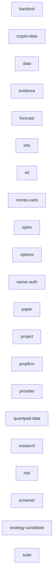

<!-- GENERATED by alpha-atlas — do not edit; run: cd tools/alpha-atlas && uv run python -m alpha_atlas.generate -->

# CLI flow

172 leaf commands in 21 groups (from the committed `alpha info commands` cache); 9 MCP action tools bridge to CLI leaves via argv literals. Interactive exploration (evidence provenance, excerpts, prompt packs): `cd tools/alpha-atlas && uv run alpha-atlas` → http://127.0.0.1:8803

<!-- nodes: cli:alpha backtest|cli:alpha crypto-data|cli:alpha data|cli:alpha evidence|cli:alpha forecast|cli:alpha info|cli:alpha ml|cli:alpha monte-carlo|cli:alpha optim|cli:alpha options|cli:alpha owner-auth|cli:alpha paper|cli:alpha project|cli:alpha propfirm|cli:alpha provider|cli:alpha quantpad-data|cli:alpha research|cli:alpha risk|cli:alpha screener|cli:alpha strategy-candidate|cli:alpha suite -->


<details><summary>Text fallback</summary>

```
cli:alpha backtest
cli:alpha crypto-data
cli:alpha data
cli:alpha evidence
cli:alpha forecast
cli:alpha info
cli:alpha ml
cli:alpha monte-carlo
cli:alpha optim
cli:alpha options
cli:alpha owner-auth
cli:alpha paper
cli:alpha project
cli:alpha propfirm
cli:alpha provider
cli:alpha quantpad-data
cli:alpha research
cli:alpha risk
cli:alpha screener
cli:alpha strategy-candidate
cli:alpha suite
```

</details>

## Groups

<details><summary>alpha backtest → alpha_cli.backtest_cmds</summary>

| Command | Options |
|---|---|
| `alpha backtest cross-sectional` | `--lookback`, `--skip`, `--vol-window`, `--target-vol`, `--rebalance-every`, `--top-quantile` |
| `alpha backtest holdout` | `--strategy`, `--lookback`, `--skip`, `--vol-window`, `--target-vol`, `--rebalance-every` |
| `alpha backtest oos` | `--strategy`, `--lookback`, `--skip`, `--vol-window`, `--target-vol`, `--rebalance-every` |
| `alpha backtest portfolio` | `--strategy`, `--weighting`, `--lookback`, `--skip`, `--vol-window`, `--target-vol` |
| `alpha backtest run` | `--strategy`, `--lookback`, `--skip`, `--vol-window`, `--target-vol`, `--rebalance-every` |

</details>
<details><summary>alpha crypto-data → alpha_cli.crypto_data_cmds</summary>

| Command | Options |
|---|---|
| `alpha crypto-data acquire` | `--base`, `--quote`, `--category`, `--frequency`, `--period`, `--network` |
| `alpha crypto-data asset` | `--as-of`, `--json` |
| `alpha crypto-data asset-contract` | `--asset-master-version`, `--as-of`, `--json` |
| `alpha crypto-data asset-master-create` | `--coingecko-manifest-id`, `--geckoterminal-manifest-id`, `--json` |
| `alpha crypto-data asset-master-verify` | `--json` |
| `alpha crypto-data asset-masters` | `--json` |
| `alpha crypto-data cache-clean` | `--confirm`, `--json` |
| `alpha crypto-data capabilities` | `--json` |
| `alpha crypto-data catalog` | `--json` |
| `alpha crypto-data compare` | `--primary-manifest-id`, `--comparison-manifest-id`, `--warning-bps`, `--quarantine-bps`, `--json` |
| `alpha crypto-data coverage` | `--json` |
| `alpha crypto-data estimate` | `--instruments`, `--days`, `--frequency`, `--json` |
| `alpha crypto-data feature-create` | `--input`, `--available-at`, `--json` |
| `alpha crypto-data feature-show` | `--json` |
| `alpha crypto-data features` | `--json` |
| `alpha crypto-data liquidity-freeze` | `--category`, `--quote-asset`, `--session`, `--limit`, `--json` |
| `alpha crypto-data profile-batches` | `--json` |
| `alpha crypto-data profile-create` | `--as-of`, `--json` |
| `alpha crypto-data profile-resume` | `--confirm`, `--json` |
| `alpha crypto-data profile-run` | `--cadence`, `--offset`, `--limit`, `--confirm`, `--json` |
| `alpha crypto-data profile-select-one-minute` | `--case-id`, `--expected-case-revision`, `--market`, `--reason`, `--json` |
| `alpha crypto-data profile-show` | `--offset`, `--limit`, `--provider`, `--family`, `--category`, `--frequency` |
| `alpha crypto-data profiles` | `--json` |
| `alpha crypto-data quality` | `--json` |
| `alpha crypto-data snapshot-create` | `--manifest-id`, `--asset-master-version`, `--json` |
| `alpha crypto-data snapshot-verify` | `--required-family`, `--purpose`, `--json` |
| `alpha crypto-data snapshot-verify-crowding` | `--json` |
| `alpha crypto-data snapshot-verify-hedged-basis` | `--json` |
| `alpha crypto-data storage` | `--json` |
| `alpha crypto-data storage-inventory` | `--json` |
| `alpha crypto-data storage-verify` | `--json` |

</details>
<details><summary>alpha data → alpha_cli.data_cmds</summary>

| Command | Options |
|---|---|
| `alpha data audit` | `--json` |
| `alpha data candles` | `--start`, `--end`, `--snapshot`, `--json` |
| `alpha data pull` | `--source`, `--exchange`, `--asset-class`, `--venue`, `--calendar`, `--currency` |
| `alpha data repair` | `--approve-differences` |
| `alpha data rollback-promotion` | `--acknowledge` |
| `alpha data snapshot` | `--source`, `--exchange` |
| `alpha data snapshots` | `--json` |
| `alpha data source-status` | `--json` |
| `alpha data symbols` | `--json` |
| `alpha data verify` | — |

</details>
<details><summary>alpha evidence → alpha_cli.evidence_cmds</summary>

| Command | Options |
|---|---|
| `alpha evidence add` | `--assets`, `--frozen-universe`, `--method`, `--knowledge-at`, `--author`, `--author-kind` |
| `alpha evidence list` | `--asset`, `--project-id`, `--status`, `--as-of`, `--limit`, `--offset` |
| `alpha evidence revise` | `--status`, `--author`, `--author-kind`, `--claim`, `--counterevidence`, `--contradiction-id` |
| `alpha evidence show` | `--json` |

</details>
<details><summary>alpha forecast → alpha_cli.forecast_cmds</summary>

| Command | Options |
|---|---|
| `alpha forecast eval` | `--horizon`, `--stride`, `--samples`, `--context`, `--temperature`, `--top-p` |
| `alpha forecast run` | `--horizon`, `--samples`, `--context`, `--temperature`, `--top-p`, `--top-k` |

</details>
<details><summary>alpha info → alpha_cli.info_cmds</summary>

| Command | Options |
|---|---|
| `alpha info commands` | `--json` |
| `alpha info providers` | `--json` |
| `alpha info strategies` | `--json` |
| `alpha info system` | `--json` |

</details>
<details><summary>alpha ml → alpha_cli.ml_cmds</summary>

| Command | Options |
|---|---|
| `alpha ml evaluate` | `--json` |
| `alpha ml export-input` | `--as-of`, `--json` |
| `alpha ml import` | `--json` |
| `alpha ml prepare` | `--worker-lock`, `--json` |
| `alpha ml prepare-replay` | `--json` |
| `alpha ml replay` | `--starting-cash`, `--periods-per-year`, `--as-of`, `--json` |
| `alpha ml train` | `--mode`, `--worker-project`, `--no-sync`, `--timeout-seconds`, `--json` |

</details>
<details><summary>alpha monte-carlo → alpha_cli.monte_carlo_cmds</summary>

| Command | Options |
|---|---|
| `alpha monte-carlo classical` | `--from-run`, `--paths`, `--regime-window`, `--min-state-observations`, `--min-state-transitions`, `--confidence` |
| `alpha monte-carlo kronos` | `--from-run`, `--forecast-eval-run`, `--paths`, `--context`, `--temperature`, `--top-p` |

</details>
<details><summary>alpha optim → alpha_cli.optim_cmds</summary>

| Command | Options |
|---|---|
| `alpha optim grid` | `--grid`, `--strategy`, `--lookback`, `--skip`, `--vol-window`, `--target-vol` |

</details>
<details><summary>alpha options → alpha_cli.options_cmds</summary>

| Command | Options |
|---|---|
| `alpha options curve` | `--vol`, `--days`, `--rate`, `--kind`, `--width`, `--points` |
| `alpha options greeks` | `--vol`, `--days`, `--rate`, `--kind`, `--json` |
| `alpha options iv` | `--price`, `--days`, `--rate`, `--kind`, `--json` |

</details>
<details><summary>alpha owner-auth → alpha_cli.owner_auth_cmds</summary>

| Command | Options |
|---|---|
| `alpha owner-auth enroll` | `--reason`, `--replace-existing`, `--json` |
| `alpha owner-auth recover` | `--reason`, `--json` |

</details>
<details><summary>alpha paper → alpha_cli.paper_cmds</summary>

| Command | Options |
|---|---|
| `alpha paper ibkr-preflight` | `--asset-class`, `--account`, `--gateway-image`, `--client-id` |
| `alpha paper ibkr-run` | `--instrument-id`, `--snapshot`, `--expected-session`, `--next-session`, `--order-cutoff`, `--intent` |
| `alpha paper ibkr-what-if-execute` | `--confirm-non-transmitting-preview`, `--json` |
| `alpha paper ibkr-what-if-plan` | `--limit-price`, `--collar-low`, `--collar-high`, `--expires-at`, `--json` |
| `alpha paper preflight` | `--strategy`, `--starting-cash`, `--param` |
| `alpha paper readiness` | `--json` |
| `alpha paper reconcile` | `--json` |
| `alpha paper run` | `--provider`, `--snapshot`, `--strategy`, `--param`, `--starting-cash`, `--lookback` |
| `alpha paper scheduler-repair` | `--config`, `--acknowledge` |
| `alpha paper scheduler-status` | `--config` |
| `alpha paper scheduler-tick` | `--config` |
| `alpha paper sessions` | `--json` |
| `alpha paper show` | `--json` |
| `alpha paper stop` | — |

</details>
<details><summary>alpha project → alpha_cli.project_cmds</summary>

| Command | Options |
|---|---|
| `alpha project agent-brief` | `--evidence-limit`, `--as-of`, `--json` |
| `alpha project attempt` | `--stage`, `--status`, `--config-fingerprint`, `--run-id`, `--error`, `--details-json` |
| `alpha project create` | `--hypothesis`, `--falsification`, `--json` |
| `alpha project decide` | `--verdict`, `--actor`, `--reason`, `--acknowledge-negative-results`, `--json` |
| `alpha project experiment` | `--version-id`, `--snapshot`, `--universe`, `--split-policy-json`, `--costs-json`, `--seeds-json` |
| `alpha project experiment-show` | `--json` |
| `alpha project job-cancel` | `--actor`, `--reason`, `--json` |
| `alpha project job-cancel-requested` | `--json` |
| `alpha project job-capacity` | `--json` |
| `alpha project job-create` | `--request-json`, `--project-id`, `--experiment-id`, `--json` |
| `alpha project job-event` | `--payload-json`, `--json` |
| `alpha project job-list` | `--limit`, `--offset`, `--json` |
| `alpha project job-reconcile` | `--reason`, `--stale-after-seconds`, `--json` |
| `alpha project job-show` | `--event-limit`, `--event-offset`, `--event-tail`, `--json` |
| `alpha project job-status` | `--result-run-id`, `--terminal-error`, `--json` |
| `alpha project link-run` | `--stage`, `--state`, `--json` |
| `alpha project list` | `--limit`, `--offset`, `--json` |
| `alpha project override-research-gate` | `--actor`, `--reason`, `--json` |
| `alpha project research-gate-overrides` | `--limit`, `--offset`, `--json` |
| `alpha project reveal-holdout` | `--actor`, `--reason`, `--json` |
| `alpha project review-monte-carlo` | `--decision`, `--actor`, `--reason`, `--json` |
| `alpha project seal-holdout` | `--actor`, `--reason`, `--start-date`, `--end-date`, `--json` |
| `alpha project show` | `--lineage-limit`, `--json` |
| `alpha project stage-state` | `--reason`, `--json` |
| `alpha project stage-transition` | `--reason`, `--json` |
| `alpha project version` | `--strategy`, `--source-fingerprint`, `--definition-json`, `--parameter-space-json`, `--research-contract-id`, `--json` |
| `alpha project version-show` | `--json` |

</details>
<details><summary>alpha propfirm → alpha_cli.propfirm_cmds</summary>

| Command | Options |
|---|---|
| `alpha propfirm run` | `--strategy`, `--firm`, `--from-run`, `--account-size`, `--profit-target`, `--max-drawdown` |

</details>
<details><summary>alpha provider → alpha_cli.provider_cmds</summary>

| Command | Options |
|---|---|
| `alpha provider check` | `--json` |

</details>
<details><summary>alpha quantpad-data → alpha_cli.quantpad_data_cmds</summary>

| Command | Options |
|---|---|
| `alpha quantpad-data archive` | `--start`, `--end`, `--start-ms`, `--end-ms`, `--timeframe`, `--schema` |
| `alpha quantpad-data verify` | `--json` |

</details>
<details><summary>alpha research → alpha_cli.research_cmds</summary>

| Command | Options |
|---|---|
| `alpha research approve` | `--actor`, `--reason`, `--json` |
| `alpha research brief` | `--created-by`, `--json` |
| `alpha research cancel` | `--reason`, `--json` |
| `alpha research capture` | `--name`, `--created-by`, `--json` |
| `alpha research compare` | `--strategies`, `--json` |
| `alpha research context build` | `--kind`, `--symbol`, `--protocol`, `--created-by`, `--json` |
| `alpha research context list` | `--limit`, `--offset`, `--json` |
| `alpha research context show` | `--json` |
| `alpha research data audit` | `--json` |
| `alpha research data list` | `--symbol`, `--limit`, `--offset`, `--json` |
| `alpha research data register` | `--kind`, `--start`, `--end`, `--snapshot-id`, `--receipt`, `--bar-minutes` |
| `alpha research data register-crypto` | `--symbol`, `--registered-by`, `--json` |
| `alpha research decide` | `--outcome`, `--disposition`, `--actor`, `--reason`, `--json` |
| `alpha research decision-view` | `--json` |
| `alpha research draft` | `--source-pack-id`, `--answer`, `--dataset`, `--answer-bundle`, `--expected-case-revision`, `--created-by` |
| `alpha research draft-confirmation` | `--created-by`, `--json` |
| `alpha research evidence-hub` | `--json` |
| `alpha research export` | `--output-dir`, `--json` |
| `alpha research list` | `--limit`, `--offset`, `--json` |
| `alpha research note add` | `--kind`, `--body`, `--author`, `--author-kind`, `--packet`, `--json` |
| `alpha research note list` | `--limit`, `--offset`, `--json` |
| `alpha research pause` | `--reason`, `--checkpoint`, `--json` |
| `alpha research proposal-options` | `--json` |
| `alpha research protocols list` | `--json` |
| `alpha research protocols show` | `--json` |
| `alpha research reject` | `--actor`, `--reason`, `--json` |
| `alpha research report` | `--json` |
| `alpha research resume` | `--reason`, `--acknowledge-orphaned-process`, `--json` |
| `alpha research revise` | `--source-pack-id`, `--answer`, `--dataset`, `--actor`, `--reason`, `--json` |
| `alpha research run` | `--json` |
| `alpha research sources acquire` | `--json` |
| `alpha research sources add` | `--title`, `--locator`, `--provider`, `--access-mode`, `--metadata-json`, `--content-hash` |
| `alpha research sources claim add` | `--source-id`, `--contract-id`, `--text`, `--direction`, `--strength`, `--method` |
| `alpha research sources claim list` | `--history`, `--limit`, `--offset`, `--json` |
| `alpha research sources claim reject` | `--actor`, `--reason`, `--json` |
| `alpha research sources claim revise` | `--actor`, `--reason`, `--revision-json`, `--json` |
| `alpha research sources claim screen` | `--actor`, `--json` |
| `alpha research sources discover` | `--query`, `--unpaywall-email`, `--max-candidates`, `--max-full-texts`, `--json` |
| `alpha research sources fetch` | `--objects-dir`, `--allow-host`, `--json` |
| `alpha research sources freeze` | `--source-id`, `--definition-json`, `--json` |
| `alpha research sources screen` | `--json` |
| `alpha research sources search` | `--limit`, `--offset`, `--json` |
| `alpha research status` | `--json` |
| `alpha research verify` | `--path`, `--json` |

</details>
<details><summary>alpha risk → alpha_cli.risk_cmds</summary>

| Command | Options |
|---|---|
| `alpha risk scenario` | `--from-run`, `--confidence`, `--periods-per-year`, `--json` |

</details>
<details><summary>alpha screener → alpha_cli.screener_cmds</summary>

| Command | Options |
|---|---|
| `alpha screener news` | `--days`, `--limit`, `--json` |
| `alpha screener quote` | `--json` |

</details>
<details><summary>alpha strategy-candidate → alpha_cli.strategy_candidate_cmds</summary>

| Command | Options |
|---|---|
| `alpha strategy-candidate paper-preflight` | `--json` |
| `alpha strategy-candidate run` | `--research-contract-id`, `--analysis`, `--source-run-id`, `--holdout-start`, `--holdout-end`, `--holdout-spec-hash` |

</details>
<details><summary>alpha suite → alpha_cli.suite_cmds</summary>

| Command | Options |
|---|---|
| `alpha suite actions` | `--json` |
| `alpha suite plan` | `--json` |
| `alpha suite reserve` | `--job-id`, `--json` |
| `alpha suite run` | `--job-id`, `--owner-actor`, `--owner-reason`, `--json` |
| `alpha suite status` | `--event-limit`, `--event-offset`, `--event-tail`, `--json` |

</details>

