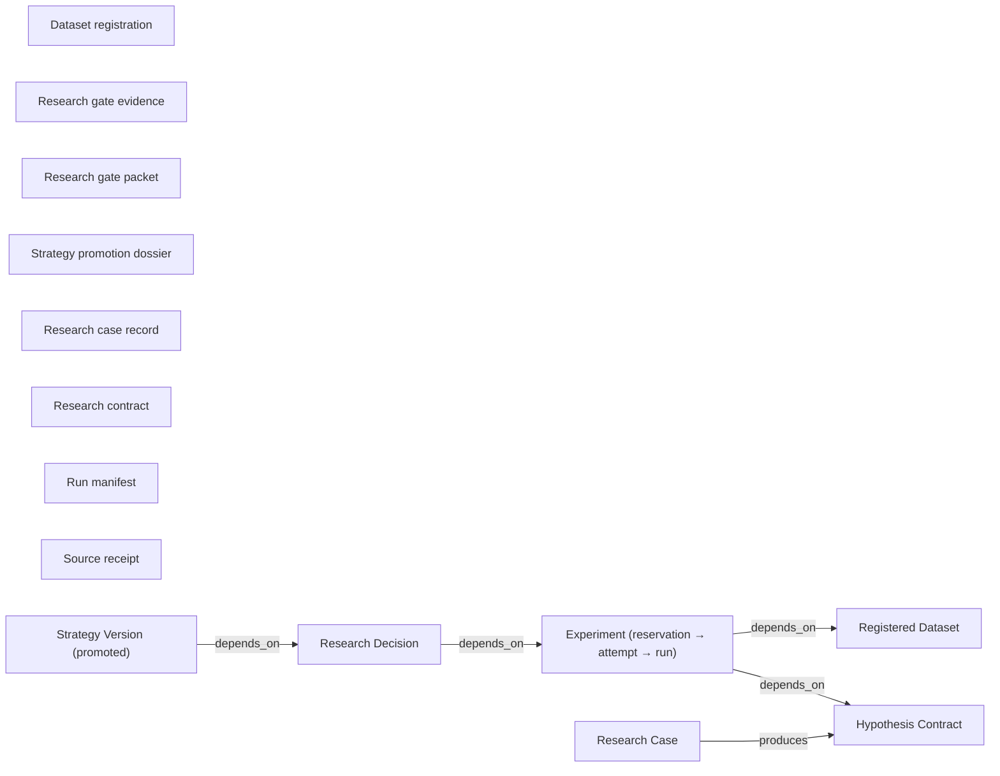

<!-- GENERATED by alpha-atlas — do not edit; run: cd tools/alpha-atlas && uv run python -m alpha_atlas.generate -->

# Data lineage

The research-entity chain (type-level in v1): Research Case → Hypothesis → Dataset → Experiment → Decision → Strategy Version, with the artifacts each workflow step produces. Interactive exploration (evidence provenance, excerpts, prompt packs): `cd tools/alpha-atlas && uv run alpha-atlas` → http://127.0.0.1:8803

<!-- nodes: artifact:dataset-registration|artifact:gate-evidence|artifact:gate-packet|artifact:promotion-dossier|artifact:research-case-record|artifact:research-contract|artifact:run-manifest|artifact:source-receipt|dataset|decision|experiment|hypothesis|research_case|strategy_version -->


<details><summary>Text fallback</summary>

```
decision -> experiment  [depends_on]
experiment -> dataset  [depends_on]
experiment -> hypothesis  [depends_on]
research_case -> hypothesis  [produces]
strategy_version -> decision  [depends_on]
```

</details>

## Artifacts

| Artifact | Description | Evidence |
|---|---|---|
| Dataset registration | rd_<sha256> ref bound fail-closed to exact snapshot-manifest bytes, plus audit records. | declared |
| Research gate evidence | Content-hashed ResearchGateEvidenceV1 selectors; re-verified by exact recomputation on every read. | declared |
| Research gate packet | Fail-closed terminal packet (packet_hash) assembled for closed cases. | declared |
| Strategy promotion dossier | Lossless spec-§11 strategy_promotion packet recorded atomically at close. | declared |
| Research case record | Append-only project + governance rows opened at capture (SQLite control plane). | declared |
| Research contract | Content-addressed rc_<sha256> hypothesis contract with review-event lineage. | declared |
| Run manifest | Immutable run directory manifest (schema v3): evidence_zone, watermark, snapshot hash, fingerprints; written last as the completion marker. | declared |
| Source receipt | Content-addressed SourceReceipt for an acquired document, labelled UNTRUSTED_SOURCE. | declared |

