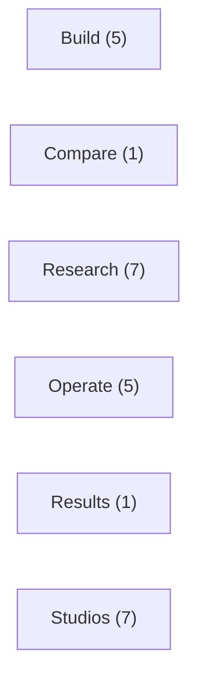

<!-- GENERATED by alpha-atlas — do not edit; run: cd tools/alpha-atlas && uv run python -m alpha_atlas.generate -->

# Frontend flow

6 Workstation screens, 25 panel components, joined to their API routes via the fail-loud client.ts scan. Interactive exploration (evidence provenance, excerpts, prompt packs): `cd tools/alpha-atlas && uv run alpha-atlas` → http://127.0.0.1:8803

<!-- nodes: screen:build|screen:compare|screen:explore|screen:operate|screen:results|screen:studios -->


<details><summary>Text fallback</summary>

```
screen:build
screen:compare
screen:explore
screen:operate
screen:results
screen:studios
```

</details>

## Screens

<details><summary>Build — panels and routes</summary>

| Panel | Calls |
|---|---|
| AiConsole | `GET /api/research/compare`, `POST /api/jobs` |
| DevelopmentCenter | — |
| JobMonitor | `DELETE /api/jobs/{job_id}`, `GET /api/jobs` |
| Pipeline | `GET /api/runs`, `GET /api/runs/{run_id}` |
| StrategyLab | `GET /api/commands`, `GET /api/strategies`, `POST /api/jobs` |

</details>
<details><summary>Compare — panels and routes</summary>

| Panel | Calls |
|---|---|
| CompareRuns | `GET /api/runs`, `POST /api/v3/runs/compare` |

</details>
<details><summary>Research — panels and routes</summary>

| Panel | Calls |
|---|---|
| CodexBench | `GET /api/research/cases/{project_id}/context-packets`, `GET /api/research/cases/{project_id}/notes`, `GET /api/research/protocols` |
| DataExplorer | `GET /api/providers`, `GET /api/symbols`, `POST /api/jobs` |
| EvidenceHub | `GET /api/research/cases/{project_id}`, `GET /api/research/cases/{project_id}/evidence-hub`, `POST /api/research/cases/{project_id}/literature/acquire`, `POST /api/research/cases/{project_id}/literature/discover` |
| PriceChart | `GET /api/candles/{symbol}`, `GET /api/runs/{run_id}/chart-bundle` |
| ResearchBacklog | `GET /api/research/cases` |
| ResearchCockpit | `GET /api/research/cases/{project_id}`, `GET /api/research/cases/{project_id}/decision-view`, `GET /api/research/cases/{project_id}/proposal-options`, `GET /api/research/cases/{project_id}/report`, `GET /api/research/cases/{project_id}/semantic-projection`, `GET /api/research/cases/{project_id}/status`, `POST /api/research/cases`, `POST /api/research/cases/{project_id}/launch`, `POST /api/research/cases/{project_id}/proposal` |
| ResearchDataExplorer | `GET /api/research/cases/{project_id}`, `GET /api/research/cases/{project_id}/proposal-options`, `GET /api/research/datasets`, `GET /api/symbols` |

</details>
<details><summary>Operate — panels and routes</summary>

| Panel | Calls |
|---|---|
| ActivityFeed | — |
| DevelopmentCenter | — |
| Glossary | — |
| PaperMonitor | `DELETE /api/jobs/{job_id}`, `GET /api/jobs`, `GET /api/paper/readiness`, `GET /api/paper/sessions`, `GET /api/paper/sessions/{session_id}`, `GET /api/paper/sessions/{session_id}/events`, `GET /api/system` |
| ProviderSystem | `GET /api/providers`, `GET /api/research-gate-overrides`, `GET /api/system`, `POST /api/providers/{provider_id}/check` |

</details>
<details><summary>Results — panels and routes</summary>

| Panel | Calls |
|---|---|
| RunDetail | — |

</details>
<details><summary>Studios — panels and routes</summary>

| Panel | Calls |
|---|---|
| AssetMemory | — |
| KronosStudio | `GET /api/projects/{project_id}`, `GET /api/runs/{run_id}`, `GET /api/runs/{run_id}/forecast`, `GET /api/runs/{run_id}/forecast/paths`, `GET /api/runs/{run_id}/origins` |
| MlDiagnostics | `GET /api/ml/exchanges/{exchange_id}/tear-sheet`, `GET /api/ml/experiments` |
| MlResearch | — |
| OptionsGreeks | `GET /api/options/curve`, `GET /api/options/greeks` |
| RiskMonitor | `GET /api/risk/scenario`, `GET /api/runs/{run_id}` |
| Screener | `GET /api/screener/news`, `GET /api/screener/quote` |

</details>

