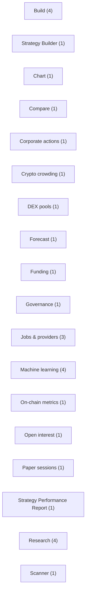

<!-- GENERATED by alpha-atlas — do not edit; run: cd tools/alpha-atlas && uv run python -m alpha_atlas.generate -->

# Frontend flow

18 Workstation screens, 25 panel components, joined to their API routes via the fail-loud client.ts scan. Interactive exploration (evidence provenance, excerpts, prompt packs): `cd tools/alpha-atlas && uv run alpha-atlas` → http://127.0.0.1:8803

<!-- nodes: screen:build|screen:builder|screen:chart|screen:compare|screen:corporate-actions|screen:crowding|screen:dex|screen:forecast|screen:funding|screen:governance|screen:jobs|screen:ml-lab|screen:onchain|screen:open-interest|screen:paper|screen:report|screen:research|screen:scanner -->

```mermaid
flowchart LR
    n0["Build (4)"]
    n1["Strategy Builder (1)"]
    n2["Chart (1)"]
    n3["Compare (1)"]
    n4["Corporate actions (1)"]
    n5["Crypto crowding (1)"]
    n6["DEX pools (1)"]
    n7["Forecast (1)"]
    n8["Funding (1)"]
    n9["Governance (1)"]
    n10["Jobs & providers (3)"]
    n11["Machine learning (4)"]
    n12["On-chain metrics (1)"]
    n13["Open interest (1)"]
    n14["Paper sessions (1)"]
    n15["Strategy Performance Report (1)"]
    n16["Research (4)"]
    n17["Scanner (1)"]
```

<details><summary>Text fallback</summary>

```
screen:build
screen:builder
screen:chart
screen:compare
screen:corporate-actions
screen:crowding
screen:dex
screen:forecast
screen:funding
screen:governance
screen:jobs
screen:ml-lab
screen:onchain
screen:open-interest
screen:paper
screen:report
screen:research
screen:scanner
```

</details>

## Screens

<details><summary>Build — panels and routes</summary>

| Panel | Calls |
|---|---|
| AiConsole | `GET /api/research/compare`, `POST /api/jobs` |
| DevelopmentCenter | `DELETE /api/development/jobs/{job_id}`, `GET /api/development/jobs/{job_id}`, `GET /api/evidence`, `GET /api/ml/experiments`, `GET /api/ml/experiments/preflight`, `GET /api/ml/status`, `GET /api/projects`, `GET /api/projects/{project_id}`, `GET /api/projects/{project_id}/agent-brief`, `GET /api/projects/{project_id}/experiments/{experiment_id}/suite/{action}/plan`, `GET /api/projects/{project_id}/workspace`, `POST /api/ml/experiments`, `POST /api/projects`, `POST /api/projects/{project_id}/attempts`, `POST /api/projects/{project_id}/experiments`, `POST /api/projects/{project_id}/experiments/{experiment_id}/suite/{action}/run`, `POST /api/projects/{project_id}/stage-links`, `POST /api/projects/{project_id}/versions`, `POST /api/projects/{project_id}/workspace/refresh` |
| Pipeline | `GET /api/runs`, `GET /api/runs/{run_id}` |
| StrategyLab | `GET /api/commands`, `GET /api/strategies`, `POST /api/jobs` |

</details>
<details><summary>Strategy Builder — panels and routes</summary>

| Panel | Calls |
|---|---|
| StrategyBuilder | `DELETE /api/rules/{name}`, `GET /api/rules`, `GET /api/rules/{name}`, `POST /api/jobs`, `POST /api/rules`, `POST /api/rules/validate` |

</details>
<details><summary>Chart — panels and routes</summary>

| Panel | Calls |
|---|---|
| PriceChart | `GET /api/candles/{symbol}`, `GET /api/overlays/{symbol}`, `GET /api/runs/{run_id}/chart-bundle` |

</details>
<details><summary>Compare — panels and routes</summary>

| Panel | Calls |
|---|---|
| CompareRuns | `GET /api/runs`, `POST /api/v3/runs/compare` |

</details>
<details><summary>Corporate actions — panels and routes</summary>

| Panel | Calls |
|---|---|
| DataManager | `GET /api/crypto-data/assets/{symbol}`, `GET /api/crypto-data/coverage`, `GET /api/crypto-data/storage`, `GET /api/data/first-bar`, `GET /api/data/snapshots`, `GET /api/data/source-status`, `GET /api/jobs/{job_id}`, `GET /api/providers`, `GET /api/symbols`, `POST /api/jobs` |

</details>
<details><summary>Crypto crowding — panels and routes</summary>

| Panel | Calls |
|---|---|
| ResearchCockpit | `GET /api/research/cases/{project_id}`, `GET /api/research/cases/{project_id}/decision-view`, `GET /api/research/cases/{project_id}/proposal-options`, `GET /api/research/cases/{project_id}/report`, `GET /api/research/cases/{project_id}/semantic-projection`, `GET /api/research/cases/{project_id}/status`, `POST /api/research/cases`, `POST /api/research/cases/{project_id}/launch`, `POST /api/research/cases/{project_id}/proposal` |

</details>
<details><summary>DEX pools — panels and routes</summary>

| Panel | Calls |
|---|---|
| ResearchDataExplorer | `GET /api/research/cases/{project_id}`, `GET /api/research/cases/{project_id}/proposal-options`, `GET /api/research/datasets`, `GET /api/symbols` |

</details>
<details><summary>Forecast — panels and routes</summary>

| Panel | Calls |
|---|---|
| KronosStudio | `GET /api/projects/{project_id}`, `GET /api/runs/{run_id}`, `GET /api/runs/{run_id}/forecast`, `GET /api/runs/{run_id}/forecast/paths`, `GET /api/runs/{run_id}/origins` |

</details>
<details><summary>Funding — panels and routes</summary>

| Panel | Calls |
|---|---|
| ResearchDataExplorer | `GET /api/research/cases/{project_id}`, `GET /api/research/cases/{project_id}/proposal-options`, `GET /api/research/datasets`, `GET /api/symbols` |

</details>
<details><summary>Governance — panels and routes</summary>

| Panel | Calls |
|---|---|
| GovernanceDocument | — |

</details>
<details><summary>Jobs & providers — panels and routes</summary>

| Panel | Calls |
|---|---|
| ActivityFeed | — |
| JobMonitor | `DELETE /api/jobs/{job_id}`, `GET /api/jobs` |
| ProviderSystem | `GET /api/providers`, `GET /api/research-gate-overrides`, `GET /api/system`, `POST /api/providers/{provider_id}/check` |

</details>
<details><summary>Machine learning — panels and routes</summary>

| Panel | Calls |
|---|---|
| AssetMemory | `DELETE /api/development/jobs/{job_id}`, `GET /api/development/jobs/{job_id}`, `GET /api/evidence`, `GET /api/ml/experiments`, `GET /api/ml/experiments/preflight`, `GET /api/ml/status`, `GET /api/projects`, `GET /api/projects/{project_id}`, `GET /api/projects/{project_id}/agent-brief`, `GET /api/projects/{project_id}/experiments/{experiment_id}/suite/{action}/plan`, `GET /api/projects/{project_id}/workspace`, `POST /api/ml/experiments`, `POST /api/projects`, `POST /api/projects/{project_id}/attempts`, `POST /api/projects/{project_id}/experiments`, `POST /api/projects/{project_id}/experiments/{experiment_id}/suite/{action}/run`, `POST /api/projects/{project_id}/stage-links`, `POST /api/projects/{project_id}/versions`, `POST /api/projects/{project_id}/workspace/refresh` |
| MlDiagnostics | `GET /api/ml/exchanges/{exchange_id}/tear-sheet`, `GET /api/ml/experiments` |
| MlResearch | `DELETE /api/development/jobs/{job_id}`, `GET /api/development/jobs/{job_id}`, `GET /api/evidence`, `GET /api/ml/experiments`, `GET /api/ml/experiments/preflight`, `GET /api/ml/status`, `GET /api/projects`, `GET /api/projects/{project_id}`, `GET /api/projects/{project_id}/agent-brief`, `GET /api/projects/{project_id}/experiments/{experiment_id}/suite/{action}/plan`, `GET /api/projects/{project_id}/workspace`, `POST /api/ml/experiments`, `POST /api/projects`, `POST /api/projects/{project_id}/attempts`, `POST /api/projects/{project_id}/experiments`, `POST /api/projects/{project_id}/experiments/{experiment_id}/suite/{action}/run`, `POST /api/projects/{project_id}/stage-links`, `POST /api/projects/{project_id}/versions`, `POST /api/projects/{project_id}/workspace/refresh` |
| RiskMonitor | `GET /api/risk/scenario`, `GET /api/runs/{run_id}` |

</details>
<details><summary>On-chain metrics — panels and routes</summary>

| Panel | Calls |
|---|---|
| ResearchDataExplorer | `GET /api/research/cases/{project_id}`, `GET /api/research/cases/{project_id}/proposal-options`, `GET /api/research/datasets`, `GET /api/symbols` |

</details>
<details><summary>Open interest — panels and routes</summary>

| Panel | Calls |
|---|---|
| ResearchDataExplorer | `GET /api/research/cases/{project_id}`, `GET /api/research/cases/{project_id}/proposal-options`, `GET /api/research/datasets`, `GET /api/symbols` |

</details>
<details><summary>Paper sessions — panels and routes</summary>

| Panel | Calls |
|---|---|
| PaperMonitor | `DELETE /api/jobs/{job_id}`, `GET /api/jobs`, `GET /api/paper/readiness`, `GET /api/paper/sessions`, `GET /api/paper/sessions/{session_id}`, `GET /api/paper/sessions/{session_id}/events`, `GET /api/system` |

</details>
<details><summary>Strategy Performance Report — panels and routes</summary>

| Panel | Calls |
|---|---|
| RunDetail | `GET /api/runs/{run_id}`, `GET /api/runs/{run_id}/figures`, `GET /api/runs/{run_id}/trades` |

</details>
<details><summary>Research — panels and routes</summary>

| Panel | Calls |
|---|---|
| CodexBench | `GET /api/research/cases/{project_id}/context-packets`, `GET /api/research/cases/{project_id}/notes`, `GET /api/research/protocols`, `POST /api/research/cases/{project_id}/notes` |
| EvidenceHub | `GET /api/research/cases/{project_id}`, `GET /api/research/cases/{project_id}/evidence-hub`, `POST /api/research/cases/{project_id}/claims`, `POST /api/research/cases/{project_id}/literature/acquire`, `POST /api/research/cases/{project_id}/literature/discover`, `POST /api/research/cases/{project_id}/sources` |
| ResearchBacklog | `GET /api/research/cases` |
| ResearchCockpit | `GET /api/research/cases/{project_id}`, `GET /api/research/cases/{project_id}/decision-view`, `GET /api/research/cases/{project_id}/proposal-options`, `GET /api/research/cases/{project_id}/report`, `GET /api/research/cases/{project_id}/semantic-projection`, `GET /api/research/cases/{project_id}/status`, `POST /api/research/cases`, `POST /api/research/cases/{project_id}/launch`, `POST /api/research/cases/{project_id}/proposal` |

</details>
<details><summary>Scanner — panels and routes</summary>

| Panel | Calls |
|---|---|
| Scanner | `DELETE /api/scans/{name}`, `GET /api/rules`, `GET /api/scans`, `POST /api/scans`, `POST /api/scans/{name}/check`, `POST /api/scans/{name}/run` |

</details>

