<!-- GENERATED by alpha-atlas — do not edit; run: cd tools/alpha-atlas && uv run python -m alpha_atlas.generate -->

# Research flow

The governed lifecycle from raw observation to strategy promotion (spec §13, ADR-0019..0027). Every step below carries a computed evidence level and a verified primary code anchor. Interactive exploration (evidence provenance, excerpts, prompt packs): `cd tools/alpha-atlas && uv run alpha-atlas` → http://127.0.0.1:8803

```mermaid
flowchart LR
    n0["Idea Capture"]
    n1["Research Case & Hypothesis Contract"]
    n2["Literature Discovery & Claims"]
    n3["Dataset Registration & Data Audit"]
    n4["Contract Approval & Freeze"]
    n5["D0 Synthetic Pilot"]
    n6["D1 Deep Research"]
    n7["D2 One-Shot Confirmation"]
    n8["Owner Decision"]
    n9["Strategy Promotion"]
    n0 --> n1
    n1 --> n2
    n2 --> n3
    n3 --> n4
    n4 --> n5
    n5 --> n6
    n6 --> n7
    n7 --> n8
    n8 --> n9
```

<!-- nodes: wf:research.idea|wf:research.case|wf:research.literature|wf:research.data-audit|wf:research.contract|wf:research.d0|wf:research.d1|wf:research.d2|wf:research.decision|wf:research.promotion -->


<details><summary>Text fallback</summary>

```
wf:research.idea -> wf:research.case
wf:research.case -> wf:research.literature
wf:research.literature -> wf:research.data-audit
wf:research.data-audit -> wf:research.contract
wf:research.contract -> wf:research.d0
wf:research.d0 -> wf:research.d1
wf:research.d1 -> wf:research.d2
wf:research.d2 -> wf:research.decision
wf:research.decision -> wf:research.promotion
```

</details>

## Steps

| Step | Primary anchor | Evidence | Purpose |
|---|---|---|---|
| Idea Capture | `apps/alpha-cli/src/alpha_cli/research_cmds.py:838` | tested | Preserve a raw market observation verbatim and open a governed Research Case before any strategy code exists. Capture is idempotent and grants no runner, strategy, holdout, paper, or execution authority. |
| Research Case & Hypothesis Contract | `apps/alpha-cli/src/alpha_cli/research_intake.py:458` | tested | Draft the bounded, falsifiable exploration contract (HypothesisCard) from the captured idea: competing explanations, scope, and the frozen analysis intent. Contracts are content-addressed (rc_<sha256>) and never overwritten — revisions create lineage. |
| Literature Discovery & Claims | `apps/alpha-cli/src/alpha_cli/research_cmds.py:141` | tested | Acquire scholarly sources through the isolated literature worker (the one research network surface) and turn them into anchored, owner-screened claims. Every stored object is content-addressed with a SourceReceipt labelled UNTRUSTED_SOURCE. |
| Dataset Registration & Data Audit | `apps/alpha-cli/src/alpha_cli/research_data_audit.py:153` | tested | Bind the case to exact immutable data: register dataset refs (rd_<sha256>) fail-closed against snapshot-manifest bytes, then run the descriptive data audit as an immutable EXPLORATORY run before any hypothesis-specific analysis. |
| Contract Approval & Freeze | `apps/alpha-cli/src/alpha_cli/control_store.py:5062` | tested | Owner approval freezes the exploration contract — analysis plan, topology, boundary, and implementation fingerprints — and advances the phase machine (strictly +1) into 'pilot'. Implementation drift after freeze is detected by hash comparison and fails loud. |
| D0 Synthetic Pilot | `apps/alpha-cli/src/alpha_cli/research_runtime.py:796` | tested | Prove the detector and power analysis on deterministic synthetic data before touching real market bars. The D0 power seed is protocol-frozen (never derived from AlphaSettings.random_seed) so acceptance is re-verified by exact recomputation on every reader. |
| D1 Deep Research | `apps/alpha-cli/src/alpha_cli/research_d1.py:1078` | tested | Execute the frozen analysis plan strictly on the discovery share of real data (owner-CLI-launched only): conditional returns, rank IC, stability, lead-lag, and the frozen Holm secondary family. Evidence artifacts are content-hashed and mechanically re-verified at admission. |
| D2 One-Shot Confirmation | `apps/alpha-cli/src/alpha_cli/research_d2.py:527` | tested | The sealed confirmation: owner approval authorizes the sealed share, the frozen primary reads it exactly once, and every admission and read re-verifies by exact recomputation. A pre-flight integrity failure contaminates the share (owner INVALID-only exit). |
| Owner Decision | `apps/alpha-cli/src/alpha_cli/research_gate_packet.py:1024` | tested | Assemble the decision view — the fourteen-question spec-§10.1 edge-validation checklist (typed finding statuses or explicit NOT_TESTED, never a numeric aggregate), the readiness scorecard, and the terminal gate packet — and record the owner's disposition (advance/revise/park/reject) in the append-only decision ledger. |
| Strategy Promotion | `apps/alpha-cli/src/alpha_cli/research_gate_packet.py:271` | tested | When the owner decision is advance_to_strategy, record the lossless spec-§11 strategy_promotion dossier atomically inside the closing phase transition (HypothesisCard, gate-packet id+hash, registered datasets, screened claims, ledgers, verified chart references, open questions). The research gate then reads 'passed' and strategy creation unlocks. |

