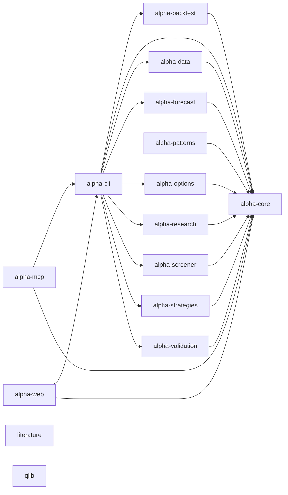

<!-- GENERATED by alpha-atlas — do not edit; run: cd tools/alpha-atlas && uv run python -m alpha_atlas.generate -->

# System map

15 components (packages, apps, workers), 289 Python modules, 14 import-linter contracts. Arrows aggregate module-level imports to component level; the contracts table is the enforced DAG. Interactive exploration (evidence provenance, excerpts, prompt packs): `cd tools/alpha-atlas && uv run alpha-atlas` → http://127.0.0.1:8803

<!-- nodes: component:alpha-backtest|component:alpha-cli|component:alpha-core|component:alpha-data|component:alpha-forecast|component:alpha-mcp|component:alpha-options|component:alpha-patterns|component:alpha-research|component:alpha-screener|component:alpha-strategies|component:alpha-validation|component:alpha-web|component:literature|component:qlib -->


<details><summary>Text fallback</summary>

```
component:alpha-backtest -> component:alpha-core
component:alpha-cli -> component:alpha-backtest
component:alpha-cli -> component:alpha-core
component:alpha-cli -> component:alpha-data
component:alpha-cli -> component:alpha-forecast
component:alpha-cli -> component:alpha-options
component:alpha-cli -> component:alpha-research
component:alpha-cli -> component:alpha-screener
component:alpha-cli -> component:alpha-strategies
component:alpha-cli -> component:alpha-validation
component:alpha-data -> component:alpha-core
component:alpha-forecast -> component:alpha-core
component:alpha-mcp -> component:alpha-cli
component:alpha-mcp -> component:alpha-core
component:alpha-options -> component:alpha-core
component:alpha-patterns -> component:alpha-core
component:alpha-research -> component:alpha-core
component:alpha-screener -> component:alpha-core
component:alpha-strategies -> component:alpha-core
component:alpha-validation -> component:alpha-core
component:alpha-web -> component:alpha-cli
component:alpha-web -> component:alpha-core
```

</details>

## Enforced contracts

<details><summary>14 import-linter forbidden contracts</summary>

| Contract | Sources | Forbidden |
|---|---|---|
| alpha_backtest depends only on core + data | `alpha_backtest` | `alpha_patterns, alpha_strategies, alpha_validation, alpha_forecast, alpha_options, alpha_screener, alpha_research, alpha_cli` |
| alpha_core imports nothing internal | `alpha_core` | `alpha_patterns, alpha_data, alpha_strategies, alpha_backtest, alpha_validation, alpha_forecast, alpha_options, alpha_screener, alpha_research, alpha_cli` |
| alpha_data depends only on core | `alpha_data` | `alpha_patterns, alpha_strategies, alpha_backtest, alpha_validation, alpha_forecast, alpha_options, alpha_screener, alpha_research, alpha_cli` |
| alpha_forecast depends only on core | `alpha_forecast` | `alpha_patterns, alpha_data, alpha_strategies, alpha_backtest, alpha_validation, alpha_options, alpha_screener, alpha_research, alpha_cli` |
| alpha_mcp imports only public platform surfaces | `alpha_mcp` | `alpha_patterns, alpha_data, alpha_strategies, alpha_backtest, alpha_validation, alpha_forecast, alpha_options, alpha_screener, alpha_research, alpha_web` |
| alpha_mcp sits atop the DAG (nothing imports it) | `alpha_core, alpha_data, alpha_strategies, alpha_backtest, alpha_validation, alpha_forecast, alpha_options, alpha_screener, alpha_research, alpha_cli` | `alpha_mcp` |
| alpha_options depends only on core | `alpha_options` | `alpha_patterns, alpha_data, alpha_strategies, alpha_backtest, alpha_validation, alpha_forecast, alpha_screener, alpha_research, alpha_cli` |
| alpha_patterns depends only on core | `alpha_patterns` | `alpha_data, alpha_strategies, alpha_backtest, alpha_validation, alpha_forecast, alpha_options, alpha_screener, alpha_research, alpha_cli, alpha_mcp, alpha_web` |
| alpha_research depends only on core | `alpha_research` | `alpha_data, alpha_strategies, alpha_backtest, alpha_validation, alpha_forecast, alpha_options, alpha_screener, alpha_cli, alpha_mcp, alpha_web` |
| alpha_screener depends only on core | `alpha_screener` | `alpha_patterns, alpha_data, alpha_strategies, alpha_backtest, alpha_validation, alpha_forecast, alpha_options, alpha_research, alpha_cli` |
| alpha_strategies depends only on core | `alpha_strategies` | `alpha_patterns, alpha_data, alpha_backtest, alpha_validation, alpha_forecast, alpha_options, alpha_screener, alpha_research, alpha_cli` |
| alpha_validation depends only on core | `alpha_validation` | `alpha_patterns, alpha_data, alpha_strategies, alpha_backtest, alpha_forecast, alpha_options, alpha_screener, alpha_research, alpha_cli` |
| alpha_web imports only public platform surfaces | `alpha_web` | `alpha_patterns, alpha_data, alpha_strategies, alpha_backtest, alpha_validation, alpha_forecast, alpha_options, alpha_screener, alpha_research, alpha_mcp` |
| alpha_web sits atop the DAG (nothing imports it) | `alpha_core, alpha_data, alpha_strategies, alpha_backtest, alpha_validation, alpha_forecast, alpha_options, alpha_screener, alpha_research, alpha_cli, alpha_mcp` | `alpha_web` |

</details>

## Unknowns review queue

34 node(s) with no documentation anchor, validating test, or cross-layer link — candidates for documentation or removal, never silently promoted:

<details><summary>34 unknown-level node(s)</summary>

- `component:literature`
- `component:qlib`
- `module:alpha_backtest`
- `module:alpha_cli._atomic`
- `module:alpha_cli._crypto_acquisition`
- `module:alpha_cli.figures._sources`
- `module:alpha_data._atomic`
- `module:alpha_data.crypto.providers`
- `module:alpha_forecast._vendor.kronos.kronos`
- `module:alpha_forecast._vendor.kronos.module`
- `module:alpha_qlib_worker`
- `module:alpha_qlib_worker.__main__`
- `module:alpha_qlib_worker.contract`
- `module:alpha_qlib_worker.fake`
- `module:alpha_qlib_worker.features`
- `module:alpha_qlib_worker.rank_ensemble`
- `module:alpha_qlib_worker.real`
- `module:alpha_research._arrays`
- `module:alpha_research.figures.theme`
- `module:alpha_research.figures.version`
- `module:alpha_strategies`
- `module:alpha_validation._atomic`
- `module:alpha_validation.conditional`
- `module:alpha_web._atomic`
- `module:alpha_web.api._common`
- `module:alpha_web.api.errors`
- `module:literature_worker`
- `module:literature_worker.__main__`
- `module:literature_worker._acquisition`
- `module:literature_worker._errors`
- `module:literature_worker.discovery`
- `module:literature_worker.extract`
- `module:literature_worker.fetch`
- `module:literature_worker.metadata`

</details>

