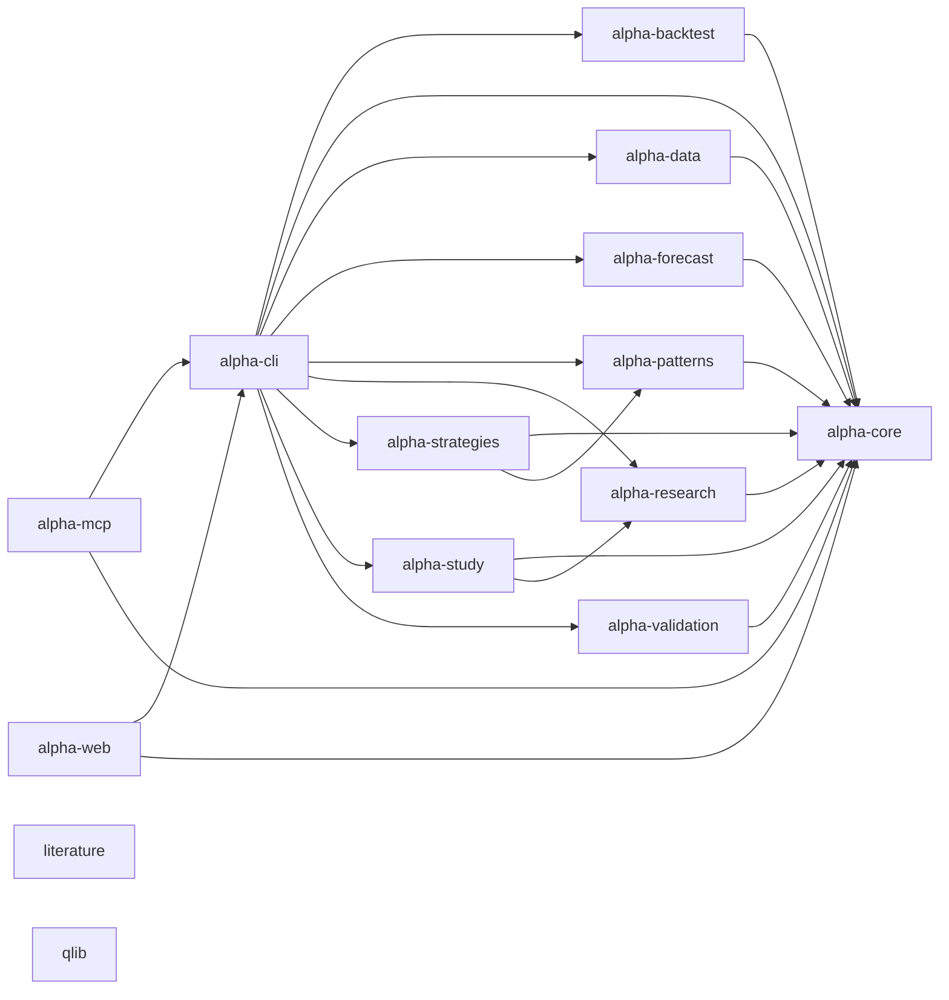

<!-- GENERATED by alpha-atlas — do not edit; run: cd tools/alpha-atlas && uv run python -m alpha_atlas.generate -->

# System map

14 components (packages, apps, workers), 307 Python modules, 13 import-linter contracts. Arrows aggregate module-level imports to component level; the contracts table is the enforced DAG. Interactive exploration (evidence provenance, excerpts, prompt packs): `cd tools/alpha-atlas && uv run alpha-atlas` → http://127.0.0.1:8803

<!-- nodes: component:alpha-backtest|component:alpha-cli|component:alpha-core|component:alpha-data|component:alpha-forecast|component:alpha-mcp|component:alpha-patterns|component:alpha-research|component:alpha-strategies|component:alpha-study|component:alpha-validation|component:alpha-web|component:literature|component:qlib -->

```mermaid
flowchart LR
    n0["alpha-backtest"]
    n1["alpha-cli"]
    n2["alpha-core"]
    n3["alpha-data"]
    n4["alpha-forecast"]
    n5["alpha-mcp"]
    n6["alpha-patterns"]
    n7["alpha-research"]
    n8["alpha-strategies"]
    n9["alpha-study"]
    n10["alpha-validation"]
    n11["alpha-web"]
    n12["literature"]
    n13["qlib"]
    n0 --> n2
    n1 --> n0
    n1 --> n2
    n1 --> n3
    n1 --> n4
    n1 --> n6
    n1 --> n7
    n1 --> n8
    n1 --> n9
    n1 --> n10
    n3 --> n2
    n4 --> n2
    n5 --> n1
    n5 --> n2
    n6 --> n2
    n7 --> n2
    n8 --> n2
    n8 --> n6
    n9 --> n2
    n9 --> n7
    n10 --> n2
    n11 --> n1
    n11 --> n2
```

<details><summary>Text fallback</summary>

```
component:alpha-backtest -> component:alpha-core
component:alpha-cli -> component:alpha-backtest
component:alpha-cli -> component:alpha-core
component:alpha-cli -> component:alpha-data
component:alpha-cli -> component:alpha-forecast
component:alpha-cli -> component:alpha-patterns
component:alpha-cli -> component:alpha-research
component:alpha-cli -> component:alpha-strategies
component:alpha-cli -> component:alpha-study
component:alpha-cli -> component:alpha-validation
component:alpha-data -> component:alpha-core
component:alpha-forecast -> component:alpha-core
component:alpha-mcp -> component:alpha-cli
component:alpha-mcp -> component:alpha-core
component:alpha-patterns -> component:alpha-core
component:alpha-research -> component:alpha-core
component:alpha-strategies -> component:alpha-core
component:alpha-strategies -> component:alpha-patterns
component:alpha-study -> component:alpha-core
component:alpha-study -> component:alpha-research
component:alpha-validation -> component:alpha-core
component:alpha-web -> component:alpha-cli
component:alpha-web -> component:alpha-core
```

</details>

## Enforced contracts

<details><summary>13 import-linter forbidden contracts</summary>

| Contract | Sources | Forbidden |
|---|---|---|
| alpha_backtest depends only on core + data | `alpha_backtest` | `alpha_patterns, alpha_strategies, alpha_validation, alpha_forecast, alpha_research, alpha_study, alpha_cli` |
| alpha_core imports nothing internal | `alpha_core` | `alpha_patterns, alpha_data, alpha_strategies, alpha_backtest, alpha_validation, alpha_forecast, alpha_research, alpha_study, alpha_cli` |
| alpha_data depends only on core | `alpha_data` | `alpha_patterns, alpha_strategies, alpha_backtest, alpha_validation, alpha_forecast, alpha_research, alpha_study, alpha_cli` |
| alpha_forecast depends only on core | `alpha_forecast` | `alpha_patterns, alpha_data, alpha_strategies, alpha_backtest, alpha_validation, alpha_research, alpha_study, alpha_cli` |
| alpha_mcp imports only public platform surfaces | `alpha_mcp` | `alpha_patterns, alpha_data, alpha_strategies, alpha_backtest, alpha_validation, alpha_forecast, alpha_research, alpha_study, alpha_web` |
| alpha_mcp sits atop the DAG (nothing imports it) | `alpha_core, alpha_data, alpha_strategies, alpha_backtest, alpha_validation, alpha_forecast, alpha_research, alpha_study, alpha_cli` | `alpha_mcp` |
| alpha_patterns depends only on core | `alpha_patterns` | `alpha_data, alpha_strategies, alpha_backtest, alpha_validation, alpha_forecast, alpha_research, alpha_study, alpha_cli, alpha_mcp, alpha_web` |
| alpha_research depends only on core | `alpha_research` | `alpha_data, alpha_strategies, alpha_backtest, alpha_validation, alpha_forecast, alpha_study, alpha_cli, alpha_mcp, alpha_web` |
| alpha_strategies depends only on core and patterns | `alpha_strategies` | `alpha_data, alpha_backtest, alpha_validation, alpha_forecast, alpha_research, alpha_study, alpha_cli` |
| alpha_study composes only research-plane primitives | `alpha_study` | `alpha_strategies, alpha_backtest, alpha_validation, alpha_forecast, alpha_cli, alpha_mcp, alpha_web` |
| alpha_validation depends only on core | `alpha_validation` | `alpha_patterns, alpha_data, alpha_strategies, alpha_backtest, alpha_forecast, alpha_research, alpha_study, alpha_cli` |
| alpha_web imports only public platform surfaces | `alpha_web` | `alpha_patterns, alpha_data, alpha_strategies, alpha_backtest, alpha_validation, alpha_forecast, alpha_research, alpha_study, alpha_mcp` |
| alpha_web sits atop the DAG (nothing imports it) | `alpha_core, alpha_data, alpha_strategies, alpha_backtest, alpha_validation, alpha_forecast, alpha_research, alpha_study, alpha_cli, alpha_mcp` | `alpha_web` |

</details>

## Unknowns review queue

47 node(s) with no documentation anchor, validating test, or cross-layer link — candidates for documentation or removal, never silently promoted:

<details><summary>47 unknown-level node(s)</summary>

- `component:alpha-study`
- `component:literature`
- `component:qlib`
- `module:alpha_backtest`
- `module:alpha_cli._atomic`
- `module:alpha_cli._control_schema`
- `module:alpha_cli._crypto_acquisition`
- `module:alpha_cli._crypto_panel`
- `module:alpha_cli._hypothesis_scan`
- `module:alpha_cli.figures._sources`
- `module:alpha_core.universe`
- `module:alpha_data._atomic`
- `module:alpha_data.crypto.providers`
- `module:alpha_forecast._vendor.kronos.kronos`
- `module:alpha_forecast._vendor.kronos.module`
- `module:alpha_qlib_worker`
- `module:alpha_qlib_worker.__main__`
- `module:alpha_qlib_worker.contract`
- `module:alpha_qlib_worker.fake`
- `module:alpha_qlib_worker.features`
- `module:alpha_qlib_worker.rank_ensemble`
- `module:alpha_qlib_worker.real`
- `module:alpha_research._arrays`
- `module:alpha_research.figures.theme`
- `module:alpha_research.figures.version`
- `module:alpha_strategies`
- `module:alpha_study._contracts`
- `module:alpha_study._operator_registry`
- `module:alpha_study.adapters`
- `module:alpha_study.authority`
- `module:alpha_study.projections`
- `module:alpha_study.semantic`
- `module:alpha_study.tables`
- `module:alpha_study.values`
- `module:alpha_validation._atomic`
- `module:alpha_validation.conditional`
- `module:alpha_web._atomic`
- `module:alpha_web.api._common`
- `module:alpha_web.api.errors`
- `module:literature_worker`
- `module:literature_worker.__main__`
- `module:literature_worker._acquisition`
- `module:literature_worker._errors`
- `module:literature_worker.discovery`
- `module:literature_worker.extract`
- `module:literature_worker.fetch`
- `module:literature_worker.metadata`

</details>

