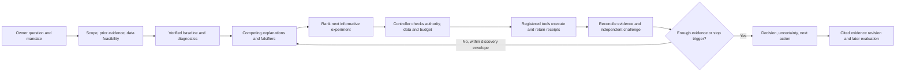

# Agentic research capability program

```json
{
  "schema_version": 1,
  "title": "Agentic research capability program",
  "context": "Planning requested by owner: autonomous, evidence-grounded investigation from vague trading questions, reliable execution, measurable learning, and selective specialist collaboration. This document proposes delivery; no runtime or research authority changes are implemented by it.",
  "assumptions": [
    {
      "statement": "Current root e54aa7a has concurrent uncommitted UI/assistant changes; later controller and fee work is in separate checkout 73fb2a9.",
      "verified_by": "Read-only git/source inspection on 2026-10-02; integration is first dependency."
    },
    {
      "statement": "New model trials remain Codex-only; historical Claude evidence remains immutable.",
      "verified_by": "Owner instruction and tools/alpha-eval/README.md."
    },
    {
      "statement": "More tools, agents, and hypotheses are useful only when verified decisions improve within bounded resources.",
      "verified_by": "Proposed paired evaluation and retained workflow-v2 evidence."
    }
  ],
  "alternatives_considered": [
    "Prompt/skill-only upgrade: inexpensive baseline, insufficient for executable evidence and access enforcement.",
    "Immediate many-agent/PydanticAI migration: defer until marginal value and isolation are demonstrated.",
    "Deterministic controller with typed proposals, existing operators and selective specialists: recommended incremental design."
  ],
  "pre_mortem": [
    "Agent explains a crisis after the fact and mistakes that narrative for a tradable signal.",
    "Adaptive regime/pattern search reuses observed confirmation data or omits failed variants.",
    "Agent generates good plans but exhausts its budget before measurement and synthesis.",
    "Schema-valid citations resolve to artifacts that do not support the claim.",
    "Parallel reviewers repeat the same mistake and create apparent consensus.",
    "A runtime migration broadens filesystem or tool access."
  ],
  "slices": [
    {
      "title": "Reconcile baseline and capture integration inventory",
      "verify": "git status --short; git log -1 --oneline; uv run python scripts/gate.py full",
      "expected": "Chosen isolated integration tree contains explicitly reconciled prior delivery and passes its gate; no concurrent user changes overwritten.",
      "rollback": "Discard only isolated integration changes; retain source checkouts and all evidence.",
      "status": "pending"
    },
    {
      "title": "Specify and test physical discovery exports and information access",
      "verify": "uv run pytest tests/bias_guards/test_research_export_boundary.py -q",
      "expected": "Planned new tests reject future, original-source and indirect reads; allowed discovery operators still work. Includes fresh context and taint handling.",
      "rollback": "Disable autonomous research mode; retain read-only explanation.",
      "status": "pending"
    },
    {
      "title": "Add typed investigation proposals and closed action validation",
      "verify": "uv run pytest tests/unit/test_research_investigation_contracts.py -q",
      "expected": "Planned new tests reject unknown operators, invalid evidence, widened budgets and undeclared parameters.",
      "rollback": "Keep existing bounded baseline/validation controller as default.",
      "status": "pending"
    },
    {
      "title": "Add loss-episode diagnosis and causal conditional-performance operators",
      "verify": "uv run pytest tests/unit/test_research_loss_diagnosis.py tests/bias_guards/test_research_regime_future_poison.py -q",
      "expected": "Planned tests reconcile P&L and protect feature timing; known-truth positive/null controls distinguish useful diagnosis from hindsight selection.",
      "rollback": "Disable new operators; preserve all attempts and original run results.",
      "status": "pending"
    },
    {
      "title": "Connect budgeted lead, critic, receipt consumption and final report",
      "verify": "uv run pytest tests/integration/test_research_investigation_controller.py -q",
      "expected": "Planned tests cover recovery, single writer, stop states, pressure turns, evidence accounting and final-answer reserve.",
      "rollback": "Route new cases through existing deterministic controller only.",
      "status": "pending"
    },
    {
      "title": "Evaluate first vertical slice and obtain independent review",
      "verify": "uv run python scripts/gate.py full",
      "expected": "Engineering gate plus separately frozen agent-evaluation acceptance; neither substitutes for the other.",
      "rollback": "Retain baseline as default and publish honest failed/inconclusive evaluation."
    }
  ],
  "tier_impact": [
    "quant",
    "risk",
    "protected",
    "dag",
    "bias",
    "determinism"
  ],
  "docs_to_update": [
    "docs/BUILD-STATUS.md",
    "docs/ARCHITECTURE.md",
    "docs/operations/research-platform-contracts.md",
    "tools/alpha-eval/README.md"
  ],
  "out_of_scope": [
    "Implementation during this planning turn",
    "Live trading or autonomous capital allocation",
    "New Claude trials",
    "Self-authorized confirmation or budget expansion",
    "Unrestricted autonomous code execution",
    "Claims of infallibility or guaranteed profit"
  ]
}
```

## Decision and status

**Delivery state:** Proposed program; planning artifact only. Implementation has not started.
**Date:** 2026-10-02. **Recommended first product:** an agent that investigates a suspicious backtest, produces a measured loss/regime diagnosis, runs one justified discovery experiment, and returns a complete, evidence-linked decision without step-by-step prompting.

Better means finding more defensible opportunities, detecting invalid ones, and producing useful completed research with less owner intervention at an explicit resource cost. It does not mean more trades, higher selected in-sample Sharpe, longer reports, more agents, or more tool calls. No model can be promised always correct. The enforceable promise is narrower: bounded access and actions, independently checked measurements, transparent uncertainty, complete accounting, and reliable stopping/recovery.

Owner examples are seeds for a general investigation system, not an exhaustive menu. The AI should form and test new explanations inside an authorized discovery envelope. It should also recognize when no additional experiment is worth doing.

## 1. What is actually present

Read-only inspection found two different baselines. The active root is `feat/agentic-benchmark` at `e54aa7a` with substantial concurrent UI, data and assistant edits. Separate checkout `/private/tmp/alpha-research-workflow-20260930` is clean at `73fb2a9`; its later additions are not assumed integrated here. Reconcile this before implementation. Do not blindly cherry-pick over the dirty root.

| Capability | Evidence inspected | Consequence for this program |
|---|---|---|
| Governed analysis plans, bounded grids and discovery/confirmation | `apps/alpha-cli/src/alpha_cli/research_analysis_plan.py`, `research_d1.py`, `research_d2.py` | Reuse existing contract and lifecycle; do not invent another research authority |
| Causal market-state features and conditional research | `packages/alpha-research/src/alpha_research/market_state.py`, `descriptives.py` | Build diagnostic orchestration on these primitives; causal means time-available here, not proven economic causation |
| Drawdown episode figures | `apps/alpha-cli/src/alpha_cli/figures/_builders.py` | Reuse episode calculation; add exposure, cross-asset, cost and event investigation |
| Head-and-shoulders, inverse and QM detection | `packages/alpha-patterns/src/alpha_patterns/head_shoulders.py` | Extend operator/search wiring; do not rebuild the detector |
| Engine-backed optimization and ordered attempt accounting | `apps/alpha-cli/src/alpha_cli/_optim.py`, `_suite.py` | Existing generic fields are narrow; pattern geometry needs an explicit new search contract |
| Cited, revisioned evidence and point-in-time retrieval | `control_store.py`; [ADR-0015](../../adr/0015-evidence-ledger-not-agent-memory.md) | Reuse canonical evidence, including negative findings and contradictions |
| Research protocol skills | `.agents/skills/alpha-research-protocols/` | Extend routing, triggers and completion; avoid a second set of contradictory protocols |
| Workstation assistant, provisional in dirty root | `assistant_runtime.py`, `assistant_contracts.py`, `assistant_service.py` | Currently a no-tool explanation/drafting boundary, not an autonomous researcher; its uncommitted presence is not acceptance evidence |
| Bounded controller, immutable rule inputs, execution digest and fee guard | Separate checkout `73fb2a9`: `research_execution.py`, `research_execution_digest.py`, `research_workflow_contract.py` and fee delivery | Integrate/reuse before extending; typed specialist envelopes do not themselves execute specialists |
| Physical discovery-window isolation and full investigation team | Separate checkout audits explicitly list these as remaining work | Required new capability, not an existing guarantee |

Retained evidence in separate checkout `docs/audit/2026-09-30-research-workflow-completion.md`: one selected five-pair panel improved artifact-backed reporting from **1/5 to 4/5**, with **+9.8% tool calls** and **+23.3% summed trial time**. These are diagnostic observations, not general performance estimates. Regime diagnosis remained untested; one trajectory encountered future data and spent its budget before final synthesis; a candidate report omitted four denied orders. The panel's inherited positive control was not a validated executable positive strategy. All of that must remain visible in future comparisons.

The first failure taxonomy is therefore: missing operator; poor tool discovery; weak investigation choice; invalid information access; incomplete execution; evidence omission; unsupported conclusion; excessive cost. Fix and measure each separately.

## 2. The general research loop



The lead must answer five questions at each meaningful fork: what did we observe; what competing explanations remain; what measurement would distinguish them; can we perform it validly and affordably; what result would change our decision? Store concise rationales and evidence, not private chain-of-thought.

Use typed investigation nodes with dependencies and states (`proposed`, `eligible`, `running`, `measured`, `blocked`, `retired`). A node contains the observation, hypothesis, alternatives, falsifier, expected discriminating outcome, required capability/data, selection family, estimated cost class and stopping condition. Rank by decision relevance, discriminatory power, feasibility and cost. Initially use explicit ordinal rankings with reasons; do not invent calibrated numeric probabilities or a precise value-of-information calculation.

The controller permits new hypotheses within the declared discovery scope. Novel ideas that need a new operator produce a capability-gap ticket with its contract and acceptance test. They enter the engineering workflow; the research agent cannot silently install a package or execute arbitrary generated code.

For novel features, prefer composition from registered time-safe primitives through a bounded feature-expression contract. The expression, availability rule, fold-local fitting and selection lineage are inspected before execution. A new primitive still needs an independently tested operator; novelty does not require unrestricted shell access.

A material integrity defect takes precedence over economic storytelling. A complete run with poor economics can still deserve diagnosis. Research merit and deployment suitability remain separate fields: a 60% drawdown can violate a risk mandate while its mechanism remains scientifically investigable.

## 3. Three anchor journeys

### A. A 60% drawdown concentrated in three months

1. Verify equity marking, deposits/withdrawals, leverage, fills, costs, rejected orders, price gaps and missing bars. Reconcile the whole five-year curve and the peak-to-trough episode. Report absolute P&L, returns, exposure, duration and recovery; don't describe drawdown as a simple additive sum of trade percentages.
2. Locate all major loss episodes under a fixed definition, not just the most narratively convenient window. Report concentration and uncertainty in the number of independent episodes.
3. Compare the same dates against the asset, a qualified crypto benchmark, relevant peers and cross-asset factors when data allow. Align calendars, currencies, session boundaries and executable timing; disclose a continuous crypto market versus weekday equity/bond observations.
4. Test competing explanations: broad market beta; asset/venue-specific collapse; funding/basis or liquidity shock; oversized exposure; stale data/valuation error; strategy-specific failure; ordinary sampling variation. Show what each explains and what residual remains.
5. Investigate event and macro context using dated source evidence: rates/yields versus bond prices are different quantities; compare actual relevant maturities/series. Search primary release/event records and competing explanations. A war, exchange failure or rate change happening nearby is association, not proof of cause.
6. Preserve the unmodified result. Any exclusion-window curve is a labeled sensitivity analysis, not a new track record. A hedge, size rule or regime filter becomes a separate candidate selected only in discovery and evaluated on untouched later data.

**Required output:** loss-episode pack, reconciled accounting, aligned benchmark comparison, evidence-supported and unresolved explanations, recurrence risk, risk-mandate status, and at most a small justified set of next experiments. A short crisis may reveal catastrophic tail exposure; brevity does not make it harmless.

### B. An unstable equity curve and a possible regime-dependent strategy

1. Check trade/episode counts, turnover/costs, exposure, leverage and P&L concentration. Distinguish sampling noise, a few trades, unstable data, and genuine conditional behavior.
2. Use existing causal state features for a fixed simple diagnostic: trend, volatility, liquidity/volume and market breadth where qualified. Compare conditional net returns and uncertainty against unconditional, buy-and-hold and simple exposure-matched baselines. A descriptive split discovered on the same history is a hypothesis.
3. Ask whether the state is recognizable **before** taking the trade. Avoid full-series clustering, hindsight change points, smoothed latent-state probabilities, future peak/trough labels, and normalization fitted outside the training fold. Training and feature selection are fold-local.
4. If simple conditions are promising, compare a transparent filter/size rule with a bounded probabilistic model. Score state transition delay, turnover at boundaries, coverage, false exclusions and net economics, not just label fit or correlation. Preserve useful positive opportunities; a filter that never trades is not success.
5. Fit/tune within chronological discovery folds, then freeze the complete feature/model/filter procedure before confirmation. Count regime definitions, thresholds, feature subsets and abandoned models in the same search lineage. Require a practical improvement after costs with uncertainty and enough effective observations; sparse states remain inconclusive.

**Required output:** unfiltered result, conditional diagnostic, time-availability proof, incremental candidate result where permitted, stability across periods/assets, and a decision on whether a filter is justified. Unstable equity does not automatically justify ML.

### C. Head-and-shoulders research and parameter search

1. State the event and tradable mechanism before optimization. Reuse the existing detector; specify head prominence, shoulder symmetry/depth, left/right duration, neckline slope/break confirmation and scale normalization. Every event is timestamped at its actual confirmation, not backdated to the head or a future-confirmed pivot.
2. Build an event study and fixed baseline before an expensive strategy sweep. Specify direction, holding/exit policy, overlap handling, opportunity count, costs and suitable placebo/matched controls selected without future outcomes.
3. Freeze a bounded search space, selection objective, trial budget, data partition and minimum event support. Start with coarse grids or space-filling candidates. Vectorization accelerates computation; Bayesian optimization chooses experiments. Neither proves the effect exists.
4. Use adaptive optimization only when dimensionality/measurement cost justifies it. Log suggested, inspected, failed, pruned, completed and duplicate candidates with objective/fold results and dependencies. Feature and asset selection are part of the search too. A pruned run is not a fully evaluated performance result.
5. Select broad stable neighborhoods over isolated peaks, inspect sensitivity surfaces and assess selection bias. Use existing DSR/PBO/RC/SPA only where their assumptions and required candidate data hold. PBO/CSCV is a selection diagnostic, not a substitute for chronological prospective confirmation. Bootstrap/null checks should reproduce the selection procedure where practical; if the budget cannot support that inference, narrow the claim/search.
6. Freeze the selected detector plus execution/selection procedure. Evaluate temporal generalization and cross-asset transfer with point-in-time universe membership, delisted assets and dependence-aware uncertainty. Multiple crypto coins sharing the same market shock are correlated transport evidence, not dozens of independent replications.
7. Reconcile a screening implementation against the canonical engine before claiming economics. Final confirmation remains governed and one-shot; new experimentation after observing it cannot treat it as pristine again.

**Required output:** event contract, timing checks, complete attempt lineage, parameter surface, null/selection diagnostics, cost-aware results, transfer matrix and honest decision. “No robust pattern edge found” is a valid completed result.

## 4. Broader capability requirements and automatic investigation triggers

The following are routing examples, not an exhaustive whitelist of hypotheses. Each trigger must have negative controls so the agent can decide no extra analysis is justified.

| Observation or vague request | Proactive question/action | Required protection |
|---|---|---|
| Great Sharpe, very few trades | Is evidence driven by one event or tiny effective sample? Compute concentration and uncertainty | No precise confidence from nominal bar count |
| High win rate, occasional huge losses | Analyze payoff asymmetry, tail episodes and sizing | Win rate is not edge |
| Performance collapses after fees | Test realistic spread, slippage, impact, funding and capacity sensitivity | Use data-backed cost ranges; no invented liquidity |
| Signal predicts direction but loses money | Check probability calibration, payoff, decision threshold and implementation timing | Separate forecast skill from economic value |
| Great results on current top coins | Rebuild historical membership and examine delistings/missing histories | No survivorship-conditioned universe |
| One asset works, peers fail | Mechanism-specific effect, common beta or selection? Run frozen transfer tests | Include failed assets; shared market dependence |
| Two strategies look diversifying | Align OOS exposure and stress periods; inspect tail co-loss and marginal portfolio contribution | No correlation of incompatible windows |
| Recent degradation | Is it drift, execution change, sample noise or broken feed? Compare monitored evidence | Detection does not authorize automatic refitting |
| Macro feature looks predictive | Is the release vintage and publication time available at decision time? | Revised latest data cannot stand in for historical releases |
| Pattern success only at high resolution | Are bars/session rules, latency and fills realistic? | Chartable data is not necessarily qualified execution data |
| Different implementations disagree | Reconcile events, inputs, timestamps and P&L with an independent reference | No voting to decide numerical truth |
| “Find something profitable” | Elicit/record mandate; inventory usable data; propose bounded distinct mechanisms and baselines | No unconstrained strategy mining or hidden final-test selection |
| Attractive carry or funding spread | Check hedge mismatch, borrow, liquidation, transfer and venue risk | No treating gross carry as executable profit |
| An economic explanation sounds convincing | Identify its observable prediction and a contradicting test | Narrative is a hypothesis, not an evidence upgrade |
| Every branch hits a capability/data gap | Produce one exact gap report and implementation ticket, preserve work, stop | Repeated searching does not create coverage |

Capabilities span data engineering/PIT, mechanism and literature research, event measurement, statistical inference, optimization/ML, forecasting/calibration, portfolio/tail risk, market microstructure/execution, economic context, reporting and experiment operations. Discretionary observations enter as testable context; they do not become unquestioned signals.

## 5. Architecture and team

**Start with one lead and one critic, plus deterministic data/execution checks.** Add specialists selectively through typed handoffs. The owner should see a coherent case and resulting evidence, not an agent chat transcript.

| Role | Distinct responsibility and deliverable | Invocation |
|---|---|---|
| Research lead | Maintain question/hypotheses, select next experiment, synthesize evidence and stop | Each case |
| Data steward | Source suitability, timestamps/vintages, membership, missingness, lineage and admissible uses | Deterministic checks always; model review for ambiguity |
| Quant/model specialist | Event design, estimator and forecast choice, parameter/feature search proposal | When a registered analysis requires it |
| Independent critic / overfitting reviewer | Challenge timing, selection, effective sample, alternatives and conclusion strength | Before consequential conclusions/confirmation handoff |
| Economics and market-structure analyst | Costs, tradability, funding, liquidity, venue mechanics, mechanism plausibility | Triggered by execution/economic uncertainty |
| Macro/event investigator | Cross-asset transmission, dated releases/events, competing explanations | Only when relevant evidence/data exist |
| Portfolio/risk analyst | Tail concentration, combined exposures, stress and risk-mandate fit | Portfolio/sizing questions |
| Deterministic controller | Validate actions, enforce budgets/access, launch approved tools, retain receipts and reconcile jobs | Only mutator; model does not confer authority |

These are responsibilities, not eight permanent processes. Initially the lead can use the quant/data/economics playbooks; a specialist gets a separate context only for a specific unresolved question. Max concurrent specialist calls and aggregate budgets are case-scoped. Fresh-context same-model review can reduce anchoring but is not independent scientific truth or model-family diversity. Give reviewers raw verified artifacts and the question before the lead's preferred narrative when practical; preserve disagreements and resolve them with measurements, not majority voting.

Keep the current CLI/ControlStore authority and package DAG. The orchestration layer belongs above the analytical packages, composing public CLI operations. `alpha_research` remains numerical/domain code; it must not depend on model SDKs. The browser and MCP remain bounded clients. Analytics execute in versioned operators; the model proposes typed calls and interprets verified outputs.

## 6. Typed contracts and deterministic enforcement

The first demo implements only the fields and transitions its four actions require. The table below is a future contract inventory, not a requirement to ship eight new model classes or a generic hypothesis graph before useful research.

Use existing Pydantic contracts, artifact references, evidence revisions and specialist envelopes wherever possible. Add only missing fields/types; exact names below are proposed, not new canonical APIs.

| Proposed contract | Critical content | Enforced outside the model |
|---|---|---|
| `InvestigationMandateV1` | Question, instruments, horizon, research vs deployment purpose, risk criteria, allowed discovery actions and total budget | Existing owner/contract authority; no self-expansion |
| `InformationScopeV1` | Snapshot/derivative lineage, data and knowledge cutoffs, partition/family identity, publication clock, exposure/contamination record | Physical export and tool access; fresh context; denied-read probes |
| `HypothesisNodeV1` | Observation, competing mechanism, falsifier, dependency, expected distinguishing result | All empirical assertions resolve to evidence or are labeled hypotheses |
| `ExperimentProposalV1` | Registered operator/version, exact inputs, parameter/search family, costs, folds, seed, objective and stop conditions | Closed discriminated union; no arbitrary argv/code or implicit defaults changing mid-case |
| `ActionDecisionV1` | Execute, inspect receipt, request specialist, conclude, report blocker, or propose scope revision | Allowed state transition, remaining budget and artifact prerequisites |
| `MeasurementReceiptV1` | Request/job identity, input/code hashes, status, units, coverage, outputs and complete failure accounting | Canonical tool receipt and independent reconciliation; no model-authored success |
| `EvidenceClaimV1` | Claim kind, effect/uncertainty if valid, exact artifact selector, scope and counterevidence | Hash/selector resolution plus semantic/unit/sample checks; association != causation |
| `InvestigationConclusionV1` | Supported/contradicted/inconclusive/invalid scientific result, separate next disposition, risk status, missing work and complete execution digest | Required evidence completeness; no silent absent-to-pass coercion |

Use strict finite typed fields, UTC-aware timestamps, explicit units/currency, versioned enums, frozen identities and `extra='forbid'`. References should bind canonical objects rather than copying mutable truth. Define a cross-field check for every important invariant. A valid JSON object or resolvable citation is insufficient: verify the cited sample, quantity and computation support the statement.

Durable execution: persist planned action before dispatch; use semantic idempotency keys and an attempt ledger; reconcile existing job/artifacts after restart before any re-launch. Classify failures as invalid input, capability/data absent, scientific inconclusive, transient provider/transport, execution incomplete, or cancelled. Retry only eligible transient actions within their shared budget. Do not automatically retry sealed confirmation. Process cancellation must reap descendants and release leases. External exactly-once execution is not assumed; ensure idempotent effects and reconciliation.

## 7. Information boundaries and controlled autonomy

Physical discovery exports precede more autonomous search. Materialize only permitted data, with derivative lineage and corporate-action/release knowledge times. Block original snapshots, future reports, cross-case artifacts, unrestricted filesystem/network reads and indirect tool routes. Validate both allowed work and forbidden reads in a fresh isolated context. `as_of` alone is not an information firewall.

Separate three clocks: event/market time, publication/availability time and the researcher's observation time. Maintain a case exposure ledger: which partitions, dates, asset results and reports were seen. Changing a filename or spawning another specialist cannot clean contaminated evidence. Historical events may also be known from model training; physical isolation does not prove an LLM is ignorant of famous crises. Date-obscured synthetic tests and genuinely prospective evidence are necessary complements. Later news may inform a labeled retrospective explanation, never a historical feature without proof of availability.

**Explicit retrospective-to-predictive handoff.** A `retrospective_diagnosis` case may examine its declared already-observed run/window and report what happened. Before any candidate development, record every inspected period/result and mark it as observed/contaminated in the lineage. Create a linked `predictive_discovery` child with a separately permitted discovery export. The child may receive the hypothesis, mechanism, necessary context and an explicit derivation/exposure record; a summary cannot conceal that its hypothesis was selected using the inspected outcomes. Any formerly sealed period already viewed is ineligible as untouched confirmation, even in a fresh process. Route it through the existing consumed/contaminated-boundary rules; do not claim that context separation unsees information. Confirm on a genuinely unobserved eligible sample or collect prospective data. If none exists, deliver a retrospective finding and a prospective test plan. The mode is a controller-validated part of the case identity, not a model-selected status upgrade.

**Historical context operator.** Add a bounded retrieval seam above the isolated literature/source worker: `historical_context_lookup` accepts event window, asset/source classes and permitted source-pack identifiers, never arbitrary URL/argv supplied by source text. Initially use a small verified local pack. Later provider adapters may fetch allow-listed primary issuer/exchange/regulator/central-bank releases and qualified archived news, subject to source rights/availability. Persist original publication time (or unknown), event time, revision/vintage, retrieval time, exact permitted archived content/hash and evidence selectors. Label each record `retrospective_context_only` or `feature_eligible`; eligibility requires independently established historical availability. Treat embedded instructions as untrusted content. Conflicting or unavailable records remain visible. Network access belongs to this broker, not the analyst sandbox. A present-day lookup is never silently relabeled as historical knowledge.

Within a frozen, budgeted discovery mandate, routine allowed reads, diagnostics and registered experiments should run without repeatedly asking the owner. Scope expansion, new sources/rights, confirmation consumption and capital authority remain explicit existing boundaries. A report records proposed/authorized/executed/verified separately. General desire for initiative does not change the scientific partition contract.

Budgets cover the whole case and children: tools, model calls, variants, data pulls, compute, elapsed time and retries. Reserve resources for result consumption and synthesis before dispatching new work. Initial reserve proposal: 25% of the case action budget; calibrate it on measured cases. Stop on integrity failure, exhausted informative hypotheses, inadequate effective sample, budget exhaustion, explicit falsification, or need for a new scope. A useful blocker report includes the exact unavailable operator/data and the smallest next action.

## 8. Packages and runtime choices

| Choice | Recommendation | Reason / adoption test |
|---|---|---|
| Pydantic + pydantic-settings | Reuse existing dependencies now | Typed boundaries/configuration; do not equate type checking with truth |
| Polars, existing numerical libraries and ALPHA engine/validation | Reuse first | Keep one domain authority and avoid duplicated estimators |
| Existing Codex runtime | Baseline transport for first slice | Already part of retained experiments; re-prove information boundaries on integration |
| `pydantic-ai-slim[openai]` | Isolated comparison spike after first useful workflow | Evaluate typed agent handoffs/tool usage and reduced maintenance; adopt only after equivalent isolation, recovery, shared-budget and outcome tests |
| Pydantic Graph | Optional for explicit state transitions if controller complexity warrants it | No graph framework is required for the first bounded loop |
| Optuna | Candidate for bounded adaptive geometry search after grid baseline | Must persist all proposals/failures and exact selection history; reproducibility requires controlled suggestion order |
| scikit-learn | Use existing isolated ML lane where suitable; check lock/API before adoption | Pipelines and simple regularized baselines; fold-local transforms and chronological nested selection |
| statsmodels / latent-state library / change-point library | Defer until a specific operator needs it | Avoid an ML-heavy regime stack before simple causal diagnostics prove useful |
| Temporal/DBOS or another durable orchestrator | Defer | First test existing ControlStore/jobs/leases with crash recovery; add infrastructure only for a measured durability gap |
| Vector database, second experiment store, automatic skill evolution | Do not add now | Canonical evidence ledger and versioned reviewed skills already provide an accountable learning path |

Current official Pydantic documentation supports programmatic delegation and explicit handoffs [S1], usage limits [S2], and a Codex OAuth provider [S3]. The provider is a viable comparison candidate, not proof that it inherits ALPHA's filesystem sandbox. Credential access belongs in the trusted transport; never in analyst exports. The OpenAI App Server is another integration option [S4], but switching runtimes is not itself a reasoning improvement. Pin and record exact versions, model identity, settings and transport during any comparison; verify provider/account compatibility before choosing one.

Optuna documents nondeterminism in distributed/parallel optimization [S5]. Proposed policy: persist sequential suggestions, execute any predetermined batch with stable identities, and record completion order; do not claim a fixed seed alone reproduces an asynchronous search. For publication-worthy confirmation, freeze/replay the actual candidate set and selection procedure.

No dependencies are installed by this plan. Benchmark the smallest supported stack before adopting extra orchestration layers.

## 9. Skills and continuous learning

Extend the existing research-protocol family with compact playbooks:

- Loss-episode investigator: accounting first, concentration, comparator choice, competing explanations, forbidden crisis deletion.
- Conditional-edge investigator: causal state availability, unconditional baseline, fold-local selection, sparse-regime handling.
- Pattern-search scientist: detector timing, search-space contract, neighborhood stability and complete attempt lineage.
- Cross-asset transport reviewer: universe/PIT checks, shared-shock dependence and distinction from independent replication.
- Forecast-to-economics reviewer: probability calibration, simple benchmark, payoff and executable policy.
- Research finisher: consume every receipt, disclose missing/denied work, stop correctly, write a complete evidence packet.

Each skill specifies triggers, required inputs, supported tools, anti-patterns, stop rules, output contract and eval cases. It is not a giant checklist to execute for every idea. Skills provide reasoning guidance; contracts constrain structure; tools perform measurements; controller enforces actions; evals measure reliability.

Learning loop: record verified finding/negative result → classify failure/success → propose a narrow operator/prompt/skill change → review it → run ablations on development cases → test on untouched cases → version/adopt or reject. Evidence retrieval filters by instrument, sampling, data/knowledge cutoffs, operator and search lineage before semantic relevance. A draft agent conclusion cannot corroborate itself. Preserve contradictions and supersessions. Do not automatically rewrite active skills or use evaluation answers as production memory.

## 10. Define and measure “better”

Use a scorecard with hard disqualifiers and separate utility/cost metrics; do not let an average score hide a critical failure.

| Dimension | Measurement |
|---|---|
| Boundary integrity | Forbidden reads, unauthorized actions, leaked confirmation, lost attempts, fabricated execution: zero observed tolerance in acceptance cases; any occurrence blocks release |
| Grounding | Every material numeric claim resolves and reconciles; unsupported causal/edge claims and omitted failures reported separately |
| Initiative | Case-defined decisive investigations or acceptable alternative paths performed unprompted; justified skips and correct early stopping receive credit; unnecessary investigations and wrong next-experiment choices are penalties. Suggestions alone receive separate lower credit |
| Discrimination | Valid measured support on known positive controls; correct handling of null/invalid/insufficient cases; false-edge endorsement and unnecessary opportunity rejection |
| Completion | Completed objectives with consumed receipts and final synthesis; honest blockers, infrastructure invalids and ungraded cases are distinct categories |
| Calibration | Confidence/uncertainty consistent with known-truth outcomes and evidence; prediction calibration tested separately from claim confidence |
| Efficiency | Useful completed cases per bounded tool/model/compute budget, time-to-first-measurement, p50/p95 elapsed time and owner interventions |
| Resilience | Recovery after crash/provider failure, no duplicate semantic effect, cancellation cleanup, budget-respecting pressure handling |
| Generalization | Unseen prompt formulations, assets, time periods, mechanisms and tool failures; stable positive/null performance |

Proposed initial product target, **not a measured result**: at least 80% artifact-complete success and 80% applicable unprompted-diagnostic coverage on a frozen feasibility-qualified panel, with zero observed critical failures and all required final-report fields populated. Report confidence intervals and per-family denominators. Twenty or thirty passing cases cannot establish universal reliability; even zero failures in 30 independent cases leaves an approximately 10% one-sided 95% upper failure bound. Correlated variants weaken that interpretation. Define final thresholds and sample size before acquisition, informed by baseline frequency, acceptable risk and budget.

Evaluator authors freeze applicability, decisive tests, acceptable alternative paths and legitimate stop/skip conditions before acquisition. An agent does not earn initiative by running every playbook. Tool failures and true data absence are scored against the declared case, not used to excuse missing reasoning.

Proposed evaluation design:

1. Retain old Claude/Codex traces and scores; use them to identify failures, not as untouched test data.
2. Create development cases for the three anchor journeys and their adversarial variants. Construct genuinely executable positive controls, nulls, data/engine faults, misleading narratives, weak power and absent-capability cases; independent calibration must precede agent scoring.
3. Freeze a separate evaluation manifest by mechanism family before tuning. Suggested initial panel: at least ten families × three variants (positive/null/invalid or deliberately unresolved as appropriate). Include vague prompts, no-hint/hint twins, sustained keep-going pressure, valid stopping, and an oracle baseline. Independent case construction/held-back truth is handled by evaluator-owned work, never agent access to `tests/holdout/`.
4. Compare A current runtime + current skills; A1 the same lead instructions with the new operators, controller and budgets; B the same environment as A1 with improved investigation routing/playbooks; C B + selective reviewers. A→B measures product improvement; A1→B isolates the routing contribution more closely. Only later compare runtime transport D. Independent arithmetic and planted-mechanism checks score measured truth; model judges assess the remaining relevance/synthesis and require trace citations. Where a library comparison is made, hold operator availability, prompts, model settings and budgets fixed. Report confounds when this is impossible.
5. Repeat selected cases under frozen repeated-run rules; use paired family-level comparisons and uncertainty. Randomize acquisition order where feasible; record versions, prompts, tool catalog, access proofs and complete trajectories. Report cost components and unknown billing honestly.
6. Predefine a practical gain (initial proposal: +15 percentage points completion/initiative with no critical regression) and resource ceilings. Treat small panels as diagnostic if uncertainty cannot distinguish a gain. Examine the quality/time/cost frontier rather than reward raw throughput.
7. Keep adaptive follow-ups out of fixed-cohort rates. Changing a judge, scorer or tool suite requires a labeled new comparison; engineering full-gate success does not establish agent capability.

Adversarial fixtures must include: crisis-story temptation; same losses caused by data error; a strategy good only under a truly observable state; a convincing hindsight-only regime; noisy equity with no useful regime; selected pattern peak on null data; robust pattern neighborhood; common-market cross-coin dependence; feature publication lag; incomplete backtest with attractive metrics; provider failure mid-case; and refusal to stop despite diminishing evidence.

## 11. Delivery sequence and first implementation tickets

| Phase | Deliverable | Exit evidence |
|---|---|---|
| 0 — Reconcile and baseline | Integrate the delivered controller/rules/fee slice into an isolated chosen tree; inventory provisional UI interfaces and operator coverage | Clean integration inventory, existing regression/gate acceptance, frozen baseline traces |
| 1 — Narrow foundation and immediate demo | Minimum physical discovery export, taint/mode record and four closed actions over existing controller/contracts; no generic agent framework prerequisite | Allowed workflow succeeds; forbidden reads/self-expansion fail; immediately exercise the demo below before broadening contracts |
| 2 — Harden the first vertical journey | Broaden validated loss/conditional operators, typed lead/critic handoff, source broker, recovery and complete CLI packet based on demo failures | Owner's drawdown/unstable-equity examples execute as complete cases and their negative controls are handled |
| 3 — Pattern discovery and transfer | Existing detector wired into bounded geometry search, full trial ledger and transport testing | Causal timing, null/positive calibration, engine parity, stable-neighborhood and chronological selection evidence |
| 4 — Specialist and runtime ablations | Add economics/macro/data specialists only for demonstrated gaps; compare PydanticAI transport separately | Measurable marginal benefit under fixed budgets and isolation/recovery parity |
| 5 — Portfolio/forecast depth and learning | Portfolio stress, forecast calibration, drift diagnosis, versioned evidence retrieval and monitored improvement | Prospective/held-back evidence; reviewed skill updates; no automatic promotion/refit |

**First compelling demonstration, before a broad framework.** Use the same vague prompt: “This backtest has a 60% drawdown. Is there anything worth investigating?” Supply a physically restricted synthetic discovery export, engine receipts, qualified benchmark/peer series and a small dated local source pack. Implement only four registered actions: inspect/reconcile run, measure loss episode with comparator overlays, inspect permitted historical context, and run one registered conditional diagnostic. Reuse existing receipt and review envelopes. Test three paired development cases: a genuinely observable conditional effect; similar-looking pure noise; an accounting defect. The agent must choose different evidence-driven actions, run at most one justified conditional experiment (or correctly skip), retain the original result and return a complete decision. An integrity defect should stop performance interpretation early. This proves the intended initiative quickly; it is not the final reliability benchmark. Broader crash/transport hardening remains mandatory before autonomous user-data operation.

Use short implementation slices with one owner of each overlapping file. The machine-readable slices above name first delivery increments, not permission to build the whole program in one patch. Before each phase, split source changes into roughly 100-line reviewable increments with failing tests and exact acceptance. Suggested first tickets:

1. Read-only integration map and semantic diff of prior delivery versus current root; record baseline without altering UI work.
2. `InformationScopeV1` schema + negative tests, then export materialization + lineage tests, then runtime/indirect access probes as separate slices.
3. Registered action proposal union + allow-list tests, then case budget/reserve handling, then idempotent receipt recovery.
4. Reuse drawdown episodes to create a typed accounting report; add independent reconciliation and completeness tests before cross-asset overlays.
5. Wire existing causal market-state operator to conditional performance; add future-poison/leaky-control tests and effect-size/uncertainty checks.
6. Historical-context local-pack operator with publication/vintage/availability labels and source-injection tests; this is a prerequisite for the four-action demo.
7. Lead and critic handoff over hash-bound artifacts; add stop/report contracts; run the three-case synthetic development demo before expanding coverage. Its conditional diagnostic remains retrospective discovery evidence unless the separate predictive handoff is exercised.
8. Add an external provider broker only when needed and independently verified, after the local-pack demonstration.

Statistical changes require primary-source verification, independent numerical oracles and bias guards. Regenerate derived Atlas artifacts after the final source/test changes, obtain independent review over every risk/protected changed path, then run the canonical full gate on that stable tree. Keep engineering and empirical agent acceptance as separate receipts. Do not repeat the entire gate for intermediate cosmetic edits; finalize those before the acceptance run.

Rollback each operator/runtime behind capability registration or the selected runtime setting; preserve all attempts and evidence revisions. Failure to prove benefit leaves the simpler baseline selected. Performance profiling comes before caching/vectorization; cache identity must include data/cutoff, operator/code, parameters, folds and costs, and must never make future-derived intermediates visible to earlier folds.

## 12. Primary sources and interpretation limits

- **S1:** [Pydantic AI multi-agent applications](https://pydantic.dev/docs/ai/guides/multi-agent-applications/) — delegation/programmatic handoff are supported composition options. Our role architecture is a design recommendation, not evidence that a team outperforms one agent.
- **S2:** [Pydantic AI agents and usage limits](https://pydantic.dev/docs/ai/core-concepts/agent/) — library usage limits are useful; ALPHA still needs shared case-level budgets and domain checks.
- **S3:** [Pydantic AI Codex provider](https://pydantic.dev/docs/ai/models/openai-codex/) — subscription OAuth and provider setup. Integration availability and isolation must be tested locally; no model/version choice is asserted by this plan.
- **S4:** [Official Codex App Server documentation](https://learn.chatgpt.com/docs/app-server) — possible application integration interface; migration is a separate experiment.
- **S5:** [Optuna reproducibility FAQ](https://optuna.readthedocs.io/en/stable/faq.html) — parallel/distributed optimization introduces nondeterminism.
- **S6:** [Bailey et al., The Probability of Backtest Overfitting](https://www.davidhbailey.com/dhbpapers/backtest-prob.pdf) — selection among many backtests needs explicit assessment; CSCV/PBO addresses a defined selection question, not a universal proof of profitability.
- **S7:** [scikit-learn nested model selection](https://sklearn.org/stable/auto_examples/model_selection/plot_nested_cross_validation_iris.html) and [time-series cross-validation](https://scikit-learn.org/stable/modules/cross_validation) — selection/evaluation separation and time dependence. The Iris example's random folds are not an ALPHA financial-validation recipe.
- **S8:** [FRED/ALFRED real-time periods](https://fred.stlouisfed.org/docs/api/fred/realtime_period.html) — data vintages differ from current revised history. ALPHA must additionally handle release timestamps/lags, not infer intraday availability from a vintage date.

Sources checked 2026-10-02. No dependency install, runtime migration, campaign or new market conclusion occurred during planning.

## Independent planning review

A fresh reviewer challenged this document on 2026-10-02. Five findings were incorporated: explicit retrospective/predictive contamination handoff; a bounded historical-context operator; an earlier four-action development demo instead of a generic framework prerequisite; scoring of justified skips/unnecessary work; and an intermediate ablation separating tool availability from investigation routing. This is planning review, not code approval or empirical acceptance. The roadmap remains proposed.

## Current handoff

Next action is Phase 0 integration inventory followed by the physical information boundary and the first loss/regime investigation journey. Pattern search follows that foundation. The first success demonstration must be an executed, evidence-grounded answer to a vague research request, with critical negative controls and a complete final report. A team or SDK is adopted for measured improvement, not for its name.
