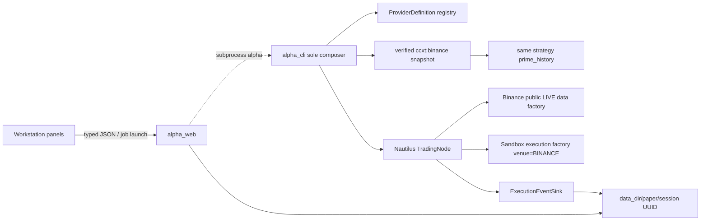

# Design and Implementation Plan — Provider Control Plane + Crypto Paper Trading

- **Date:** 2026-07-19
- **Status:** Implemented offline — network smoke and UTC-rollover soak pending
- **Scope:** local single-user provider/system visibility, public Binance market data, Nautilus
  sandbox execution, durable paper monitoring
- **Non-goal:** real-order routing

## 1. Outcome

Extend the shipped ALPHA workstation without creating a parallel engine, store, composer, or UI.
The CLI remains the sole orchestration authority. Historical research remains point-in-time and
content-addressed. Paper sessions are explicitly opt-in, operational, nondeterministic, and
**sandbox-only**.

The user workflow is:

```text
pull Binance history -> freeze/verify same-venue snapshot -> inspect readiness
-> launch supported strategy with public Binance live data + local sandbox fills
-> monitor/cancel the known job -> inspect durable bounded session events
```

## 2. Immutable Constraints

1. Preserve the twelve import contracts and the CLI sole-composer rule.
2. Preserve the PIT `as_of` firewall, strategy trailing windows, and close-`t`/open-`t+1`
   research convention.
3. Do not change existing `RunSpec`, run-id inputs, manifest keys, `RUN_DIRS`, or byte-pinned SIM
   artifacts except through explicitly additive fields already permitted by their contracts.
4. Never return a credential value. Provider projections expose environment-variable names and
   Boolean presence only.
5. `ALPHA_PAPER_ENABLED` defaults to false. Disabled means no node construction and no network
   access.
6. The only market-data client in the first paper release is public Binance `LIVE` data. The only
   execution client is Nautilus `SandboxExecutionClientConfig(venue="BINANCE")`.
7. Never construct a Binance execution client/factory, accept real-order credentials, or describe
   this path as exchange testnet execution.
8. Keep ticks/bars out of the session journal.
9. Keep Kronos unsupported for live paper until a separate causal live-cache design is approved.
10. Add none of OpenBB, Qlib, FinancePy, TradingAgents, TensorTrade, Alpaca, or Twelve Data to the
    runtime in this track.

Governing decisions: [ADR-0011](../../adr/0011-evidence-gated-external-integrations.md) and
[ADR-0012](../../adr/0012-operational-paper-sessions.md).

## 3. Target Architecture



Research and operations share typed domain/strategy code but not artifact identity:

```text
deterministic research: snapshot -> RunSpec -> content run_id -> RUN_DIRS manifest
operational paper:      snapshot -> launch UUID -> PID/heartbeat/events -> data_dir/paper
```

## 4. Provider Control Plane

### 4.1 Registry contract

One public, lightweight `alpha_cli` module owns immutable `ProviderDefinition` records:

| Field | Contract |
|---|---|
| `id` | stable unique lowercase identifier |
| `label` | human-readable display label |
| `capabilities` | immutable unique capability names, suitable for filtering |
| `network_required` | whether normal use needs outbound network |
| `credential_env` | environment-variable names only |
| `options` | typed/serializable option definitions and allowed values |
| `limitations` | explicit user-visible caveats |
| `installed` | local import/package readiness only |
| `configured` | required credential names are present; never their values |
| historical adapter factory | optional callable kept out of serialized output |

The initial entries are:

| ID | Capability | Credentials | Required option/limitation |
|---|---|---|---|
| `yfinance` | historical bars/actions | none | research vendor; pandas edge; Yahoo conventions |
| `ccxt` | historical crypto bars | none | `exchange=coinbase|binance`; daily OHLCV |
| `stooq` | historical bars | none | anti-bot/quota may fail loud; provider-adjusted |
| `finnhub` | quote/news | `ALPHA_FINNHUB_API_KEY` | configured only when key is present |
| `binance` | Nautilus live market data for paper | none | public `LIVE` data; Binance availability/rate limits |

Registry construction fails on duplicate IDs. Tests pin unique IDs, exact capability filtering,
credential redaction/configuration, CCXT option values, and historical-factory coverage.

### 4.2 Historical data integration

`alpha data pull` derives source choices and adapter construction from the registry. CCXT accepts:

```text
alpha data pull BASE/QUOTE --source ccxt --exchange coinbase|binance --start ... --end ...
```

The exchange option is rejected for non-CCXT sources. Pulls atomically invalidate stale provenance,
then persist the venue-qualified provider ID (`ccxt:coinbase` or `ccxt:binance`) plus adapter/parser
versions per symbol. Snapshot creation refuses a requested source that differs from those stored
bytes and copies the provenance into a hashed sidecar. The Data Explorer derives source choices and
conditionally renders the exchange selector from the provider projection.

### 4.3 Read-only status projections

Commands:

```text
alpha info providers --json
alpha info system --json
```

Routes:

```text
GET /api/providers
GET /api/system
```

`providers` returns only serialized registry metadata. `system` reports local facts only:

- data directory path/readability/writability and free bytes;
- stored symbol count and immutable snapshot count;
- pinned Nautilus version and whether it matches the reviewed adapter version;
- Kronos cache path/configuration/local-only mode without probing the hub; and
- parsed `ALPHA_PAPER_ENABLED` state.

No status call performs a network probe. `/healthz` remains a minimal liveness response.

## 5. Safe Crypto Paper Execution

### 5.1 CLI contract

```text
alpha paper run BASE/USDT \
  --provider binance \
  --snapshot SNAPSHOT_ID \
  --strategy NAME \
  [--param name=value ...]
```

The provider and quote asset are deliberately narrow in this release. `BASE/USDT` maps to Nautilus
instrument ID `BASEUSDT.BINANCE`. Reject malformed/multi-slash symbols, non-USDT quote assets,
unknown providers, unsupported strategies, and any attempt to select a real execution mode.

### 5.2 Admission sequence

Admission is fail-closed and ordered before network/node construction:

1. require `ALPHA_PAPER_ENABLED=true` using strict Boolean parsing;
2. require `provider == "binance"`;
3. validate the strategy parameter schema and `supports_live_paper` metadata;
4. verify the immutable snapshot hashes;
5. require snapshot source plus hashed per-symbol pull provenance `ccxt:binance` and the exact requested symbol;
6. load bars through the PIT seam at the launch cutoff;
7. reject a bar whose daily UTC close boundary is not yet knowable, insufficient warmup, or stale crypto history;
8. create the session start record;
9. prime the strategy without order emission;
10. construct/register public data and sandbox execution factories, add strategy, build, then run.

The freshness threshold is an explicit constant/configuration surfaced in failure details and
covered at both sides of its boundary. No implicit history fetch repairs a rejected snapshot.

### 5.3 Node assembly and lifecycle

Use the reviewed NautilusTrader `1.228.0` APIs:

- `BinanceLiveDataClientFactory` with public Binance `LIVE` data configuration;
- `SandboxLiveExecClientFactory` with
  `SandboxExecutionClientConfig(venue="BINANCE", ...)`;
- add the strategy to `node.trader` **before** `node.build()`;
- register both factories before build;
- install SIGINT/SIGTERM handling that requests a clean stop;
- update terminal session state on success, cancellation, or failure; and
- call `node.dispose()` in an unconditional `finally` after construction succeeds.

The compatibility baseline is the
[official Nautilus Binance integration](https://github.com/nautechsystems/nautilus_trader/blob/develop/docs/integrations/binance.md)
at the reviewed adapter version; moving the pin requires a deliberate API/behavior review.

Tests inspect the configured/factory types and fail if a Binance execution factory/client can be
reached. No real-order API key/secret option exists.

### 5.4 Strategy parity and warmup

`VolTargetStrategy.prime_history()` accepts PIT `alpha_core.Bar` history and fills the same internal
close/high/low sequences used by live bar callbacks. Priming:

- preserves source order and rejects disorder/future data at the caller boundary;
- uses exactly the configured strategy cadence/window;
- does not call `_signal`, submit/cancel an order, publish execution events, mutate position, or
  start the strategy lifecycle; and
- leaves the first live decision at the same index/cadence expected after historical warmup.

An optional `ExecutionEventSink` is constructor/runtime wiring only; it is never part of strategy
parameters, `RunSpec`, or hashing.

Existing SIM sizing remains unchanged. In paper mode, target quantities are normalized with the
resolved Binance instrument's size precision/increment before order submission; zero-after-rounding
means no order. Regression fixtures prove prior SIM artifacts remain byte-identical.

Strategy catalog metadata adds `supports_live_paper`. The four rule strategies
(`ts_momentum`, `ma_crossover`, `mean_reversion`, `breakout`) are enabled. `kronos` is rejected with
guidance that a separate live-cache design is required.

## 6. Durable Session Journal

### 6.1 Layout and atomicity

```text
data_dir/paper/<session_uuid>/session.json
data_dir/paper/<session_uuid>/events/00000000000000000001.json
data_dir/paper/<session_uuid>/events/00000000000000000002.json
...
```

IDs must parse as canonical UUIDs; resolved paths must remain under `data_dir/paper`. Every JSON
write uses a unique sibling temporary file followed by atomic replacement. Readers tolerate a
missing event directory and report/reject malformed committed
JSON explicitly; temporary/partial files are never listed as committed events.

### 6.2 Session schema

`session.json` contains:

- `session_id`, schema version, status;
- provider, `sandbox: true`, user symbol, Nautilus instrument ID;
- strategy name and normalized parameters;
- verified snapshot ID;
- PID, heartbeat, start/end timestamps;
- last committed sequence;
- terminal error (nullable).

Allowed statuses have explicit transitions such as
`starting -> running -> completed|cancelled|failed`. Recovery may report a partial/stale session but
must not invent a successful terminal state.

### 6.3 Event schema

Persist only:

- lifecycle (`starting`, `running`, stop/cancel/failure);
- order accepted/submitted/cancelled;
- fill;
- order denied/rejected;
- position opened/changed/closed; and
- reconciliation warning.

Each event has session ID, monotonically increasing sequence, type, event timestamp, optional
instrument/order identifiers, and a JSON-primitive payload. Credential values, raw ticks, bars,
SDK objects, and arbitrary exception tracebacks are forbidden.

### 6.4 Read surfaces

CLI:

```text
alpha paper sessions --json
alpha paper show SESSION_ID --json
```

API:

```text
GET /api/paper/sessions
GET /api/paper/sessions/{id}
GET /api/paper/sessions/{id}/events?after=SEQ
```

Events are sequence-ordered and strictly greater than `after`. Unknown canonical IDs return not
found; malformed IDs/negative cursors fail validation. The monitor derives its latest position
summary from the newest persisted `position` event.

Workstation jobs gain additive nullable `session_id`. Cancellation is allowed only through a known
live child job/process group. A stale heartbeat is visible but never triggers a PID kill.

## 7. Workstation UX

### Provider/System panel

- local data-directory and dependency readiness;
- provider installed/configured badges;
- credential **name** and missing/present state only;
- network requirements and limitations; and
- paper-enabled state with explicit opt-in guidance.

### Data Explorer

- source selector populated from `/api/providers`;
- CCXT exchange selector shown only when that provider/option is selected;
- unavailable/unconfigured providers explained, not silently hidden.

### Paper Monitor

- permanent, high-contrast **SANDBOX** banner;
- disabled-state block before launch;
- session status, start/heartbeat/stale state, provider, symbol, strategy, snapshot;
- compact position summary and sequence-ordered order/fill/rejection blotter;
- cursor-incremental logs/events with `after` polling; and
- cancel button bound to the known Workstation job, never a raw PID.

Empty, loading, polling error, terminal error, stale, and cancelled states all have tests.

## 8. TDD Slices and Ownership

1. Governance/ADRs and dependency pin.
2. Provider registry + JSON projections + CCXT venue provenance.
3. Provider/system API and Data Explorer/provider panel.
4. Strategy metadata, no-order history priming, and live quantity normalization.
5. Snapshot admission and fake-node assembly/lifecycle.
6. Atomic paper store, event sink, recovery, CLI reads.
7. Paper API, job `session_id`, monitor/cancellation.
8. Network smoke and opt-in soak.

Each slice begins with a failing focused test and ends with the narrowest relevant gates. No slice
may weaken an existing deterministic fixture to accommodate paper behavior.

## 9. Acceptance and Release Gates

Python gate:

```text
uv lock --check
uv sync --locked
uv run ruff check .
uv run ruff format --check .
uv run lint-imports                         # 12/12
uv run mypy packages apps tests             # strict
uv run pytest -q -m "not network" --cov --cov-report=term
uv run pytest -q -m bias_guard
uv build --all-packages
```

Frontend gate:

```text
npm ci
npm run lint -- --deny-warnings
npm run test:coverage
npm run generate:api
npm run build
```

Generated OpenAPI/TypeScript and committed `static/app` assets must be clean after regeneration.
The real Binance connection/quote smoke is marked `network` and remains outside deterministic CI.

The feature may be called implemented after offline gates plus the network smoke. Phase 4 may be
called operationally complete only after an owner-initiated sandbox soak crosses a UTC date boundary
without stale heartbeat, reconciliation, precision, or shutdown defects.

## 10. Migration, Rollback, and Deferred Work

- Existing snapshots remain readable. New CCXT snapshots carry venue-qualified provenance;
  ambiguous old `ccxt` snapshots are intentionally rejected for paper warmup and need recreation.
- Existing research commands, run IDs, manifests, and SIM fixtures do not migrate.
- Disable new launches instantly with `ALPHA_PAPER_ENABLED=false`; existing session files remain
  readable.
- Removing the Binance paper path does not remove historical CCXT data or the provider registry.
- Real execution, testnet execution, additional venues, automated recovery, remote/multi-user
  operation, Kronos live caching, ML/RL workers, and operational-data promotion are separately
  governed future specs.
