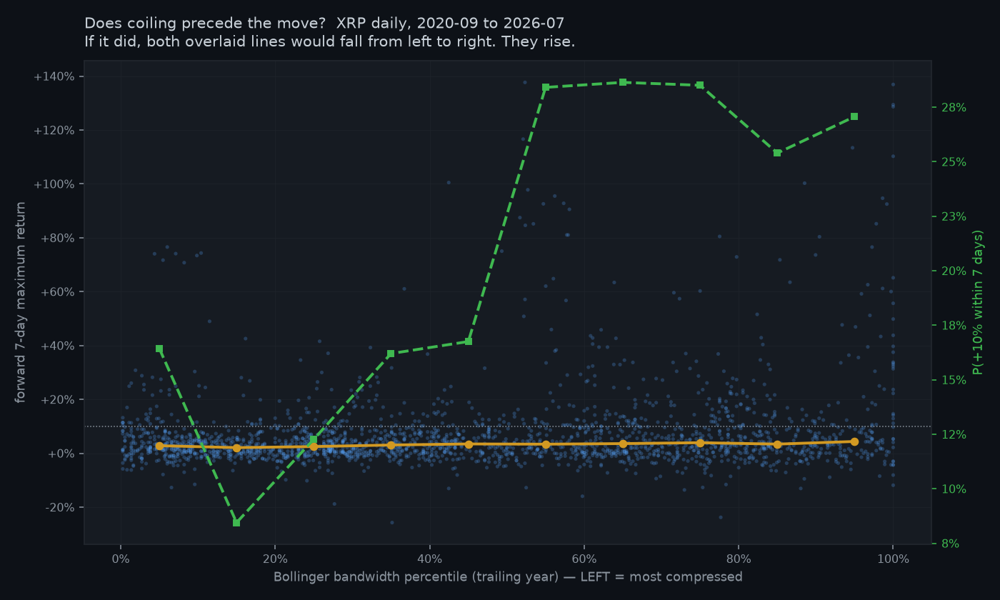
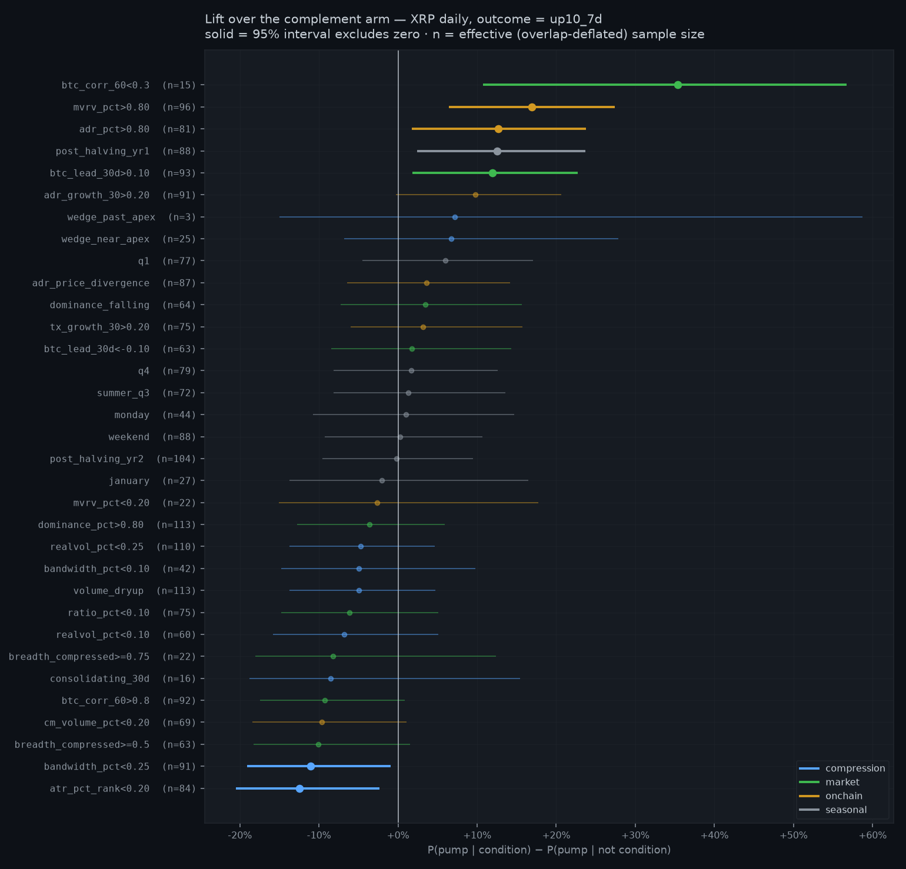
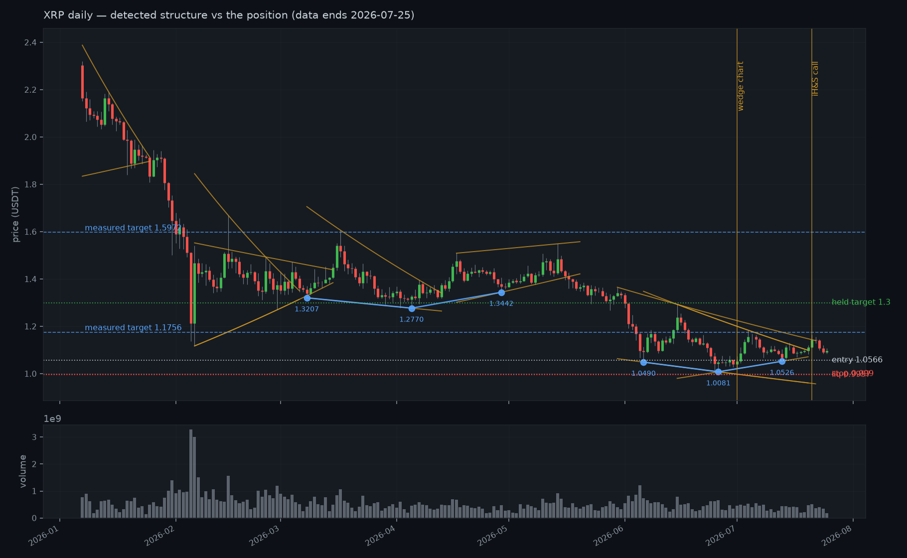

# When does XRP pump — and is the market "coiling"?

**Date:** 2026-07-28 · **Sample:** 2,153 XRP daily bars (2020-09 → 2026-07-25) plus 2,706 on a
second venue back to 2017-07 · 5 assets · 7 assets of chain data to 2026-05-23 · 33 pre-registered
conditions × 6 outcome definitions

## The short version

1. **Compression does not precede XRP moves. It follows quiet with more quiet.** Every one of six
   independent compression measures points the wrong way, on every asset, at both horizons where
   this study has enough independent observations to tell. Two of the intervals exclude zero.
   `atr_pct_rank<0.20` → **−12.4pp** [−20.5, −2.3]; `bandwidth_pct<0.25` → **−11.0pp** [−19.1, −0.9].
2. **What actually precedes a move is a market that is already moving.** The one cell in the entire
   study that survives false-discovery correction is **high** MVRV — extended, not cheap:
   **+16.9pp** [+6.4, +27.4], q = 0.048. High active-address counts and BTC already up 10%+ point
   the same way.
3. **The specific claim "the whole crypto market is on the verge of a breakout" measures negative.**
   Operationalised as half or more of the majors simultaneously compressed: **−10.1pp** on the
   7-day label, **−17.9pp** on the 30-day. Wrong sign, not merely unproven.
4. **Stacking "confluence" does not help, and the point estimate says it hurts.** Pump rate by
   number of conditions held: 33.9% → 25.4% → 25.0% → 14.1% → 13.3%. At the effective sample size
   the trend is z = −1.03, so this is *not* established — but there is no version of this data in
   which more confluence looked better.
5. **The study is badly underpowered at the horizons it was designed around, and that is itself the
   most useful finding.** A 30/90/180-day forward window on a decade of daily bars holds 71 / 23 /
   11 independent observations. Not 2,153. Nothing at those horizons can be established by anyone,
   with any method, on this much data.

For the live XRP long: the position is **+3.9%** above entry as of the last bar. The daily
inverse head and shoulders is real and the detector confirmed it 2026-07-18, three days before it
was called publicly. Its measured target is **1.1756**, not 1.3000. The falling wedges on the daily
did break **upward** on 20–22 July. None of that changes finding 1: this setup sits in the
compressed-and-under-supply cell that both this study and the previous one measure as unhelpful.

> Risk note, stated once as agreed: 60,124 XRP with a 0.0576 stop distance risks **3,463 USDT**
> against a 44 USDT framework cap, and the stop sits 0.33% above liquidation. Both facts are in the
> position, not in the analysis, and are not repeated below.

## What was tested, and how the multiplicity was handled

Four families, 33 conditions, six outcome definitions, five assets. That is a large enough grid to
manufacture findings, so the protocol was fixed in `config.py` before any outcome was inspected:

- **One primary predictor per family**; everything else is a stability check.
- **Benjamini–Hochberg within each family separately** (m ≈ 8), never one pooled correction across
  every cell — the families test different mechanisms and a null in one says nothing about another.
- **Effective sample size everywhere.** Every interval and p-value in this report is computed on
  overlap-deflated counts. The nominal counts are printed alongside so the deflation is auditable.
- **Cross-asset replication** on BTC, ETH, SOL and LTC through the identical pipeline.

**One deviation, declared.** The four pre-registered pump definitions (+20%/30d, +50%/90d,
+100%/180d, top-decile/30d) turned out to have n_eff of 71, 23, 11 and 71. Nothing could have
separated from zero at those sizes whatever the market did. Two shorter horizons (+10%/7d,
+25%/14d) were added **after** seeing that, for a power reason that depends only on the horizon and
not on any outcome. They are reported in their own section, are not treated as confirmatory, and
are BH-corrected alongside everything else. This is the one place where the specification moved.

## Finding 1 — quiet does not precede the move

Six independent compression measures against the +10%/7d label, XRP daily (base rate 20.7%,
n_eff 307):

| condition | n_eff | P(pump\|cond) | P(pump\|not) | difference | 95% CI |
|---|---|---|---|---|---|
| `atr_pct_rank<0.20` | 84 | 11.7% | 24.1% | **−12.4pp** | [−20.5, −2.3] |
| `bandwidth_pct<0.25` | 91 | 12.9% | 24.0% | **−11.0pp** | [−19.1, −0.9] |
| `breadth_compressed>=0.5` | 63 | 12.7% | 22.8% | −10.1pp | [−18.3, +1.5] |
| `realvol_pct<0.10` | 60 | 15.2% | 22.0% | −6.8pp | [−15.8, +5.1] |
| `volume_dryup` | 113 | 17.6% | 22.5% | −4.9pp | [−13.7, +4.7] |
| `bandwidth_pct<0.10` | 42 | 16.4% | 21.4% | −4.9pp | [−14.8, +9.8] |

Neither of the two separating cells survives BH within its family (q = 0.976). The evidence is not
in any single cell — it is in the **uniformity**:

| horizon | n_eff | XRP | BTC | ETH | SOL | LTC | sign test |
|---|---|---|---|---|---|---|---|
| +10%/7d | 307 | −4.4% | −6.8% | −4.7% | −5.9% | −3.8% | 5−/0+, p = 0.062 |
| +25%/14d | 153 | −2.1% | −2.2% | −1.1% | −2.8% | −0.9% | 5−/0+, p = 0.062 |
| +20%/30d | 71 | **+4.8%** | −4.8% | −5.6% | −7.4% | −0.1% | 4−/1+, p = 0.375 |

Five of five assets negative at both powered horizons. The 30-day row is shown because it
disagrees: XRP alone flips positive there. That row rests on 71 independent windows and individual
cells with n_eff of 4–26, so it is noise — but it is *the* horizon the study was designed around,
and suppressing it would be exactly the selection this project exists to avoid.

The episode tables reach the same conclusion by a different route. Collapsing 605 qualifying bars
into **40 distinct episodes**, compression is under-represented at the first bar of an episode
versus its background frequency: `bandwidth_pct<0.10` 5% vs 14%, `volume_dryup` 25% vs 37%,
`breadth_compressed>=0.5` 8% vs 21%. Restricting further to the 28 **cold starts** (trailing 30-day
return below +10%, so genuinely from a base rather than mid-rally) does not rescue it. The same
pattern holds on the independent Bitstamp series covering 2017–2025.



Both overlaid lines rise from left to right. If coiling preceded breakouts they would fall.

## Finding 2 — extension precedes the move

The single cell that survives false-discovery correction anywhere in this study:

| condition | n_eff | P(pump\|cond) | P(pump\|not) | difference | 95% CI | q |
|---|---|---|---|---|---|---|
| `mvrv_pct>0.80` | 96 | 32.5% | 15.6% | **+16.9pp** | [+6.4, +27.4] | **0.048** |
| `adr_pct>0.80` | 81 | 30.2% | 17.6% | +12.7pp | [+1.7, +23.8] | 0.414 |
| `btc_lead_30d>0.10` | 93 | 29.2% | 17.3% | +11.9pp | [+1.8, +22.7] | 0.245 |
| `post_halving_yr1` | 88 | 29.6% | 17.1% | +12.5pp | [+2.4, +23.7] | 0.387 |

MVRV in the **top** quintile — market value far above realised value, the classic "overheated"
read — precedes a further +10% within a week substantially more often than the alternative. Its
mirror, `mvrv_pct<0.20` ("cheap"), is flat to negative. The on-chain family points positive on 5 of
5 assets at both powered horizons (p = 0.062), same structure as the compression result.

This is a momentum finding wearing on-chain clothing, and it should be read that way. It says XRP
moves when XRP and the market around it are already moving. It does **not** say buying an extended
MVRV is profitable — this study measures conditional probability of a forward move, not the payoff
of a trade with a stop, and the previous two studies both found the gap between those two things to
be where edges die.



## Finding 3 — the two claims, tested directly

**"The whole crypto market is on the verge of a breakout"** (Ace, 20 July). Operationalised as
market breadth: the fraction of the majors whose Bollinger bandwidth sits in the bottom quartile of
its own trailing year.

| outcome | n_eff | P(pump\|breadth compressed) | P(pump\|not) | difference | CI |
|---|---|---|---|---|---|
| +10% / 7d | 63 | 12.7% | 22.8% | **−10.1pp** | [−18.3, +1.5] |
| +20% / 30d | 15 | 14.3% | 32.2% | **−17.9pp** | [−35.0, +8.0] |

Both intervals still touch zero, so this is not established as a *negative* signal either. But the
claim as stated — that market-wide coiling raises the odds of a breakout — has the wrong sign in
this data at every horizon tested, on every asset. As a directional read it is not supported.

**"Multiple technical factors reinforcing the upside bias."** Scoring each bar by how many of five
independent conditions hold (one per family, so the stack tests different mechanisms rather than
four rescalings of volatility):

| conditions held | 0 | 1 | 2 | 3 | 4 |
|---|---|---|---|---|---|
| bars (nominal / effective) | 1,038 / 35 | 665 / 22 | 256 / 9 | 92 / 3 | 30 / 2 |
| P(+20% in 30d) | 33.9% | 25.4% | 25.0% | 14.1% | 13.3% |

Trend z = **−1.03**. The nominal figure is −5.34, and quoting that would be the single most
misleading number available here — it is inflated by √30 because consecutive daily bars share 29 of
the 30 days in their forward window. Deflated, the staircase is not distinguishable from flat.

The honest statement: confluence is **not shown to help**, the point estimate at every horizon says
it hurts, and the effect is not established in either direction.

## Finding 4 — the power ceiling, which limits everything above

| label | nominal n | n_eff | overlap | base rate |
|---|---|---|---|---|
| +10% / 7d | 2,146 | 307 | 7× | 20.7% |
| +25% / 14d | 2,139 | 153 | 14× | 13.3% |
| +20% / 30d | 2,123 | 71 | 30× | 28.5% |
| +50% / 90d | 2,063 | 23 | 90× | 28.8% |
| +100% / 180d | 1,973 | 11 | 180× | 25.4% |

Nine years of daily XRP data contains **eleven** independent 180-day windows. No amount of
resolution fixes this — moving to 4-hour bars multiplies the row count by six and leaves n_eff
identically unchanged, because the number of independent six-month windows in a record is a
property of the record's length, not its sampling rate.

This is why the four pre-registered labels produced nothing, why the two post-hoc ones were added,
and why the cross-asset sign test is where the real evidence in this study lives.

## What this says about the live position

The scorecard (`python -m research.xrp_pumps.scorecard`) prints all 33 conditions with their
current state. As of the last bar (2026-07-25, close 1.0980):

- **Compressed on every measure** — `bandwidth_pct` 0.016, `realvol_pct` 0.058, `atr_pct_rank`
  0.058, `volume_dryup` yes, `breadth_compressed>=0.75` yes. This is precisely the state that
  measures −11 to −12pp at the powered horizon.
- **`btc_corr_60` = 0.868** — highly correlated with BTC, the negative side of that predictor.
- **All eight on-chain conditions are UNAVAILABLE**, 57 days stale. The chain record ends
  2026-05-23. The scorecard refuses to carry the May values forward, so the one family with a
  surviving finding cannot be read for the live setup at all.
- Detected structure: three converging formations on the daily, all of which **broke upward**
  20–22 July; the inverse head and shoulders (LS 1.0490 / head 1.0081 / RS 1.0526, confirmed
  2026-07-18) with a measured target of **1.1756** and no break of structure.



The two source charts imply incompatible targets — the weekly falling wedge points at 1.85–2.40,
the daily inverse head and shoulders at 1.1756 — and only the second has a measurable geometry
attached. The 1.18 neckline was touched on 4 July (high 1.1838) but never closed through.

## The call record

Three dated calls are logged in `calls.csv`. **All three are unresolved** — their 30- and 90-day
horizons have not elapsed against data ending 2026-07-25 — so the harness reports progress and
refuses to score them. That is the correct output, not a limitation to work around: judging a call
before its horizon means judging it on a window the caller did not choose.

What can be said now: the 21 July inverse-head-and-shoulders call matched a structure this study's
detector had independently confirmed on **18 July**, three days earlier, from price geometry alone.
That is one instance of agreement between a discretionary read and an algorithmic one. It is not
evidence of skill, and 20–30 dated calls would be needed before the harness's interval means
anything. The machinery is built and waiting for them.

## Limitations — read before acting

- **Underpowered at the pre-registered horizons.** Finding 4 is not a caveat, it is a result. Any
  claim about 30-day-plus XRP moves from a decade of data rests on tens of observations.
- **The post-hoc labels.** The two horizons carrying most of the evidence were chosen after seeing
  that the pre-registered ones had no power. The reason is defensible and stated; it is still a
  specification chosen with knowledge of the sample.
- **The sign test assumes assets are independent. They are not.** Its p-values are optimistic,
  worst for the seasonal family where all five assets share one calendar and a single Q4 rally is
  counted five times. Seasonal results should be read as very weak.
- **`btc_corr_60<0.3` looks like the largest effect in the study** (+35.3pp on 7d) and rests on
  n_eff = 15. It is one of 33 cells; a cell that extreme at that sample size is what multiplicity
  produces. It does not survive BH and is not claimed.
- **On-chain data ends 2026-05-23**, two months before the price data. It informs the history and
  says nothing about the present.
- **Majors dominance is a seven-asset basket**, not the market-wide figure quoted on data sites.
- **Conditional probability is not a trade.** Everything here measures P(move | state). It does not
  model entry, stop, slippage or position size, and the previous two studies both found effects
  that were real at the probability level and worthless once a stop was attached.
- **Provenance.** Every market-data API is egress-blocked in this environment. OHLCV comes from
  SHA-256-pinned GitHub mirrors ending 2026-07-25; chain data from the CoinMetrics community
  mirror, each file hash-pinned (`xrp` `251ed578003a`, `btc` `06495ff8e643`, 7 assets total).
- **Wedges are common in noise.** The detector fires ~24 times per 1,000 bars of pure random walk.
  That base rate is measured in `tests/unit/test_wedge.py` and is the number any real-data wedge
  count must be read against.

## Reproducing

```bash
python -m research.xrp_pumps.onchain --fetch    # CoinMetrics, SHA-pinned (network)
python -m research.xrp_pumps.study              # lift tables, BH, walk-forward, consistency
python -m research.xrp_pumps.episodes           # the 40 distinct episodes and their preconditions
python -m research.xrp_pumps.scorecard          # live state of all 33 conditions
python -m research.xrp_pumps.calls              # score dated calls against matched controls
python -m research.xrp_pumps.viz                # the three figures
```

Artefacts: `data/xrp_pumps/lifts_1d.parquet` (456 result rows: every condition × outcome × window,
with nominal and effective counts, intervals, p- and q-values).

New library code, all gated by the project's normal CI: `alpha_patterns.indicators` (eight causal
indicators), `alpha_patterns.wedge` (converging-trendline detection with a computed apex),
`alpha_validation.conditional` (`conditional_lift`, `lift_table`, `apply_fdr`, `monotonic_trend`).
Every indicator and the wedge detector carry future-poison bias guards in
`tests/bias_guards/test_indicator_no_lookahead.py`; the wedge detector is verified against injected
ground truth with exact anchor and apex recovery.
